# Chapter 1: OpenCombat SDL - Overview and Architecture

## Table of Contents

1. [Gameplay Overview](#1-gameplay-overview) - **Concept Level**
2. [System Architecture](#2-system-architecture) - **Algorithm Level**
3. [Design Philosophy](#3-design-philosophy) - **Why These Patterns?**
4. [Implementation Details](#4-implementation-details) - **Code Level**
5. [Directory Structure](#5-directory-structure)
6. [Execution Flow](#6-execution-flow)

---

## 1. Gameplay Overview

> **Concept Level** - Understanding OpenCombat SDL as a tactical RTS game

### 1.1 What Is OpenCombat SDL?

OpenCombat SDL is a **squad-level tactical real-time strategy game** set in World War II:

- **Scale**: Squad-level combat (4-12 soldiers per squad)
- **Setting**: World War II Western Front
- **Perspective**: Top-down view of the battlefield
- **Time**: Real-time gameplay with tactical pause for issuing orders
- **Core Activity**: Commanding soldiers to move, take cover, and engage enemies

**Key Gameplay Mechanics:**
- **Command Interface**: Select units and issue orders (move, attack, take cover)
- **Line of Sight**: Units can only see and fire at targets within their vision cone
- **Cover System**: Terrain objects provide protection from enemy fire
- **Squad Cohesion**: Soldiers in squads move together and share tactical awareness
- **Ballistics Simulation**: Weapon accuracy, penetration, and suppression effects

### 1.2 Digital Implementation Elements

| Element | Gameplay Role | Implementation |
|---------|---------------|----------------|
| Map | Battlefield with terrain features | 2D tile-based terrain system |
| Soldiers | Controllable infantry units | Animated sprites with state machines |
| Cover | Tactical positions (walls, trees) | Collision detection and visibility calculations |
| Orders | Player-issued commands | Order objects queued for execution |
| Combat | Weapon firing and damage | Ballistics simulation with hit probability |
| Fog of War | Limited visibility | Line-of-sight raycasting |

### 1.3 Core Gameplay Loop

**What the Player Does:**
1. **Selection**: Click to select individual soldiers or squads
2. **Movement**: Right-click to issue move orders to positions on the map
3. **Combat**: Target enemies within line of sight for soldiers to engage
4. **Tactical Positioning**: Use terrain features for cover and ambush positions

**What the Game Simulates:**
- **Physics**: Projectile trajectories, penetration through cover
- **AI**: Pathfinding around obstacles, tactical positioning
- **Visibility**: Dynamic line-of-sight calculations as units move
- **State Transitions**: Soldiers transition between idle, moving, firing, taking cover

**Why This Design?**
1. **Tactical Depth**: Real-time decision-making under pressure
2. **Accessibility**: Pause-and-command reduces RTS complexity barriers
3. **Simulation Fidelity**: Ballistics and LOS create emergent tactical situations
4. **Solo Play**: AI opponents use the same systems as player-controlled units

> **→ Next**: How do we organize the code to represent this tactical RTS experience?

---

## 2. System Architecture

> **Algorithm Level** - Understanding systems without implementation details

### 2.1 High-Level System Diagram

The architecture follows a **layered responsibility hierarchy**, similar to how a military organization delegates authority:

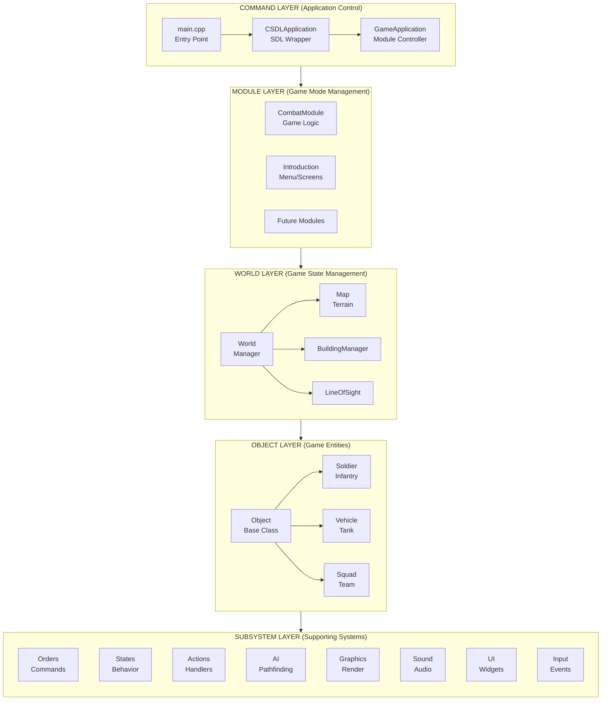

#### Simplified Flow View

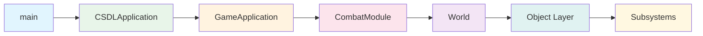

**Note**: The flow is `main` → `CSDLApplication` → `GameApplication` → `CombatModule`. CSDLApplication creates and manages GameApplication.

### 2.2 Layer Responsibilities

#### Command Layer
**Purpose**: Application entry point and game mode selection.
- `main.cpp`: Entry point, initialization, shutdown
- `GameApplication`: Decides which module is active
- `CSDLApplication`: Handles SDL platform details

**Key Decision**: Which game mode are we running right now?

#### Module Layer

**Purpose**: Encapsulate distinct game modes with different behaviors.
- Each module is a complete, self-contained game mode
- Modules can be swapped without restarting the application
- Current modules: Combat (main game)
- Future modules: Introduction (menus) - declared but not yet implemented

**Key Decision**: How does this game mode work?

**Module System Flow:**

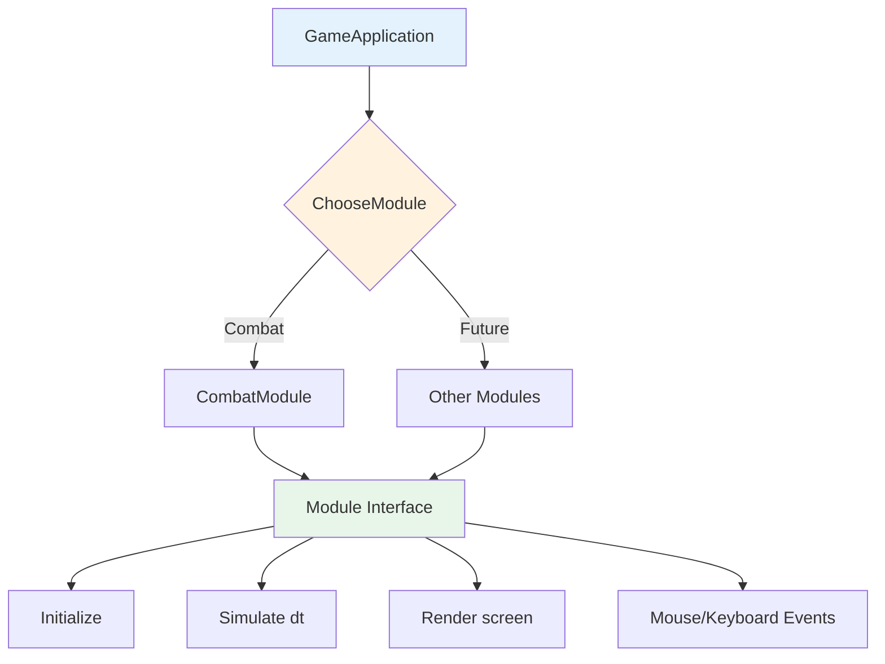

**Note**: Currently only CombatModule is implemented. The Introduction module is declared in the enum but not yet implemented.

#### World Layer
**Purpose**: Central authority for all game state.
- `World`: Master container that owns all game objects
- `Map`: Terrain data (elevation, ground type)
- `BuildingManager`: Structures that block movement and line of sight
- `LineOfSight`: Visibility calculations between points

**Key Decision**: What's the current state of everything on the map?

#### Object Layer
**Purpose**: Game entities with individual behavior and state.
- `Object`: Base class for anything that can exist in the world
- `Soldier`: Infantry with weapons, morale, and health
- `Vehicle`: Tanks and trucks with turrets, armor, and crew
- `Squad`: Groups of soldiers that share orders and formations

**Key Decision**: What is this specific unit doing right now?

#### Subsystem Layer
**Purpose**: Shared services used by game objects.
- **Orders**: Command queue system ("move to X", "attack Y")
- **States**: Behavior state machine (idle, moving, firing, dying)
- **Actions**: Low-level action execution
- **AI**: Pathfinding and tactical decision-making
- **Graphics**: Rendering sprites, effects, and UI
- **Sound**: Audio playback and management
- **UI**: User interface widgets and panels
- **Input**: Mouse and keyboard event handling

**Key Decision**: How do we execute this specific behavior?

### 2.3 Communication Flow

**Top-Down**: Commands flow from Application → Module → World → Objects → Subsystems
**Bottom-Up**: Events flow from Input → UI → Objects → World → Module → Application

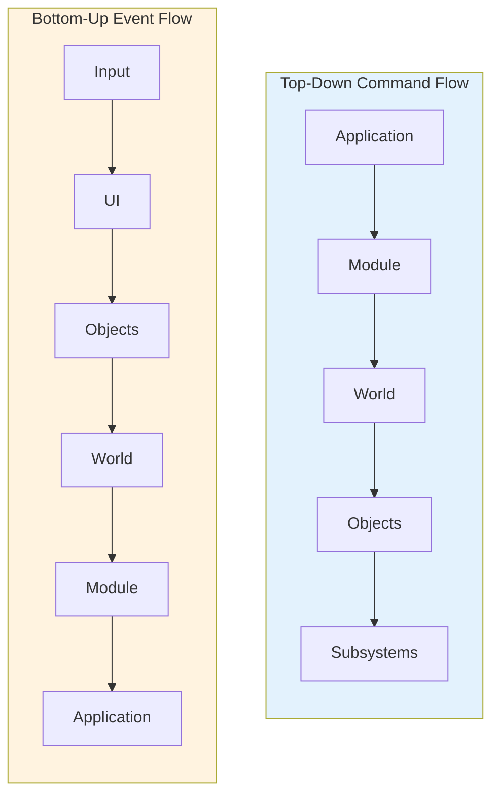

**Example - Issuing a Move Order:**

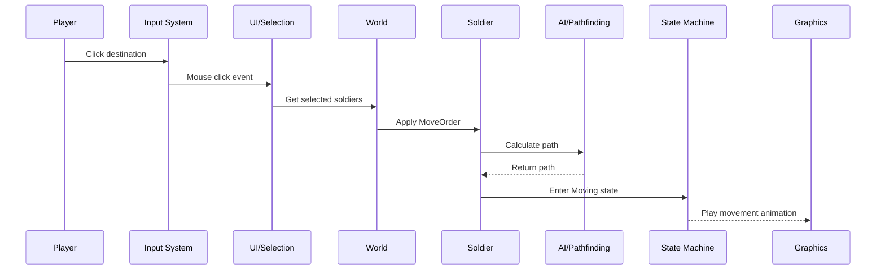

1. **Input**: Player clicks destination
2. **UI**: Selection system identifies clicked location
3. **World**: Finds selected soldiers
4. **Objects**: Soldiers receive MoveOrder
5. **AI**: Pathfinding calculates route
6. **States**: Soldiers enter Moving state
7. **Graphics**: Movement animations play

> **→ Next**: Why do we organize code this way? What problems do these patterns solve?

---

## 3. Design Philosophy

> **Why These Patterns?** - Understanding design decisions before seeing code

### 3.1 The Manager Pattern

**The Problem**: Creating game objects (soldiers, weapons, vehicles) requires loading data from files, validating it, and configuring instances. If every system did this independently, we'd have code duplication and inconsistent objects.

**The Solution**: Centralized factory classes that handle creation.

**Analogy**: Managers function as **object factories**. When you need a soldier:
1. Request is made to SoldierManager with specifications (nationality, type)
2. Manager looks up the template (XML file with stats)
3. Manager creates and configures the soldier
4. Ready-to-use object is returned

**Manager Pattern Flow:**

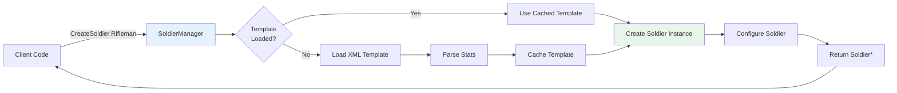

**Managers in the System**:
- `SoldierManager`: Creates soldiers from XML templates
- `WeaponManager`: Manages weapon definitions and ammo types
- `VehicleManager`: Handles vehicle types and configurations
- `SquadManager`: Creates squad compositions
- `EffectManager`: Manages visual effects (muzzle flashes, explosions)
- `ElementManager`: Terrain element definitions
- `AnimationManager`: Loads and clones animation sequences (owned by CombatModule, not in globals)

**Benefits**:
- Single point of control for object creation
- Consistent initialization from data files
- Easy to add validation and logging
- Data-driven design (change XML, change game)

### 3.2 Reference Counting for Orders

**The Problem**: Orders can be shared between multiple objects. For example, a Squad order applies to all soldiers in that squad. When is it safe to delete an order?

**The Solution**: Manual reference counting - track how many objects are using an order.

**Analogy**: Orders are like **shared resources**:
- When a soldier receives an order, they acquire a reference (increment count)
- When they complete or cancel it, they release the reference (decrement count)
- When count reaches zero, the order is automatically destroyed

**Reference Counting Flow:**

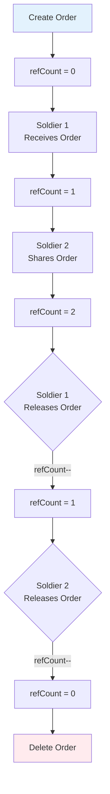

**Why Not std::shared_ptr?**
The codebase predates widespread `shared_ptr` adoption and uses a custom lightweight implementation for performance-critical order handling.

**Critical Rule**: Never add the same Order pointer to multiple objects without incrementing the reference count. This prevents use-after-free bugs.

### 3.3 Non-Owning References

**The Problem**: Squads need to track their members, but who actually owns the soldiers? If both Squad and World try to delete soldiers, we get double-free errors.

**The Solution**: Clear ownership hierarchy with non-owning references.

**Analogy**: Consider a **team roster system**:
- The **team** (Squad) has a roster of players (pointers to soldiers)
- The **organization** (World) actually manages and employs the players (owns them)
- If the team disbands, players still exist - they just need new team assignments

**Ownership Hierarchy:**

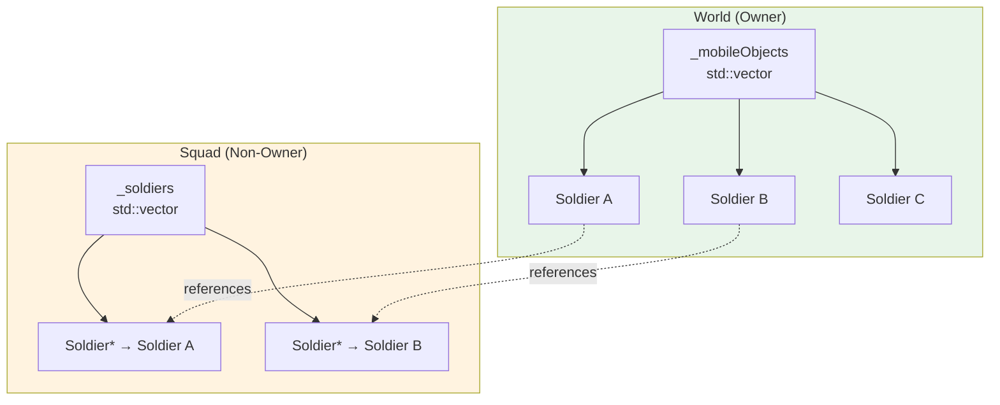

**Note**: World uses raw pointers (`std::vector<Object*>`, not `std::unique_ptr<Object>`) for legacy compatibility. The World is responsible for object lifetime management.

**Implementation**:
- `World::_mobileObjects` **owns** all soldiers and vehicles (vector of objects)
- `Squad::_soldiers` **references** soldiers (vector of pointers, no ownership)
- When a soldier dies, World removes and deletes it; Squad's pointer becomes stale (handled via cleanup)

### 3.4 Module System for Game Modes

**The Problem**: A game has different modes (main menu, combat, victory screen) with different update and render needs.

**The Solution**: Module interface that each game mode implements.

**Analogy**: Modules are **swappable components**:
- Each module is a self-contained unit with its own resources and logic
- The application switches between modules by changing the active pointer
- Each module has its own initialization, update, and rendering logic

**Lifecycle**:
1. `Initialize()` - Set up resources when module loads
2. `Simulate(dt)` - Update logic every frame
3. `Render(screen)` - Draw the module
4. Input handling - Respond to user input

> **→ Next**: How are these patterns actually implemented in C++?

---

## 4. Implementation Details

> **Code Level** - C++17 implementation with explanations

### 4.1 Module System Implementation

**Concept → Algorithm → Code**

**Concept**: Different game modes (combat, menus) should be swappable without restarting.
**Algorithm**: Define a common interface; each mode implements the interface; application holds pointer to current mode.
**Code**:

```cpp
// src/application/GameApplication.h
enum AvailableModules {
    Introduction = 0,  // Menu/screens
    Combat,            // Main gameplay
    NumAvailableModules
};

class GameApplication : public Module {
    Module* _modules[NumAvailableModules];  // All available modes
    AvailableModules _currentModule;         // Currently active
    
    void ChooseModule(AvailableModules module);  // Switch modes
};
```

**Module Interface** (`src/application/Module.h`):
```cpp
class Module {
public:
    virtual void Initialize(void *app) = 0;
    virtual void Simulate(long dt) = 0;  // long, not float
    virtual void Render(Screen *screen) = 0;
    // Individual event handling methods (not a generic HandleInput)
    virtual void LeftMouseDown(int x, int y) = 0;
    virtual void LeftMouseUp(int x, int y) = 0;
    virtual void LeftMouseDrag(int x, int y) = 0;
    virtual void RightMouseDown(int x, int y) = 0;
    virtual void RightMouseUp(int x, int y) = 0;
    virtual void RightMouseDrag(int x, int y) = 0;
    virtual void MiddleMouseDown(int x, int y) = 0;
    virtual void MiddleMouseUp(int x, int y) = 0;
    virtual void MiddleMouseDrag(int x, int y) = 0;
    virtual void KeyUp(int key) = 0;
    virtual void KeyDown(int key) = 0;
};
```

**Note**: The interface uses separate methods for each event type rather than a generic `HandleInput(const SDL_Event& event)` method. The `dt` parameter is `long` (milliseconds), not `float`.

**Why This Works**: The application only knows about the Module interface. It can switch between completely different game modes without caring about implementation details.

### 4.2 Manager Pattern Implementation

**Concept → Algorithm → Code**

**Concept**: Centralized creation of game objects from data files.
**Algorithm**: Manager loads templates from XML; provides factory methods; caches loaded data.
**Code**:

```cpp
// Soldiers are created from XML templates
class SoldierManager {
public:
    Soldier* CreateSoldier(const char* templateName, Nationality* nation);
    
private:
    // Cache of loaded templates
    std::map<std::string, SoldierTemplate> _templates;
};

// Usage
Soldier* soldier = g_Globals->World.Soldiers->CreateSoldier(
    "Rifleman", 
    g_Globals->World.Nationalities[0]
);
```

**Benefits of This Approach**:
1. **Data-driven**: Change `config/Soldiers.xml` to modify stats without recompiling
2. **Validation**: Manager can validate templates on load
3. **Caching**: Templates loaded once, reused for multiple instances

### 4.3 Reference Counting Implementation

**Concept → Algorithm → Code**

**Concept**: Track how many objects reference an order so we know when to delete it.
**Algorithm**: Increment count on assignment; decrement on release; delete when count reaches zero.
**Code**:

```cpp
class Order {
    int _refCount;  // How many objects use this order
    
public:
    Order() : _refCount(0) {}
    
    void IncrementRefCount() { ++_refCount; }
    
    void Release() { 
        if(--_refCount <= 0) {
            delete this;  // Safe to delete when no references
        }
    }
};

// Usage pattern
void Soldier::SetOrder(Order* order) {
    if(_currentOrder) {
        _currentOrder->Release();  // Release old order
    }
    _currentOrder = order;
    if(order) {
        order->IncrementRefCount();  // Take ownership of new order
    }
}
```

**Critical Pattern**: Always pair `IncrementRefCount()` with `Release()` to prevent leaks.

### 4.4 Non-Owning References Implementation

**Concept → Algorithm → Code**

**Concept**: Clear ownership hierarchy prevents double-free errors.
**Algorithm**: World owns objects in a vector; other classes hold pointers without deletion rights.
**Code**:

```cpp
// World OWNS all mobile objects (using raw pointers for legacy compatibility)
class World {
    std::vector<Object*> _mobileObjects;  // Raw pointers, not unique_ptr
    
public:
    void AddObject(Object* object) {
        _mobileObjects.push_back(object);
    }
    
    void RemoveObject(Object* object) {
        // Find and erase (actual implementation more complex)
    }
};

// Squad REFERENCES soldiers (no ownership)
class Squad {
    std::vector<Soldier*> _soldiers;  // Raw pointers - World owns these
    
public:
    void AddSoldier(Soldier* soldier) {
        _soldiers.push_back(soldier);  // Just store pointer
        // Note: We do NOT delete soldier in ~Squad()
    }
};
```

**Note**: The codebase currently uses raw pointers (`Object*`) rather than modern `std::unique_ptr<Object>` for legacy compatibility. Future refactoring may modernize this.

**Why This Is Safe**:
- World controls lifetime; when World deletes a soldier, it notifies Squad
- Squad can check if pointers are still valid before use
- No ambiguity about who deletes what

### 4.5 State Machine Implementation

**Concept → Algorithm → Code**

**Concept**: Complex actions break down into simple steps executed in sequence.
**Algorithm**: Actions are pushed to a queue; handlers process them based on current state and requirements.
**Code**:

```cpp
// Action requirements are checked, not automatic prerequisites
class ObjectActions {
public:
    struct Action {
        std::string Name;
        std::string Group;
        long Time;                       // Time to complete (ms)
        std::vector<StateIdx> Requirements;  // Required states
        std::vector<StateIdx> Adds;      // States to add when complete
        std::vector<StateIdx> Subtracts; // States to remove when complete
    };
    
    // CheckRequirements returns action index if prerequisites needed, -1 if satisfied
    ActionIdx CheckRequirements(ActionIdx actionID, State* srcState);
};
```

**Note**: The action system uses requirement checking rather than automatic prerequisite chaining. Actions check their requirements in their handlers and either execute or return early.

### 4.6 Global State Management

**The Globals Struct**: Centralized access point for all subsystems.

**Why Use Globals?**
In a game engine, many systems need access to common resources (managers, world state, debug flags). Passing these through every function call would create unwieldy parameter lists. The Globals struct provides a single, type-safe access point.

**Globals Structure Overview:**

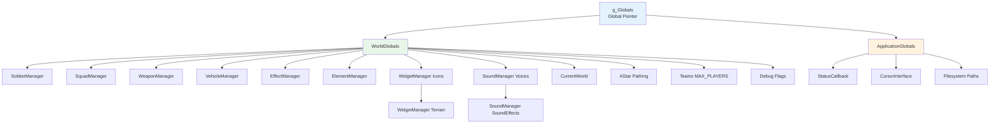

**Structure**:

```cpp
struct Globals {
    WorldGlobals World;           // Game world state
    ApplicationGlobals Application; // Platform state
};

struct WorldGlobals {
    // Object managers (factories)
    SoldierManager* Soldiers;
    SquadManager* Squads;
    WeaponManager* Weapons;
    VehicleManager* Vehicles;
    EffectManager* Effects;
    ElementManager* Elements;
    
    // Widget managers (UI)
    WidgetManager* Icons;
    WidgetManager* Terrain;
    
    // Sound managers (audio)
    SoundManager* Voices;
    SoundManager* SoundEffects;
    
    // Other systems
    FontManager* Fonts;
    World* CurrentWorld;
    Mark* Marks;
    AStar Pathing;
    
    // Debugging flags (toggled with F-keys)
    bool bRenderElevation;
    bool bRenderElements;
    bool bRenderStats;
    bool bWeaponFan;
    bool bRenderBoundingBoxes;
    bool bRenderPaths;
    bool bRenderHelpText;
    bool bRenderBuildingOutlines;
    bool bRenderBuildingInteriors;
    
    // Team system
    TeamAttributes Teams[MAX_PLAYERS];  // MAX_PLAYERS = 32
    int NumTeams;
    PlayerID CurrentPlayer;
    
    // State/action containers (object pools)
    ObjectStatesContainer States;
    ObjectActionsContainer Actions;
    
    WorldConstants Constants;
    std::vector<Nationality*> Nationalities;
};

struct ApplicationGlobals {
    StatusCallback* Status;
    CursorInterface* Cursor;
    
    // Path handling with C++17 filesystem
    std::filesystem::path CurrentDirectory;
    std::filesystem::path ConfigDirectory;
    std::filesystem::path GraphicsDirectory;
    std::filesystem::path MapsDirectory;
    std::filesystem::path SoundsDirectory;
};
```

**Access Pattern**:
```cpp
// Global pointer declared in Globals.h
extern Globals* g_Globals;

// Usage anywhere in codebase
World* world = g_Globals->World.CurrentWorld;
SoldierManager* soldiers = g_Globals->World.Soldiers;
```

### 4.7 C++17 Features and Rationale

**Why C++17?** The codebase was modernized from C-style to leverage C++17 features for type safety, clarity, and maintainability.

#### constexpr Instead of #define

**Why Change?**
- `#define` constants have no type information
- Macros can cause name collisions
- No debugger support for macros

**Before:**
```cpp
#define MAX_WEAPONS_PER_SOLDIER 8
#define SIMULATION_TIMESTEP_MS 50
```

**After:**
```cpp
constexpr int MAX_WEAPONS_PER_SOLDIER = 8;
constexpr int SIMULATION_TIMESTEP_MS = 33;  // ~30 FPS, not 50ms
```

**Benefits**: Type safety, scoping, debugger visibility, no macro collisions.

#### enum class Instead of enum

**Why Change?**
- Plain enums implicitly convert to integers (error-prone)
- Enum names pollute global namespace
- No type checking between different enums

**Before:**
```cpp
enum Direction { South, West, North, East };
Direction dir = South;
int i = dir;  // Silent conversion - potential bug
```

**After:**
```cpp
enum class Direction { South, West, North, East };
Direction dir = Direction::South;
int i = static_cast<int>(dir);  // Explicit conversion required
```

**Benefits**: Type safety, namespace scoping, explicit conversions.

#### std::vector with std::unique_ptr

**Why Change?**
- Raw pointers require manual memory management (error-prone)
- No clear ownership semantics
- Exception-unsafe

**Modern Pattern:**
```cpp
// Clear ownership - vector owns the objects
std::vector<std::unique_ptr<Effect>> _effects;

// Automatic cleanup when vector destroyed
// No manual delete needed
// Exception-safe
```

**Benefits**: Automatic memory management, clear ownership, exception safety.

#### nullptr Instead of NULL

**Why Change?**
- `NULL` is typically defined as `0` (an integer)
- Can cause ambiguous function overload resolution
- Not type-safe

**Before:**
```cpp
void* ptr = NULL;  // Actually 0, an integer
```

**After:**
```cpp
void* ptr = nullptr;  // Distinct type: std::nullptr_t
```

**Benefits**: Type safety, no integer conversion, self-documenting.

#### static_cast Instead of C-style Casts

**Why Change?**
- C-style casts can do anything (dangerous)
- Not searchable in code
- Can accidentally cast away constness

**Before:**
```cpp
int i = (int)floatValue;  // Could be reinterpret_cast, const_cast, etc.
```

**After:**
```cpp
int i = static_cast<int>(floatValue);  // Clear intent
```

**Benefits**: Clear intent, compile-time checking, cannot accidentally remove const.

#### std::filesystem::path

**Why Change?**
- Path handling is OS-specific (backslash vs forward slash)
- String concatenation is error-prone
- No type safety for path operations

**Modern Pattern:**
```cpp
// Portable path construction
std::filesystem::path iconPath = g_Globals->Application.CurrentDirectory / "graphics" / "icon.tga";

// Automatic separator handling (/) on Unix, (\) on Windows
// Type-safe concatenation
```

**Benefits**: Portable paths, type-safe operations, clear semantics.

### 4.8 Self-Test Infrastructure

**Concept → Algorithm → Code**

**Concept**: Critical subsystems should validate themselves to catch bugs early.
**Algorithm**: Each subsystem implements SelfTest(); tests run from command line before game starts.
**Code**:

```cpp
// src/main.cpp - Command-line test entry point
bool testScreen = false;
bool testActionQueue = false;

for(int i = 1; i < argc; i++) {
    if(strcmp(argv[i], "--test-screen") == 0 || 
       strcmp(argv[i], "--test-all") == 0) {
        testScreen = true;
    }
    if(strcmp(argv[i], "--test-actionqueue") == 0 || 
       strcmp(argv[i], "--test-all") == 0) {
        testActionQueue = true;
    }
}

if(testScreen) {
    Screen::SelfTest();      // Test blitting, clipping, alpha
}
if(testActionQueue) {
    ActionQueue::SelfTest(); // Test circular buffer
}
```

**Running Tests**:
```bash
./opencombat --test-screen        # Test graphics only
./opencombat --test-actionqueue   # Test action queue only
./opencombat --test-all           # Run all tests
```

**Why Self-Tests?**
- Catch regressions immediately
- Validate critical subsystems in isolation
- Provide confidence when refactoring
- Document expected behavior

---

## 5. Directory Structure

```mermaid
flowchart TD
    root["OpenCombat-SDL/"] --> src["src/"]
    root --> config["config/"]
    root --> graphics["graphics/"]
    root --> maps["maps/"]
    root --> sounds["sounds/"]

    src --> ai["ai/ - A* pathfinding"]
    src --> app["application/ - GameApplication, Modules"]
    src --> gfx["graphics/ - Rendering, Animations"]
    src --> misc["misc/ - Utilities, TGA, tinyxml2"]
    src --> obj["objects/ - Soldier, Vehicle, Squad"]
    src --> ord["orders/ - Move, Attack, etc."]
    src --> snd["sound/ - SDL2_mixer audio"]
    src --> st["states/ - State machine, Actions"]
    src --> wrld["world/ - World, Map, Buildings"]
    src --> maincpp["main.cpp - Entry point"]
    src --> mainh["main.h - CSDLApplication"]

    config --> xml["XML configs"]
    graphics --> tga["TGA assets"]
    maps --> mapdata["Map data"]
    sounds --> wav["WAV files"]
```

**Text Version:**

```
OpenCombat-SDL/
├── src/
│   ├── ai/              # A* pathfinding algorithms
│   ├── application/     # Main application, modules, globals
│   ├── graphics/        # Rendering, animations, effects
│   ├── misc/            # Utilities, TGA loader, XML parser (tinyxml2)
│   ├── objects/         # Game objects (Soldier, Vehicle, Squad)
│   ├── orders/          # Order types (Move, Attack, etc.)
│   ├── sound/           # Audio management (SDL2_mixer)
│   ├── states/          # State machine, actions
│   ├── world/           # World, Map, Buildings, LOS
│   ├── main.cpp         # Entry point with CSDLApplication
│   └── main.h           # CSDLApplication class definition
├── config/              # XML configuration files (soldiers, weapons, vehicles)
├── graphics/            # Visual assets (TGA image files)
├── maps/                # Map data and building graphics
└── sounds/              # Audio assets (WAV files)
```

**Note**: `CSDLApplication` is defined in `src/main.h` and implemented in `src/main.cpp`, not in `src/application/`.

---

## 6. Execution Flow

### 6.1 Application Startup Flow

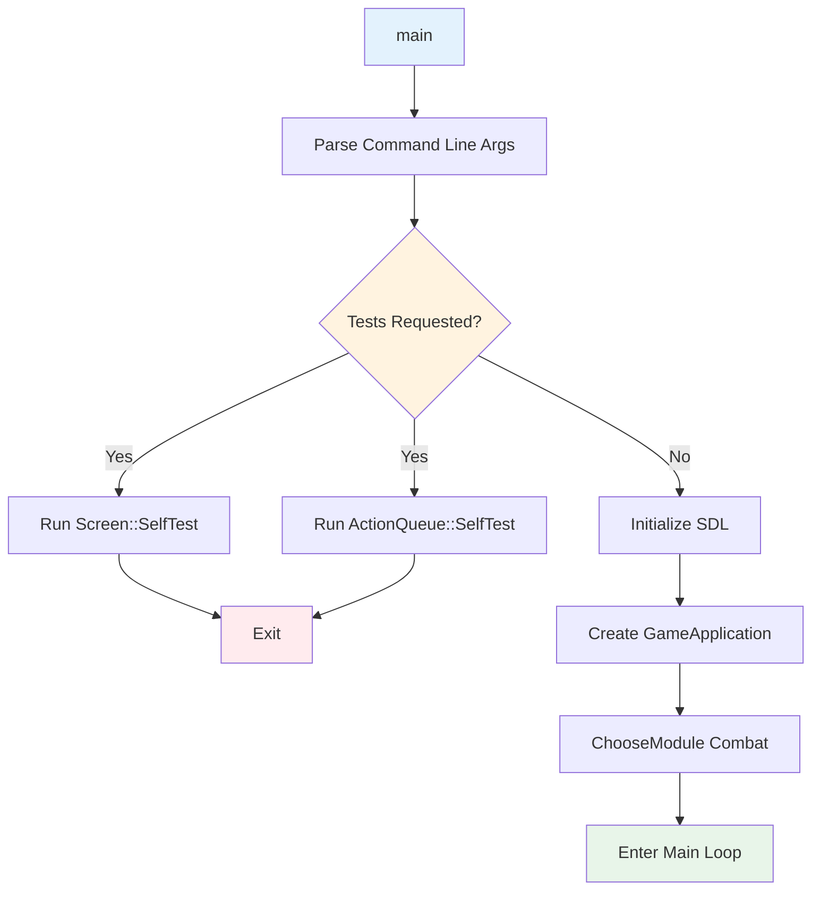

### 6.2 Main Game Loop

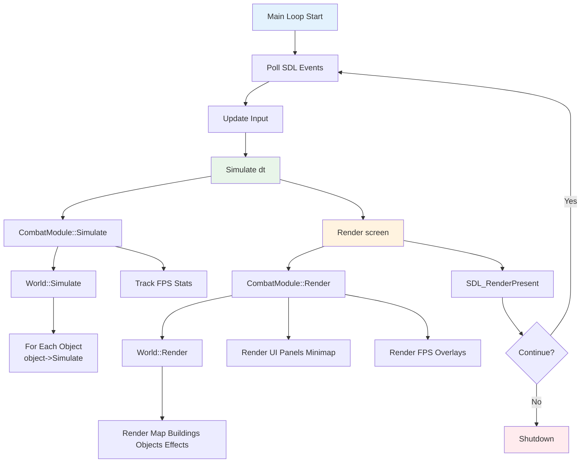

### 6.3 Detailed Execution Flow

```
1. main()
   └── Parse command-line arguments (--test-screen, --test-actionqueue, --test-all)
   └── Run requested SelfTests (Screen, ActionQueue)
   └── If tests run, exit without starting game
   └── Initialize SDL (video, audio, timer)
   └── Create GameApplication
   └── ChooseModule(Combat)
   └── Run main loop

2. Game Loop (per frame, ~30 FPS simulation)
   └── Poll SDL Events (keyboard, mouse, window)
   └── Update() - Process input, update mouse states
   └── Simulate(dt) - Update game logic (33ms timestep)
   │   └── CombatModule::Simulate(dt)
   │       └── World::Simulate(dt)
   │           └── For each object: object->Simulate(dt, world)
   │       └── Track FPS and frame timing statistics
   └── Render(screen)
   │   └── CombatModule::Render(screen)
   │       └── World::Render(screen, clip)
   │           └── Render map, buildings, objects, effects
   │       └── Render UI panels, minimap
   │       └── Render FPS/stats overlays (if enabled)
   │       └── Render help text overlay (if enabled)
   └── SDL_RenderPresent()

3. Shutdown
   └── Cleanup managers and resources
   └── SDL_Quit()
```

**Key Characteristics**:
- **Fixed simulation timestep**: 33ms for consistent game logic
- **Variable frame rate**: Rendering adapts to display
- **Decoupled update/render**: Simulation runs independently of frame rate

---

## 7. Coordinate Systems

| System | Units | Origin | Description |
|--------|-------|--------|-------------|
| Screen | pixels | (0,0) top-left | Window coordinates |
| World | pixels | (0,0) top-left | Absolute map position |
| Tile | blocks | (0,0) top-left | 10x10 pixel grid |
| Mega-tile | 12x12 tiles | - | 120x120 pixel regions |

**Conversions**:
- World to Screen: `screen = world - cameraOrigin`
- World to Tile: `tile = world / 10`
- Tile to World: `world = tile * 10 + 5` (center of tile)

---

## 8. Time and Simulation

- **Simulation timestep**: 33ms (~30 updates/second)
- **Frame time**: Variable (rendering independent of simulation)
- **Animation timing**: Milliseconds per frame (33ms = ~30fps)
- **Weapon timing**: All times in milliseconds

```cpp
void Update() {
    long currentMillis = GetTickCount();
    if(currentMillis - oldMillis >= SIMULATION_TIMESTEP_MS) {
        _millis = currentMillis;
        _game->Simulate(SIMULATION_TIMESTEP_MS);  // long dt in milliseconds
    }
}
```

**Note**: The simulation timestep is 33ms (not 50ms as sometimes documented), giving approximately 30 updates per second.

---

## 9. Debug Rendering Flags and UI Toggles

The `WorldGlobals` struct includes debugging flags for visualizing game state, and CombatModule includes UI panel toggles:

**Debug Flags Location**: `src/application/Globals.h:151-159`
**UI Toggles Location**: `src/application/CombatModule.h:79-85`

### Debug Rendering Flags (F1-F4, F8-F10)

| Flag | F-Key | Description |
|------|-------|-------------|
| bRenderHelpText | **F1** | Show control help overlay |
| bRenderStats | **F2** | Show FPS and frame time |
| bRenderPaths | **F3** | Show movement paths |
| bWeaponFan | **F4** | Show weapon line-of-sight fan |
| bRenderBuildingOutlines/Interiors | **F8** | Cycle building display mode |
| bRenderElements | **F9** | Toggle terrain elements display |
| bRenderBoundingBoxes | **F10** | Show object bounding boxes |
| bRenderElevation | - | Show terrain elevation (no F-key) |

### UI Panel Toggles (F5-F7)

| Toggle | F-Key | Description |
|--------|-------|-------------|
| _showMiniMap | **F5** | Toggle minimap on/off |
| _showTeamPanel | **F6** | Toggle team/squad panel |
| _showUnitPanel | **F7** | Toggle unit details panel |

**Default Values** (constructor in Globals.h):
- Most debug flags default to `false` (off)
- `bRenderElements` defaults to `true` (show terrain features)
- All UI panels default to `true` (visible)

---

