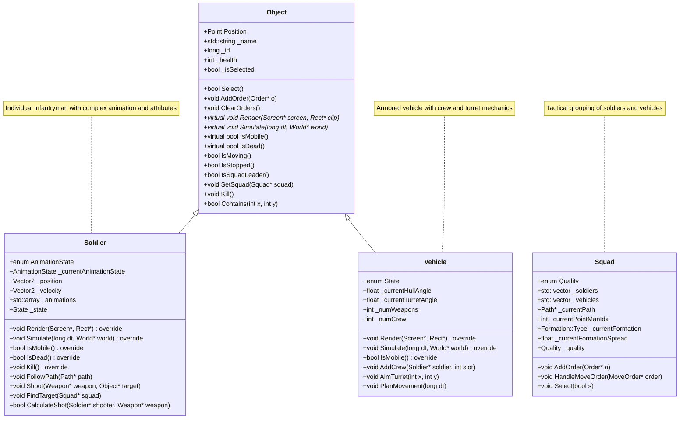
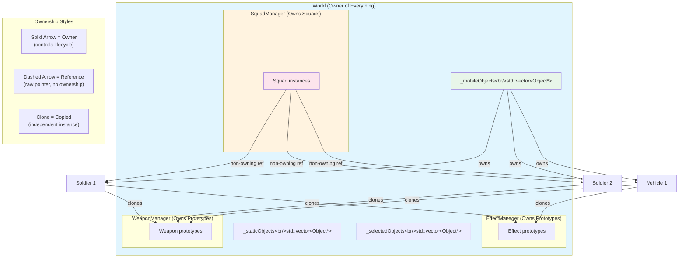
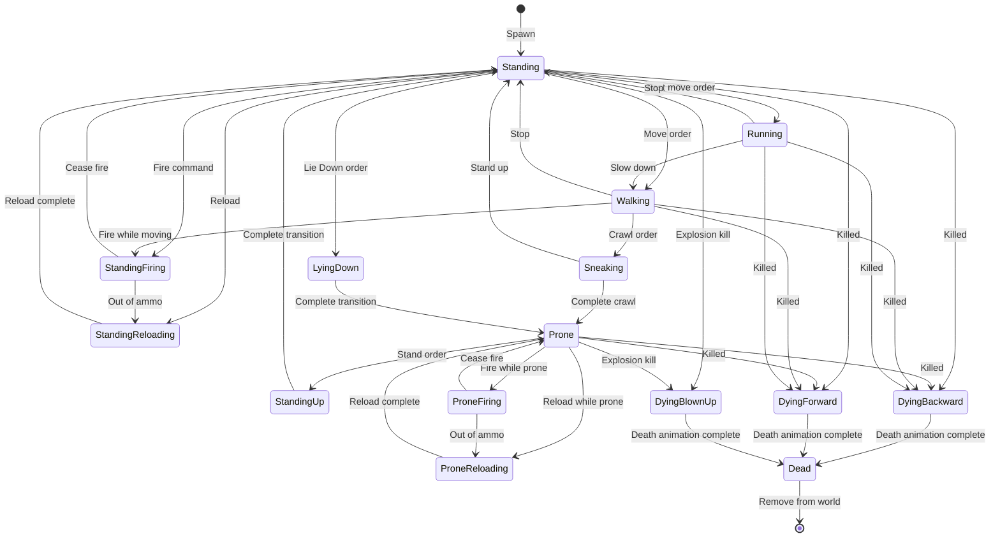
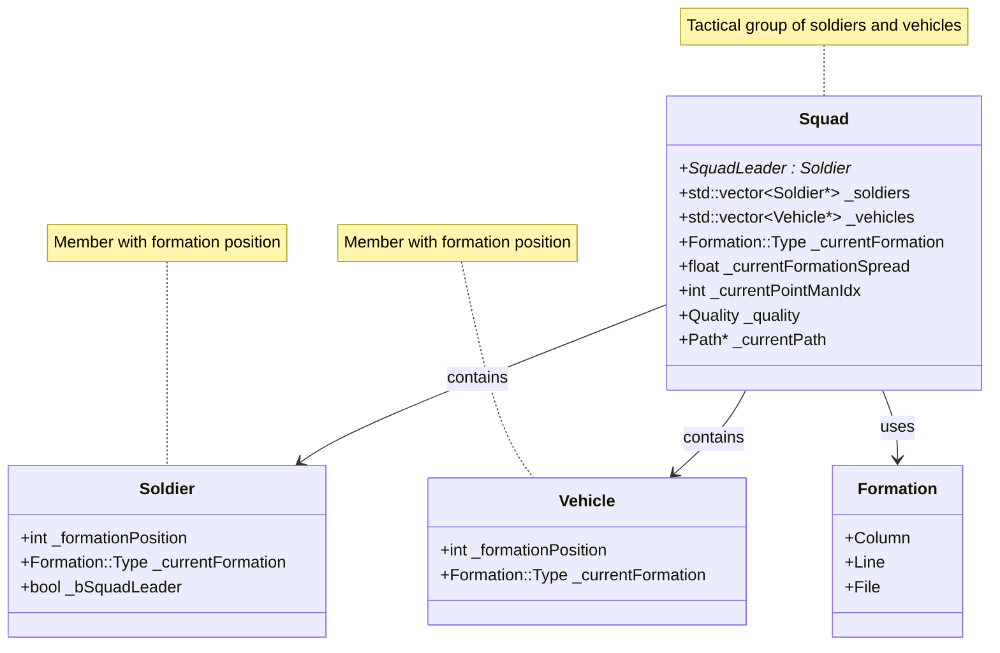
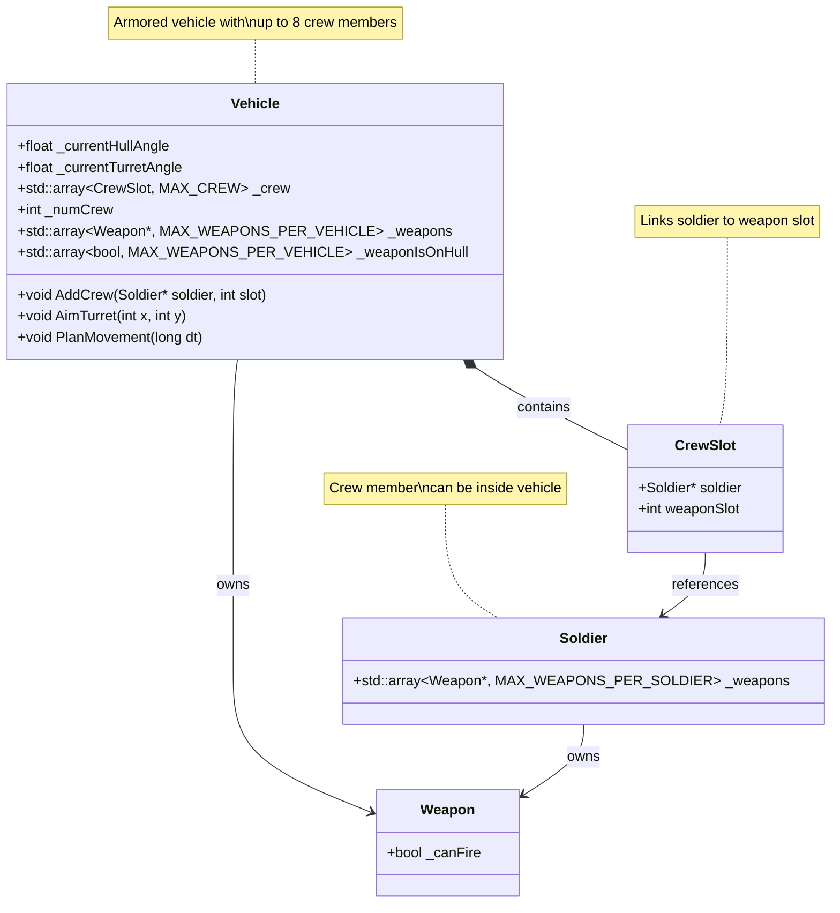

## 2. Object System

### 2.1 Overview: Game Entities

OpenCombat is a real-time tactical simulation where you command military units across a digital battlefield. This section describes the core entities that populate the game world and their roles in combat.

#### The Four Types of Game Entities

**Soldiers**  
Individual infantrymen—the fundamental combat unit. Each soldier is a distinct entity with:
- **Physical presence**: Position on the map, facing direction, posture (standing, prone)
- **Attributes**: Experience, morale, stamina, leadership ability
- **Equipment**: Up to 8 weapons with ammunition
- **States**: Moving, firing, reloading, taking cover, dying

**Vehicles**  
Armored fighting vehicles that operate differently from infantry:
- **Crew-based**: Requires soldiers to operate (driver, gunner, commander)
- **Turret mechanics**: Hull and turret can rotate independently
- **Mount points**: Weapons mounted on hull vs. turret have different firing constraints
- **Movement**: Must align hull to direction of travel before moving

**Squads**  
Tactical groupings that bind soldiers and vehicles together:
- **Command structure**: One soldier designated as squad leader
- **Formation following**: Members maintain relative positions (column, line, file)
- **Shared orders**: Orders given to the squad propagate to all members
- **Quality rating**: Affects overall unit performance

**The Object Base**  
The common foundation that all game entities share:
- **Identity**: Unique ID, name, icon
- **Position**: Location in world coordinates
- **Selection**: Click-to-select for player control
- **Orders**: Queue of commands to execute
- **Health**: Damage tracking (0-100)

#### Why This Hierarchy Matters

Understanding the relationships helps you write correct code:

- **Soldiers and Vehicles are Objects** → They inherit common functionality
- **Squads contain Soldiers/Vehicles** → But don't own them (World does)
- **Orders flow downward** → Squad orders become individual unit actions
- **State flows upward** → Individual unit states affect squad behavior

---

### 2.2 Class Hierarchy

The following class diagram shows the inheritance structure of all game objects:



---

### 2.3 Relationships and Ownership

#### Command Structure

The command hierarchy in OpenCombat follows military doctrine:

```
Player (you)
    │
    ├── Squad A (selected as a group)
    │   ├── Squad Leader (soldier)
    │   ├── Soldier 2
    │   ├── Soldier 3
    │   └── Vehicle 1 (with crew)
    │       ├── Driver (soldier)
    │       └── Gunner (soldier)
    │
    └── Squad B
        └── ...
```

**Key Points**:
- You give orders to **Squads**, not individual soldiers
- The squad leader influences how orders are interpreted
- Vehicle crew are still soldiers—they can exit and fight on foot

#### Object Ownership

Understanding memory ownership prevents crashes and memory leaks:

**The World Owns Everything Mobile**  
The `World` class is the ultimate owner of all game objects:
- Creates soldiers and vehicles when scenarios load
- Stores them in `std::vector<Object*> _mobileObjects`
- Destroys them when the scenario ends
- Never delete a soldier or vehicle yourself—the World handles it

**SquadManager Owns Squads**  
- Creates squads from templates
- Manages squad lifecycle (creation, destruction)
- Squads are destroyed when the scenario ends

**Squads Reference But Don't Own**  
Squads hold pointers to their members, but:
- If a soldier dies, the Squad updates its list
- If a squad is destroyed, soldiers continue to exist (they just become unassigned)
- This is why we use raw pointers (`std::vector<Soldier*>`) not `unique_ptr`

**Weapons Are Copied**  
- WeaponManager owns weapon prototypes
- When equipping a soldier, we **clone** the weapon (deep copy)
- Each soldier has their own weapon instance

**Orders Are Shared**  
- Orders use reference counting because multiple objects may receive the same order
- Always call `order->IncrementRefCount()` before adding to a queue
- Call `order->Release()` when removing from queue

#### Ownership Diagram

The following diagram visualizes ownership and reference relationships:



**Traditional Text View:**

```
World (Owner)
├── _mobileObjects (std::vector<Object*> owns Soldiers and Vehicles)
│   ├── Soldier instances (created by World)
│   └── Vehicle instances (created by World)
│
├── SquadManager (member, creates/owns Squads)
│   └── Squad instances
│       └── Squad::_soldiers (std::vector<Soldier*> - non-owning refs)
│       └── Squad::_vehicles (std::vector<Vehicle*> - non-owning refs)
│
├── WeaponManager (member, owns Weapon prototypes)
│   └── Weapons assigned to Soldiers/Vehicles (copies/clones)
│
└── EffectManager (member, owns Effect prototypes)
    └── Effects cloned into Objects (owned by Object via unique_ptr)

Object (owns)
├── _effects (std::vector<std::unique_ptr<Effect>>)
├── _orders (std::deque<Order*> - ref counted, not owned)
└── _actionQueue (std::deque<Action*> - raw ptrs, manual delete)
```

---

### 2.3 State Management

#### Unit States

**Animation States (Visual)**  
These control what the soldier looks like. The state machine transitions between these states:



| State | Description |
|-------|-------------|
| Standing | Idle upright posture |
| Prone | Lying on ground |
| Walking | Walking animation |
| Sneaking | Crawling/sneaking |
| Running | Running animation |
| StandingFiring | Firing while standing |
| ProneFiring | Firing while prone |
| StandingReloading | Reloading while standing |
| ProneReloading | Reloading while prone |
| DyingBlownUp | Death by explosion |
| DyingBackward | Falling backward |
| DyingForward | Falling forward |
| Dead | Static corpse |
| StandingUp | Transition: prone → standing |
| LyingDown | Transition: standing → prone |

Each state has 8 directional variants (South, SouthWest, West, NorthWest, North, NorthEast, East, SouthEast).

**Logical States (Behavior)**  
These are bitflags that can be combined:

| State | Meaning |
|-------|---------|
| Standing | Currently upright |
| Prone | Currently on ground |
| Stopped | Not moving |
| Moving | In motion |
| Firing | Currently firing weapon |
| Walking | Using walking speed |
| Running | Using running speed |
| Crawling | Moving while prone |
| Reloading | Reloading weapon |
| Dead | Deceased |
| Defending | In defensive posture |
| Ambushing | In ambush mode |
| FollowingInFormation | Moving in formation |

A soldier can be in multiple states simultaneously: "Prone + Firing + Defending" = lying down shooting in defensive mode.

**Vehicle States**  
Simpler than soldiers (vehicles don't have complex postures):
- Stopped
- Moving  
- Firing

---

### 2.4 The Formation System

#### Purpose of Formations

In tactical warfare, formations control how units move and fight:

- **Column**: Single file—good for traveling, bad for fighting
- **Line**: Extended line—good for fighting, slow to move
- **File**: Tight single file—good for dense terrain (woods, urban)

In OpenCombat, formations solve a critical problem: **How do you move a group of units together without them bunching up or wandering off?**

#### How Formation Following Works

When you order a squad to move:

1. **Path Calculation**: The squad leader (point man) gets a path calculated
2. **Formation Assignment**: Each squad member is assigned a formation position (0, 1, 2, 3...)
3. **Relative Positioning**: Instead of following the path directly, members calculate where they should be relative to the leader
4. **Dynamic Adjustment**: As the leader moves, followers continuously adjust to maintain formation

**Example: Column Formation**
```
Leader moves here ──────►
    │
    Member 1 follows at offset (-20, 0)
    │
    Member 2 follows at offset (-40, 0)
    │
    Member 3 follows at offset (-60, 0)
```

**Example: Line Formation**
```
        Member 2
           │
Member 1 ─ Leader ─ Member 3
           │
        Member 4
```

The `formationSpread` parameter controls how far apart units are.

#### Squad Composition



#### Implementation Details

```cpp
// Each member stores:
Formation::Type _currentFormation;    // Column, Line, or File
float _currentFormationSpread;        // Distance between units
int _formationPosition;               // Position in formation (0=leader)

// When following, members calculate their destination based on:
// - Leader's current position
// - Formation type
// - Formation spread
// - Their position index
```

---

### 2.5 Object Base Class Implementation

**Location**: `src/objects/Object.h`, `src/objects/Object.cpp`

Now that we understand the concepts, let's look at the implementation.

#### What It Is

The `Object` class is the abstract base for all game entities. It defines what every unit can do:
- Exist at a position in the world
- Be selected by the player
- Receive and execute orders
- Take damage and die
- Display visual effects

#### How It Works

**Selection Hit Testing**  
When you click on the map, the game needs to know what you clicked:

1. Cast a horizontal ray from the click position to the right
2. Count how many times the ray crosses the object's boundary edges
3. If the count is odd, the point is inside (odd-even rule)

```cpp
bool Object::Contains(int x, int y) {
    Region r;
    r.points[0].x = _minBounds.x0; r.points[0].y = _minBounds.y0;
    r.points[1].x = _minBounds.x1; r.points[1].y = _minBounds.y0;
    r.points[2].x = _minBounds.x1; r.points[2].y = _minBounds.y1;
    r.points[3].x = _minBounds.x0; r.points[3].y = _minBounds.y1;
    return Screen::PointInRegion(x, y, &r);
}
```

**Order Queue Management**  
Orders are stored in a queue and executed sequentially:
1. Add order to back of queue (`AddOrder`)
2. Insert order at specific position (`InsertOrder`)
3. Clear all orders (`ClearOrders`)
4. Derived classes process orders in `Simulate()`

#### Implementation

```cpp
class Object {
public:
    // Position in world coordinates
    Point Position;
    
    // Linked list for spatial partitioning
    Object* NextObject;
    Object* PrevObject;
    
    // Pure virtual methods
    virtual void Render(Screen* screen, Rect* clip) = 0;
    virtual void Simulate(long dt, World* world) = 0;
    virtual bool IsMobile() { return false; }
    
    // Selection
    virtual bool Select(int x, int y);
    virtual void Select(bool s) { _isSelected = s; }
    virtual bool IsSelected() { return _isSelected; }
    virtual bool Contains(int x, int y);
    
    // Orders (reference counted)
    virtual void AddOrder(Order* o);
    virtual void InsertOrder(Order* o, int i);
    virtual void ClearOrders();
    
    // Capabilities
    bool CanMove();
    bool CanFire();
    bool CanDefend();
    bool CanSneak();
    bool CanAmbush();
    bool CanSmoke();
    bool CanMoveFast();
    
    // Identity
    long GetID();
    const std::string& GetName();
    const std::string& GetIconName();
    
    // Squad
    Squad* GetSquad();
    void SetSquadLeader(bool v);
    bool IsSquadLeader();
    
    // Target
    Target::Type GetType();
    
    // State
    bool IsMoving();
    bool IsPathComplete();
    bool IsStopped();
    Direction GetHeading();
    
    // Highlight
    virtual void Highlight(Color* color);
    virtual void UnHighlight();
    
    // Life/death
    virtual bool IsDead() { return true; }
    virtual void Kill() {}
    
    // Interface
    virtual void UpdateInterfaceState(InterfaceState* state, int teamIdx, int unitIdx) = 0;

protected:
    bool _isSelected;
    Bounds _minBounds;
    
    // Capability flags (set from XML)
    bool _canFire;
    bool _canMove;
    bool _canMoveFast;
    bool _canSneak;
    bool _canDefend;
    bool _canAmbush;
    bool _canSmoke;
    
    // Order queue (reference counted)
    std::deque<Order*> _orders;
    
    // Action queue (owned, deleted when processed)
    std::deque<Action*> _actionQueue;
    
    // Visual effects (owned via unique_ptr)
    std::vector<std::unique_ptr<Effect>> _effects;
    
    // Identity
    std::string _iconName;
    std::string _name;
    long _id;
    
    // Combat
    int _health;
    Object* _currentTarget;
    Target::Type _currentTargetType;
    int _currentTargetX, _currentTargetY;
    
    // State
    Direction _currentHeading;
    bool _moving;
    bool _pathComplete;
    bool _bSquadLeader;
    bool _bHighlight;
    Color _highlightColor;
    
    // Relationships
    Squad* _currentSquad;
    int _currentTeamID;
    Element* _currentTileElement;
    
    Target::Type _type;
};
```

---

### 2.6 Soldier Class Implementation

**Location**: `src/objects/Soldier.h`, `src/objects/Soldier.cpp`

#### What It Is

An individual soldier—your basic tactical unit. Soldiers are the most complex entities because they have:
- Complex animation states (15 different animations)
- Detailed attributes (8 ratings affecting behavior)
- Multiple weapons (up to 8)
- Sophisticated movement physics
- 22 different action types

#### How It Works

**Animation System**  
Soldiers have separate animations for each state and direction:

1. Current state determines which animation to play
2. Current heading determines which directional variant
3. Animation frames are played sequentially
4. Some animations loop (walking), others play once (dying)

```cpp
void Soldier::Render(Screen* screen, Rect* clip) {
    if(_animations[_currentAnimationState] != nullptr) {
        _animations[_currentAnimationState]->Render(
            screen, 
            _currentHeading,  // Direction selects frame set
            Position.x - screen->Origin.x, 
            Position.y - screen->Origin.y, 
            _bHighlight, 
            &_highlightColor, 
            _camoIdx
        );
    }
}
```

**Movement Physics**  
Soldiers use vector-based movement with acceleration:

1. Calculate heading angle from direction enum
2. Apply acceleration in that direction
3. Cap velocity at maximum speed for current movement type
4. Update position based on velocity
5. Convert floating-point position to integer screen coordinates

```cpp
// Accelerate toward heading
_velocity.x -= accel * dt * sin(headingAngle) / 1000.0f;
_velocity.y += accel * dt * cos(headingAngle) / 1000.0f;

// Cap at max speed
if(_velocity.Magnitude() > maxSpeed) {
    _velocity.Normalize();
    _velocity.Multiply(maxSpeed);
}

// Update position
_position.x += _velocity.x * dt * PixelsPerMeter / 1000.0f;
_position.y += _velocity.y * dt * PixelsPerMeter / 1000.0f;

// Sync integer Position
Position.x = static_cast<int>(_position.x);
Position.y = static_cast<int>(_position.y);
```

**Action Processing**  
Actions are immediate commands (unlike orders which are strategic):

1. Actions stored in `_actionQueue` deque
2. Each frame, process actions from front of queue
3. Action handlers perform the actual work
4. Action is deleted after processing

```cpp
// 22 action types with dedicated handlers
std::array<SoldierActionHandlers::SoldierActionHandler, 
           SoldierAction::NumActions> _actionHandlers;
```

Actions include: Fire, Run, Walk, Crawl, Stand, Lie Down, Stop, Reload, Find Cover, Follow, Defend, Ambush, Wait, etc.

**Death Handling**  
When a soldier dies:

1. Randomly select one of three death animations
2. Set state to Dying (prevents further actions)
3. Play death sound
4. Eventually transition to Dead state
5. Squad is notified to remove from formation

#### Implementation

```cpp
class Soldier : public Object {
public:
    // Animation states
    enum AnimationState {
        Standing = 0, Prone, Walking, Sneaking, Running,
        StandingFiring, ProneFiring, StandingReloading, ProneReloading,
        DyingBlownUp, DyingBackward, DyingForward, Dead,
        StandingUp, LyingDown, NumStates
    };
    
    // Core methods
    void Render(Screen* screen, Rect* clip) override;
    void Simulate(long dt, World* world) override;
    bool IsMobile() override { return true; }
    bool IsDead() override;
    void Kill() override;
    
    // Movement
    void FollowPath(Path* path, SoldierAction::Action movementStyle);
    void Follow(Object* object, Formation::Type formationType, 
                float formationSpread, int formationIdx, 
                SoldierAction::Action movementStyle);
    
    // Combat
    void Shoot(Weapon* weapon, Object* target, Target::Type targetType, 
               int targetX, int targetY);
    bool CalculateShot(Soldier* shooter, Weapon* weapon);
    Soldier* FindTarget(Squad* squad);

protected:
    // Animation storage (15 states)
    std::array<Animation*, NumStates> _animations;
    AnimationState _currentAnimationState;
    
    // Logical state (bitflags)
    State _state;
    
    // Position (high precision)
    Vector2 _velocity;
    Vector2 _position;
    
    // Movement parameters
    float _runningAccel;
    float _walkingAccel;
    float _walkingSlowAccel;
    float _crawlingAccel;
    
    // Weapons
    std::array<Weapon*, MAX_WEAPONS_PER_SOLDIER> _weapons;
    std::array<int, MAX_WEAPONS_PER_SOLDIER> _weaponsNumClips;
    int _currentWeaponIdx;
    int _numWeapons;
    
    // Action handlers
    std::array<SoldierActionHandlers::SoldierActionHandler, 
               SoldierAction::NumActions> _actionHandlers;
    
    // Attributes (0-100)
    struct {
        Rating Aggressiveness;
        Rating Leadership;
        Rating Charisma;
        Rating Knowledge;
        Rating Experience;
        Rating Intelligence;
        Rating Morale;
        Rating Stamina;
    } Attributes;
};
```

---

### 2.7 Vehicle Class Implementation

**Location**: `src/objects/Vehicle.h`, `src/objects/Vehicle.cpp`

#### What It Is

An armored vehicle with distinct characteristics from infantry:
- **Crew requirement**: Needs soldiers to operate
- **Turret mechanics**: Can aim independently of hull direction
- **Weapon mounting**: Guns on hull vs. turret have different constraints
- **Armor**: (Currently damage calculation is not fully implemented)

#### How It Works

**Hull/Turret Rotation**  
Vehicles must align before firing:

1. Calculate angle to target
2. Determine if hull or turret (or both) need to rotate
3. Choose shortest rotation direction (clockwise vs. counterclockwise)
4. Rotate at defined rate (different for hull vs. turret)
5. Snap to target angle when close enough

```cpp
// Rotation physics
_currentTurretAngle += _turretRotationDirection * dt * 2PI / (16 * _turretRotationRate);

// Snap when close
if(_currentTurretAngle <= (_turretTargetAngle + DA) && 
   _currentTurretAngle >= (_turretTargetAngle - DA)) {
    _turretRotating = false;
    _currentTurretAngle = _turretTargetAngle;
}
```

**Movement**  
Different physics from infantry:

1. Must align hull to destination before moving
2. Accelerate in hull facing direction
3. Cap at max speed (road vs. cross-country)
4. Cannot move sideways (unlike infantry)

```cpp
// Accelerate in heading direction
_velocity.x += -_acceleration * secs * sin(_currentHullAngle);
_velocity.y += -_acceleration * secs * cos(_currentHullAngle);

// Cap at max road speed
if(_velocity.Magnitude() > _maxRoadSpeed) {
    _velocity.Normalize();
    _velocity.Multiply(_maxRoadSpeed);
}
```

**Crew Management**  
Crew members are assigned to weapon slots:



```cpp
struct CrewSlot {
    Soldier* soldier;
    int weaponSlot;  // Which weapon this crewman fires
};

std::array<CrewSlot, MAX_CREW> _crew;
```

When the vehicle fires, the appropriate crewman triggers the weapon.

**Combat Status**  
⚠️ **Important**: Vehicle combat is partially implemented:
- Vehicles CAN fire and show effects
- Vehicles CANNOT currently deal damage (CalculateShot not implemented)
- Soldiers CANNOT target vehicles (no Target::Vehicle case)

See `docs/VEHICLE_COMBAT_IMPLEMENTATION_PLANS.md` for implementation options.

#### Implementation

```cpp
class Vehicle : public Object {
public:
    enum State { Stopped = 0, Moving, Firing, NumStates };
    
    void Render(Screen* screen, Rect* clip) override;
    void Simulate(long dt, World* world) override;
    bool IsMobile() override { return true; }
    
    // Crew management
    void AddCrew(Soldier* soldier, int slot);
    
    // Aiming
    void AimTurret(int x, int y);
    void AimTurret(Direction dir);
    
    // Movement
    void PlanMovement(long dt);

protected:
    // Rotation
    float _currentHullAngle;
    float _currentTurretAngle;
    int _turretRotationRate;
    int _hullRotationRate;
    bool _turretRotating;
    bool _hullRotating;
    float _turretTargetAngle;
    float _hullTargetAngle;
    float _turretRotationDirection;
    float _hullRotationDirection;
    
    // Graphics
    TGA* _hullGraphics;
    TGA* _turretGraphics;
    TGA* _wreckGraphics;
    Point _turretPosition;
    Point _muzzlePosition;
    
    // Movement
    Point _destination;
    Point _shortDestination;
    
    // Weapons
    std::array<Weapon*, MAX_WEAPONS_PER_VEHICLE> _weapons;
    std::array<int, MAX_WEAPONS_PER_VEHICLE> _weaponsNumClips;
    std::array<bool, MAX_WEAPONS_PER_VEHICLE> _weaponIsOnHull;
    int _numWeapons;
    
    // Crew
    std::array<CrewSlot, MAX_CREW> _crew;
    int _numCrew;
};
```

---

### 2.8 Squad Class Implementation

**Location**: `src/objects/Squad.h`, `src/objects/Squad.cpp`

#### What It Is

A tactical grouping of soldiers and vehicles that operate as a unit. Squads solve the coordination problem—instead of controlling 8 individual soldiers, you control one squad.

Key responsibilities:
- Maintain formation during movement
- Distribute orders to members
- Track squad leader
- Display quality rating

#### How It Works

**Order Distribution**  
Different order types propagate differently:

- **Move/Fast/Sneak Orders**:
  1. Squad calculates path to destination
  2. Point man (formation position 0) gets FollowPath order
  3. Other members get FollowInFormation order targeting the point man
  4. Formation system maintains relative positions

- **Ambush/Defend Orders**:
  1. Squad handles soldier ordering directly
  2. Soldiers are positioned according to tactical AI
  3. Each soldier receives individual orders

- **Fire Orders**:
  1. Target is set for all squad members
  2. Each member engages independently based on their capabilities

- **Stop Orders**:
  1. Clear orders at squad level
  2. Clear orders at all member levels

**Formation Selection**  
```cpp
void Follow(Object* object, Formation::Type formationType, 
            float formationSpread, int formationIdx, 
            SoldierAction::Action movementStyle);
```

Members continuously recalculate their desired position based on:
- Leader's current position and heading
- Formation type (Column, Line, File)
- Formation spread (distance multiplier)
- Their formation index (position in formation)

**Point Man System**  
Only the point man (formation position 0) follows the path directly. This ensures:
- Pathfinding only happens once per squad
- Formation is maintained even on winding paths
- Units don't bunch up at waypoints

#### Implementation

```cpp
class Squad {
public:
    enum Quality {
        Useless = 0, Fragile, Weak, Average, Good, Strong, NumQuality
    };
    
    // Composition (non-owning references)
    std::vector<Soldier*> _soldiers;
    std::vector<Vehicle*> _vehicles;
    
    // Order handling
    void AddOrder(Order* o);
    void HandleMoveOrder(MoveOrder* order, SoldierAction::Action movementStyle, 
                         Mark::Color markColor);
    void HandleAmbushOrder(AmbushOrder* order);
    void HandleDefendOrder(DefendOrder* order);
    
    // Path management
    Path* _currentPath;
    int _currentPointManIdx;
    
    // Formation
    Formation::Type _currentFormation;
    float _currentFormationSpread;
    int _formationPosition;
    
    // Visual
    bool _bShowMark;
    Mark::Color _markColor;
    bool _bMarkTargetPosition;
    
    // Quality
    Quality _quality;
    
    // Selection
    void Select(bool s);
    void Highlight(Color* color);
    void UnHighlight();
};
```

---

### 2.9 Memory Management Deep Dive

Now that you understand the object relationships, let's examine the memory management patterns in detail.

#### Pattern 1: Unique Pointer Ownership (Effects)

Effects are owned by individual objects and cleaned up automatically:

```cpp
// Declaration in Object class
std::vector<std::unique_ptr<Effect>> _effects;

// Adding an effect
void Object::AddEffect(Effect* effect) {
    _effects.push_back(std::unique_ptr<Effect>(effect));
}

// No manual cleanup needed!
// Effects are automatically deleted when:
// 1. The effect finishes and is removed from the vector
// 2. The Object is destroyed
```

**Why unique_ptr?**  
- Effects belong to one object only
- Automatic cleanup prevents memory leaks
- Exception-safe

#### Pattern 2: Reference Counting (Orders)

Orders can be shared between objects (e.g., multiple squad members receiving the same move order):

```cpp
// Order.h - Reference counting interface
class Order {
public:
    inline void Release() { 
        --_refCount; 
        if(_refCount <= 0) { 
            delete this; 
        } 
    }
    inline void IncrementRefCount() { ++_refCount; }
private:
    int _refCount = 1;  // Start with 1 reference
};

// Adding an order to an object
void Object::AddOrder(Order* o) {
    o->IncrementRefCount();  // Take shared ownership
    _orders.push_back(o);
}

// Removing an order
void Object::ClearOrders() {
    while(!_orders.empty()) {
        Order* o = _orders.front();
        _orders.pop_front();
        o->Release();  // Release reference, delete if last
    }
}
```

**CRITICAL RULE**: Never add the same order to multiple objects without calling `IncrementRefCount()` for each.

#### Pattern 3: Manual Ownership (Actions)

Actions are created by soldiers and deleted after processing:

```cpp
// Action is a simple struct
struct Action {
    int Index;      // Index into global actions array
    void* Data;     // Action-specific data
};

// Actions are stored in deque
std::deque<Action*> _actionQueue;

// Adding an action (soldier creates it)
void Soldier::AddAction(int actionIndex, void* data) {
    Action* action = new Action();
    action->Index = actionIndex;
    action->Data = data;
    _actionQueue.push_back(action);
}

// Processing and deletion (in Simulate)
while(!_actionQueue.empty()) {
    Action* action = _actionQueue.front();
    _actionQueue.pop_front();
    
    // Process the action
    _actionHandlers[action->Index](this, action->Data);
    
    // Delete after processing
    delete action;
}
```

**Why manual delete?**  
- Actions are ephemeral (processed once then discarded)
- No sharing needed
- Raw pointers are simpler for this use case

#### Pattern 4: Non-Owning References (Squad Members)

Squads reference but don't own their members:

```cpp
// Squad holds raw pointers
std::vector<Soldier*> _soldiers;
std::vector<Vehicle*> _vehicles;

// Adding a member (no ownership transfer)
void Squad::AddSoldier(Soldier* soldier) {
    _soldiers.push_back(soldier);
    soldier->SetSquad(this);  // Tell soldier about squad
}

// Removing a member (e.g., soldier died)
void Squad::RemoveSoldier(Soldier* soldier) {
    auto it = std::find(_soldiers.begin(), _soldiers.end(), soldier);
    if(it != _soldiers.end()) {
        _soldiers.erase(it);
    }
    // Soldier is NOT deleted here!
    // World owns the soldier and handles deletion
}
```

**Important**: Always check if pointers are valid before dereferencing. A soldier might die while a squad still references them.

---

### 2.10 Constants Reference

```cpp
// Object health
constexpr int HEALTH_MAX = 100;

// Soldier limits
constexpr int MAX_WEAPONS_PER_SOLDIER = 8;

// Vehicle limits
constexpr int MAX_WEAPONS_PER_VEHICLE = 8;
constexpr int MAX_CREW = 8;

// World limits
constexpr int MAX_UNITS = 16;   // Per squad
constexpr int MAX_SQUADS = 32;

// Animation
// AnimationState::NumStates = 15 (Standing=0 to LyingDown=14)
// SoldierAction::NumActions = 22 (StandingFire=0 to Wait=21)
// Direction::NumDirections = 8 (South=0 to SouthEast=7)
// Formation::NumFormations = 3 (Column, File, Line)
// Squad::NumQuality = 6 (Useless to Strong)
```

---

### 2.11 Data Structure Summary

| Purpose | Class | Data Structure | Ownership |
|---------|-------|----------------|-----------|
| Mobile objects | World | `std::vector<Object*>` | World owns |
| Static objects | World | `std::vector<Object*>` | World owns |
| Selected objects | World | `std::vector<Object*>` | Non-owning refs |
| Squad soldiers | Squad | `std::vector<Soldier*>` | Non-owning refs |
| Squad vehicles | Squad | `std::vector<Vehicle*>` | Non-owning refs |
| Orders | Object | `std::deque<Order*>` | Reference counted |
| Actions | Object | `std::deque<Action*>` | Manual delete |
| Effects | Object | `std::vector<std::unique_ptr<Effect>>` | Object owns |
| Animations | Soldier | `std::array<Animation*, NumStates>` | Soldier owns |
| Weapons | Soldier | `std::array<Weapon*, MAX_WEAPONS_PER_SOLDIER>` | Soldier owns |
| Action handlers | Soldier | `std::array<SoldierActionHandler, NumActions>` | Static/global |
| Weapons | Vehicle | `std::array<Weapon*, MAX_WEAPONS_PER_VEHICLE>` | Vehicle owns |
| Crew | Vehicle | `std::array<CrewSlot, MAX_CREW>` | Non-owning refs |
| Squad templates | SquadManager | `std::vector<SquadTemplate*>` | Manager owns |

---

*[Continue to Section 3: State Machine and Action System]*
