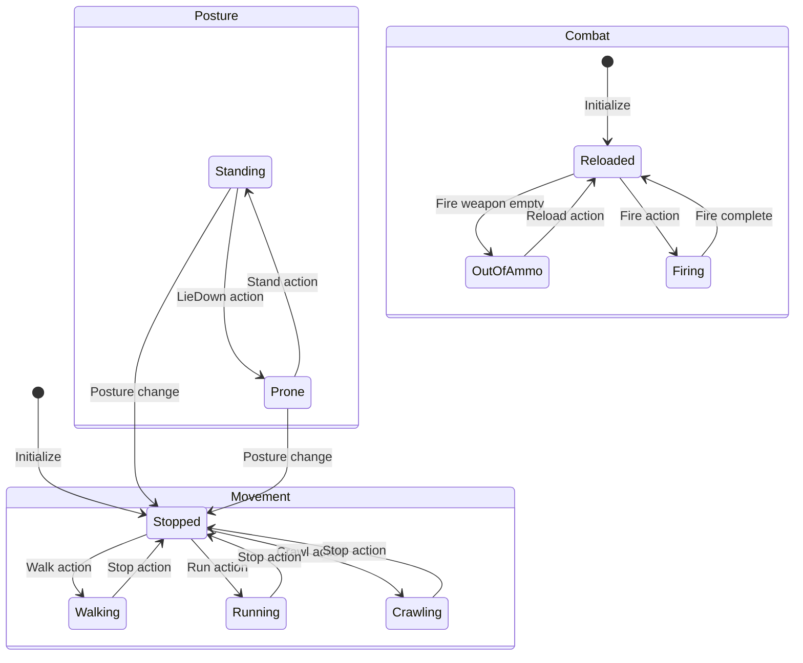
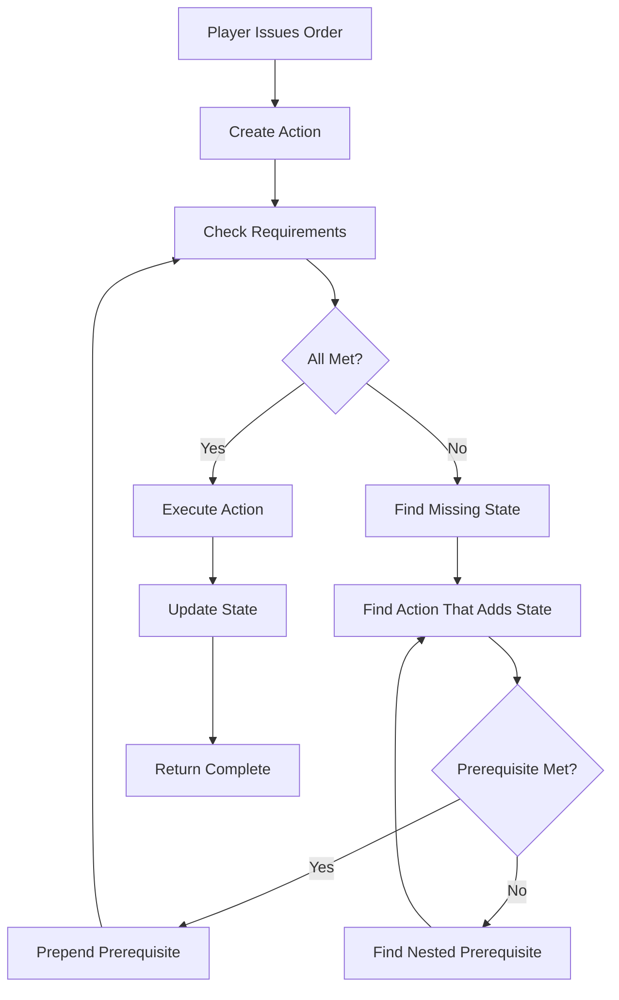
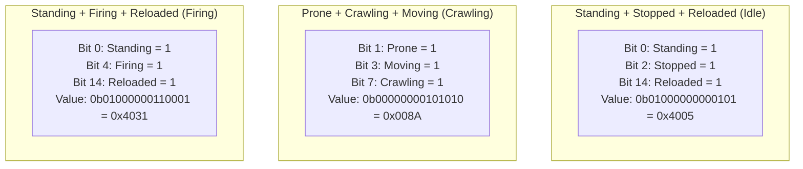
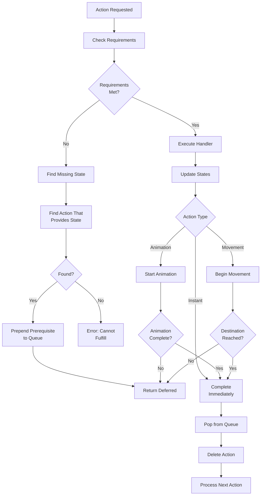
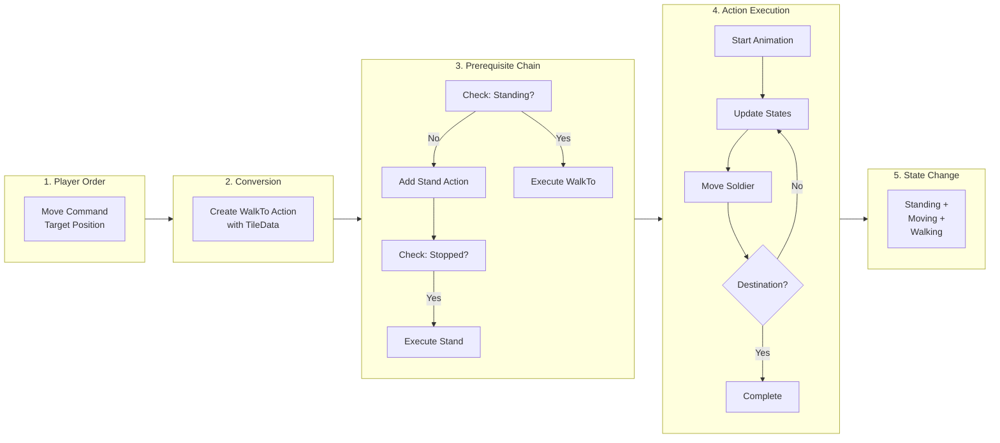
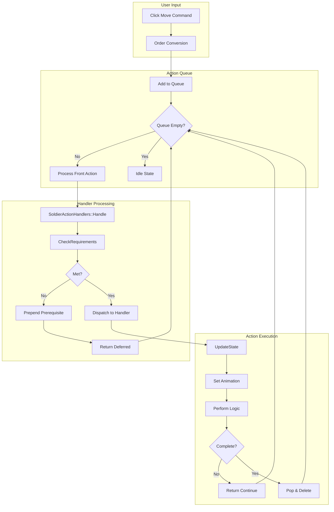
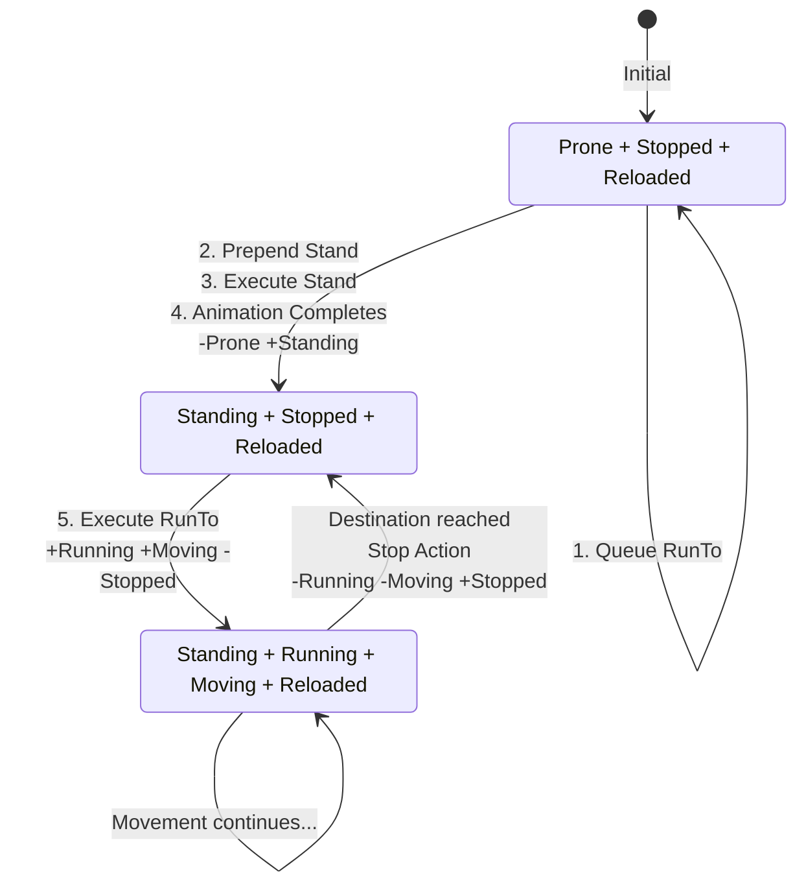

## 3. State Machine and Action System

---

### 3.1 Concept: What Are States?

In tactical simulations, game entities exist in various **states** that describe their current condition, posture, and activity. States represent the unit's current capabilities and limitations in the game world:

| State Type | Examples | Meaning |
|------------|----------|---------|
| **Posture** | Standing, Prone | Body position |
| **Movement** | Stopped, Moving, Walking, Running, Crawling | Current locomotion |
| **Activity** | Firing, Reloading | Active task |
| **Condition** | Reloaded, OutOfAmmo, Dead | Readiness status |
| **Behavior** | FindingCover, Defending, Following | Strategic behavior |

**A soldier can be in multiple states simultaneously.** For example:
- Standing + Stopped + Reloaded (soldier is idle, ready to fire)
- Prone + Moving + Crawling (soldier is crawling forward)
- Standing + Firing + OutOfAmmo (soldier tried to fire but is empty)

These combinations define what a unit *can* and *cannot* do at any moment, forming the foundation of the unit's AI behavior and game logic.

---

### 3.2 Concept: The State Machine

A **state machine** governs how units transition between valid combinations of states. It answers questions like:

- *Can a soldier fire while crawling?* (Yes - but with different animation/accuracy)
- *Can a soldier run while prone?* (No - must stand up first)
- *Can a soldier reload while moving?* (Depends on game design)

**State transitions follow rules:**

```
Current State: Prone, Stopped, Reloaded
Want to do:   Run to destination

Problem: Running requires Standing, but soldier is Prone
Solution: Must transition through intermediate states

Transition chain:
Prone → [Stand up] → Standing → [Start running] → Running
```

The state machine enforces these constraints automatically, preventing impossible actions and managing prerequisite transitions.

**State Transition Diagram:**



---

### 3.3 Concept: Commands vs Actions

The system uses a **two-tier command structure** similar to an RTS interface:

| Tier | Purpose | Example |
|------|---------|---------|
| **Commands** | High-level player orders | "Move squad to this position" |
| **Actions** | Low-level unit behaviors | "Walk to tile (15, 23)" |

**Why two tiers?**

1. **Commands** are abstract and strategic - players think in terms of objectives
2. **Actions** are concrete and executable - the simulation needs specific behaviors

**Example flow:**
```
Player clicks "Move here" on the map
        ↓
    Command created: MoveOrder(targetPos)
        ↓
    Command converted to Action: WalkTo(tileX, tileY)
        ↓
    Action added to unit's queue
        ↓
    State machine executes action, handling prerequisites
```

This separation allows complex commands (like "Find cover") to be decomposed into multiple actions without the player micromanaging each step.

---

### 3.4 Concept: Action Prerequisites

Most actions have **requirements** - states that must be present before the action can execute. When requirements are missing, the system automatically chains prerequisite actions.

**Example: "A soldier wants to run while prone"**

```
Current states: Prone, Stopped, Reloaded
Desired action: RunTo(destination)
Requirements for RunTo: Standing

Step 1 - Check requirements:
  ✗ Missing: Standing
  ✓ Have: Prone

Step 2 - Find action that adds Standing:
  Stand action: requires Stopped + Prone, adds Standing
  ✓ We have both requirements!

Step 3 - Prepend Stand to queue:
  Queue becomes: [Stand, RunTo]

Step 4 - Execute Stand:
  - Plays "standing up" animation
  - Updates state: -Prone, +Standing
  - Queue now: [RunTo]

Step 5 - Execute RunTo:
  ✓ Standing requirement met
  - Updates state: +Running, +Moving, -Stopped
  - Soldier begins running
```

This automatic chaining happens transparently - the player only issued "RunTo", but the unit intelligently stood up first.

**Prerequisite Chain Flow:**



---

### 3.5 Algorithm: State Representation

**Conceptually:** Each state is a boolean flag (true/false). With 23 states, we need 23 booleans per soldier.

**Efficient Implementation:** Pack all boolean states into a single 64-bit integer (bitfield).

```
Bit Position:  63 62 ... 5  4  3  2  1  0
                 |  |      |  |  |  |  |  |
State:         (unused)   Fi Mo St Pr St
                              
Bit 0 (0x0001): Standing
Bit 1 (0x0002): Prone
Bit 2 (0x0004): Stopped
Bit 3 (0x0008): Moving
Bit 4 (0x0010): Firing

Example: Soldier is Standing, Stopped, Reloaded
  Bits: 0b0001 (Standing) | 0b0100 (Stopped) = 0b0101 = 5
```

**Operations:**
- **Check state**: `(bits & (1 << stateIndex)) != 0`
- **Set state**: `bits |= (1 << stateIndex)`
- **Clear state**: `bits &= ~(1 << stateIndex)`

This allows checking/modifying multiple states simultaneously using bitwise operations.

**64-Bit State Bitfield:**

```mermaid
flowchart LR
    subgraph Bits["64-Bit State Bitfield (unsigned long long)"]
        direction LR
        B63["63<br/>Unused"] --- B32["..."] --- B22["22<br/>Waiting"] --- B21["21<br/>Ambushing"] --- B20["20<br/>Defending"] --- B19["19<br/>FollowingInFormation"] --- B18["18<br/>Following"] --- B17["17<br/>FindingCover"] --- B16["16<br/>NoTarget"] --- B15["15<br/>OutOfAmmo"] --- B14["14<br/>Reloaded"] --- B13["13<br/>Dead"] --- B12["12<br/>DyingForward"] --- B11["11<br/>DyingBackward"] --- B10["10<br/>DyingBlownUp"] --- B9["9<br/>Reloading"] --- B8["8<br/>Running"] --- B7["7<br/>Crawling"] --- B6["6<br/>WalkingSlow"] --- B5["5<br/>Walking"] --- B4["4<br/>Firing"] --- B3["3<br/>Moving"] --- B2["2<br/>Stopped"] --- B1["1<br/>Prone"] --- B0["0<br/>Standing"]
    end
    
    style B63 fill:#333,color:#fff
    style B32 fill:#333,color:#fff
    style B22 fill:#faa
    style B21 fill:#afa
    style B20 fill:#afa
    style B19 fill:#afa
    style B18 fill:#afa
    style B17 fill:#afa
    style B16 fill:#ffa
    style B15 fill:#ffa
    style B14 fill:#ffa
    style B13 fill:#faa
    style B12 fill:#faa
    style B11 fill:#faa
    style B10 fill:#faa
    style B9 fill:#aaf
    style B8 fill:#aff
    style B7 fill:#aff
    style B6 fill:#aff
    style B5 fill:#aff
    style B4 fill:#aaf
    style B3 fill:#aff
    style B2 fill:#aff
    style B1 fill:#afa
    style B0 fill:#afa
```



**Example State Combinations:**



---

### 3.6 Algorithm: Action Definitions

Each action is defined by:

| Property | Purpose |
|----------|---------|
| **Name** | Unique identifier (e.g., "Run", "Stand") |
| **Requirements** | States that must be present |
| **Adds** | States to set when action starts |
| **Subtracts** | States to clear when action starts |
| **Time** | Duration (-1 = animation-based, 0 = instant) |

**Example action definition (conceptual):**

```
Action: Stand
Requirements: Stopped, Prone
Adds: Standing
Subtracts: Prone, Firing
Time: -1 (animation-based)

Meaning: 
- Can only stand up if stopped and prone
- After standing: no longer prone, now standing
- Cannot fire while standing up
- Takes as long as the animation
```

**Prerequisite chain resolution:**

```
CheckRequirements(action, currentState):
    For each required state in action.Requirements:
        If not currentState.Has(required):
            // Find action that provides this state
            For each available action:
                If action.Adds contains required:
                    Return action  // This must run first
    Return null  // All requirements met
```

**Action System Flowchart:**



---

### 3.7 Implementation: State Class

**Location**: `src/states/State.h`, `src/states/State.cpp`

**⚠️ LIMIT**: Only 64 states (bits 0-63) can be stored. Current max state index: 22 (Waiting).

```cpp
class State {
private:
    unsigned long long _bits;  // 64 bits = 64 possible states (0-63)
    
public:
    State() : _bits(0) {}
    
    // Check if a specific bit is set
    bool IsSet(unsigned int state) {
        assert(state < 64);  // Must be 0-63
        uint64_t flag = 1ULL << state;
        return (_bits & flag) != 0;
    }
    
    // Set a specific bit
    void Set(unsigned int state) {
        assert(state < 64);
        uint64_t flag = 1ULL << state;
        _bits |= flag;
    }
    
    // Clear a specific bit
    void UnSet(unsigned int state) {
        assert(state < 64);
        uint64_t flag = 1ULL << state;
        _bits &= ~flag;
    }
};
```

**Example operations:**
```cpp
State state;
state.Set(SoldierState::Standing);    // _bits = 0b0001
state.Set(SoldierState::Stopped);     // _bits = 0b0101
state.IsSet(SoldierState::Prone);     // false
state.UnSet(SoldierState::Standing);  // _bits = 0b0100
```

---

### 3.8 Implementation: Soldier States

**Location**: `src/states/ObjectStates.h`, `config/SoldierStates.txt`

**⚠️ CRITICAL INCONSISTENCY**: The `Waiting` state (index 22) exists in the C++ enum but is **MISSING** from `SoldierStates.txt`. This means:
- The enum has 23 states (0-22)
- The config file only has 22 states (0-21)
- State indices after `Waiting` cannot be added without updating the config file

**State Configuration File Format** (`config/SoldierStates.txt`):
```
1: Standing             (index 0)
2: Prone                (index 1)
3: Stopped              (index 2)
4: Moving               (index 3)
5: Firing               (index 4)
6: Walking              (index 5)
7: WalkingSlow          (index 6)
8: Crawling             (index 7)
9: Running              (index 8)
10: Reloading           (index 9)
11: DyingBlownUp        (index 10)
12: DyingBackward       (index 11)
13: DyingForward        (index 12)
14: Dead                (index 13)
15: Reloaded            (index 14)
16: OutOfAmmo           (index 15)
17: NoTarget            (index 16)
18: FindingCover        (index 17)
19: Following           (index 18)
20: FollowingInFormation (index 19)
21: Defending           (index 20)
22: Ambushing           (index 21)
                          (index 22 - Waiting NOT in file!)
```

**C++ Enum** (`src/states/ObjectStates.h`):
```cpp
namespace SoldierState {
    enum State {
        Standing = 0,
        Prone = 1,
        Stopped = 2,
        Moving = 3,
        Firing = 4,
        Walking = 5,
        WalkingSlow = 6,
        Crawling = 7,
        Running = 8,
        Reloading = 9,
        DyingBlownUp = 10,
        DyingBackward = 11,
        DyingForward = 12,
        Dead = 13,
        Reloaded = 14,
        OutOfAmmo = 15,
        NoTarget = 16,
        FindingCover = 17,
        Following = 18,
        FollowingInFormation = 19,
        Defending = 20,
        Ambushing = 21,
        Waiting = 22    // ⚠️ NOT in SoldierStates.txt!
    };
}
```

**Important**: When adding new states:
1. Add to `SoldierStates.txt` first (1-indexed)
2. Add to C++ enum (0-indexed)
3. Ensure state index < 64 (64-bit limit)

---

### 3.9 Implementation: Action System

**Location**: 
- Action runtime: `src/states/Action.h`
- Action definitions: `src/states/ObjectActions.h/cpp`
- Action handlers: `src/objects/SoldierActionHandlers.h/cpp`
- Config: `config/SoldierActions.txt`

#### 3.9.1 Two Action Structures

The codebase uses **two different Action structs**:

**1. Runtime Action** (`src/states/Action.h`):
```cpp
struct Action {
    int Index;      // Index into global actions array
    void* Data;     // Action-specific data (TileData, FireActionData, etc.)
    
    Action(int index, void* data) : Index(index), Data(data) {}
};
```
Used for: Queued actions during gameplay

**2. Action Definition** (`src/states/ObjectActions.h`):
```cpp
struct ObjectActions::Action {
    std::string Name;           // Human-readable name
    std::string Group;          // Category (Fire, Move, etc.)
    long Time;                  // Duration (-1=animation-based, 0=instant)
    std::vector<StateIdx> Requirements;  // Required states
    std::vector<StateIdx> Adds;          // States to add
    std::vector<StateIdx> Subtracts;     // States to remove
};
```
Used for: Defining action properties loaded from config

#### 3.9.2 Action Definitions (SoldierActions.txt)

Tab-separated format:
```
Name                    Group   Time    Requirements                    Changes
--------------------------------------------------------------------------------
StandingFire            Fire    0       Stopped,Standing,Reloaded       +Firing,-NoTarget
ProneFire               Fire    0       Stopped,Prone,Reloaded          +Firing,-NoTarget
Run                     Move    0       Standing                        +Running,-Walking,-WalkingSlow,-Crawling,-Stopped,+Moving,-Firing
Walk                    Move    0       Standing                        +Walking,-Running,-WalkingSlow,-Crawling,-Stopped,+Moving,-Firing
WalkSlow                Move    0       Standing                        +WalkingSlow,-Walking,-Running,-Crawling,-Stopped,+Moving,-Firing
Crawl                   Move    0       Prone                           +Crawling,-Running,-Walking,-WalkingSlow,-Stopped,+Moving,-Firing
Stand                   Move    -1      Stopped,Prone                   -Prone,+Standing,-Firing
LieDown                 Move    -1      Stopped,Standing                -Standing,+Prone,-Firing
Stop                    Move    0       nil                             -Moving,+Stopped,-Firing,-Running,-Walking,-WalkingSlow,-Crawling,-FindingCover,-Following,-FollowingInFormation,-Defending,-Ambushing
DestinationReached      Move    0       Stopped                         nil
Reload                  Fire    0       nil                             +Reloaded
FindCover               Move    0       nil                             +FindingCover
Follow                  Move    0       nil                             +Following
FollowInFormation       Move    0       nil                             +FollowingInFormation
WalkTo                  Move    0       Standing                        +Walking,-Running,-WalkingSlow,-Crawling,-Stopped,+Moving,-Firing
RunTo                   Move    0       Standing                        +Running,-Walking,-WalkingSlow,-Crawling,-Stopped,+Moving,-Firing
WalkSlowTo              Move    0       Standing                        +WalkingSlow,-Walking,-Running,-Crawling,-Stopped,+Moving,-Firing
CrawlTo                 Move    0       Prone                           +Crawling,-Running,-Walking,-WalkingSlow,-Stopped,+Moving,-Firing
Turn                    Move    0       nil                             nil
Defend                  Fire    0       Prone                           +Defending
Ambush                  Fire    0       Prone                           +Ambushing
Wait                    Move    0       nil                             nil
```

**Column meanings**:
- **Name**: Unique action identifier (must match enum)
- **Group**: Logical category (Fire, Move)
- **Time**: Duration in ms (-1=animation-based, 0=instant)
- **Requirements**: Required states (comma-separated, "nil"=none)
- **Changes**: State modifications (+X adds, -X removes)

#### 3.9.3 Action Types (Enum)

```cpp
namespace SoldierAction {
    enum Action {
        StandingFire = 0,
        ProneFire,
        Run,
        Walk,
        WalkSlow,
        Crawl,
        Stand,
        LieDown,
        Stop,
        DestinationReached,
        Reload,
        FindCover,
        Follow,
        FollowInFormation,
        WalkTo,
        RunTo,
        WalkSlowTo,
        CrawlTo,
        Turn,
        Defend,
        Ambush,
        Wait,
        NumActions  // Must be last - total 22 actions
    };
}
```

#### 3.9.4 Action Queue Implementation

**⚠️ IMPORTANT**: Soldiers use `std::deque<Action*>` directly, NOT the `ActionQueue` class.

The `ActionQueue` class (`src/states/ActionQueue.h`) exists but is **not used** by soldiers. Soldiers use:

```cpp
// From src/objects/Object.h
std::deque<Action*> _actionQueue;
```

**ActionQueue class** (available but unused):
```cpp
class ActionQueue {
    std::vector<int> _data;  // Stores action indices only
    // ... circular buffer implementation
};
```

**Soldier action queue usage**:
```cpp
// Add action to back
soldier->_actionQueue.push_back(new Action(SoldierAction::WalkTo, tileData));

// Add prerequisite to front (automatic)
soldier->_actionQueue.push_front(new Action(prereqActionIdx, nullptr));

// Insert after current action
soldier->_actionQueue.insert(soldier->_actionQueue.begin() + 1, newAction);

// Process queue (from Soldier::Simulate())
if(!_actionQueue.empty()) {
    Action* action = _actionQueue.front();
    bool complete = SoldierActionHandlers::Handle(this, action, dt);
    if(complete) {
        _actionQueue.pop_front();
        delete action;  // ⚠️ Must manually delete!
    }
}
```

#### 3.9.5 Prerequisites System and Automatic Chaining

The prerequisites system automatically prepends required actions to the queue:

```cpp
bool SoldierActionHandlers::Handle(Soldier* soldier, Action* action, long dt) {
    // Check if requirements are met
    int prereqIdx = g_Globals->World.Actions.Soldiers.CheckRequirements(
        action->Index, &(soldier->_currentState));
    
    if(prereqIdx >= 0) {
        // Missing requirement - prepend prerequisite action
        soldier->_actionQueue.push_front(new Action(prereqIdx, nullptr));
        return false;  // Current action deferred
    }
    
    // All requirements met - dispatch to handler
    switch(action->Index) {
        case SoldierAction::WalkTo: 
            return WalkToActionHandler(soldier, action, dt);
        // ... other handlers
    }
}
```

**Requirements checking** (`src/states/ObjectActions.cpp`):
```cpp
int ObjectActions::CheckRequirements(ActionIdx actionID, State* srcState) {
    Action* action = &Actions[actionID];
    
    // Check each required state
    for(StateIdx reqState : action->Requirements) {
        if(!srcState->IsSet(reqState)) {
            // Find action that adds this state
            for(int i = 0; i < NumActions; i++) {
                for(StateIdx addState : Actions[i].Adds) {
                    if(reqState == addState) {
                        return i;  // Return prerequisite action index
                    }
                }
            }
        }
    }
    return -1;  // All requirements satisfied
}
```

**Example automatic chaining** (Prone → Run):
```
1. User orders RunTo (requires Standing)
   Current state: Prone, Stopped, Reloaded
   
2. CheckRequirements(RunTo):
   - Requires Standing ✗ (have Prone)
   - Find action that adds Standing: Stand
   - Return Stand index
   
3. Prepend Stand to queue
   Queue: [Stand, RunTo]
   Return false (action continues next frame)
   
4. Next frame: Process Stand (requires Stopped, Prone)
   Both requirements met → Execute Stand
   
5. Stand completes (animation-based)
   UpdateState: -Prone, +Standing
   
6. Next frame: Process RunTo (requires Standing)
   Requirement met → Execute RunTo
```

**Order to Action Flow:**



#### 3.9.6 State Updates

```cpp
void ObjectActions::UpdateState(ActionIdx actionID, State* state) {
    Action* action = &Actions[actionID];
    
    // Apply all additions
    for(StateIdx addState : action->Adds) {
        state->Set(addState);
    }
    
    // Apply all removals
    for(StateIdx subState : action->Subtracts) {
        state->UnSet(subState);
    }
}
```

---

### 3.10 Complete Example Walkthrough

**Scenario: Player orders a prone soldier to run to a destination**

**Step 1: Initial State**
```
Soldier states: Prone, Stopped, Reloaded
Action queue: empty
```

**Step 2: Order Conversion**
```
Player issues Move order
↓
Game creates RunTo action with TileData(destination)
↓
Action added to queue: [RunTo]
```

**Step 3: First Frame - Check Requirements**
```cpp
Handle(RunTo):
    CheckRequirements(RunTo):
        Requires: Standing
        Current: Prone ✗
        
    Find action adding Standing: Stand
    Prepend Stand to queue
    
    Queue: [Stand, RunTo]
    Return false (deferred)
```

**Step 4: Second Frame - Execute Stand**
```cpp
Handle(Stand):
    CheckRequirements(Stand):
        Requires: Stopped ✓, Prone ✓
        All met!
        
    StandActionHandler():
        Start "StandingUp" animation
        Return false (animation in progress)
```

**Step 5: Animation Completes (X frames later)**
```cpp
StandActionHandler():
    Animation finished
    UpdateState(Stand): -Prone, +Standing
    Return true (complete)

Queue: [RunTo]
```

**Step 6: Next Frame - Execute RunTo**
```cpp
Handle(RunTo):
    CheckRequirements(RunTo):
        Requires: Standing ✓
        All met!
        
    RunToActionHandler():
        UpdateState(RunTo): +Running, +Moving, -Stopped
        Start moving toward destination
        Return false (movement in progress)
```

**Step 7: Movement Completes**
```cpp
RunToActionHandler():
    Destination reached
    Return true (complete)

Queue: []
Soldier states: Standing, Running, Moving, Reloaded
```

**Step 8: Idle State**
```
Queue empty → Soldier idle
Animation: Running (but not moving)
```

---

### 3.11 Key Handler Implementations

**⚠️ STUB HANDLERS** - The following handlers are incomplete/stubs:

| Handler | Status | Location |
|---------|--------|----------|
| `StandingFireActionHandler` | Empty stub | SoldierActionHandlers.cpp:82 |
| `WalkSlowActionHandler` | Empty stub | SoldierActionHandlers.cpp:247 |
| `WalkSlowToActionHandler` | Empty stub | SoldierActionHandlers.cpp:577 |
| `FindCoverActionHandler` | Partial stub | SoldierActionHandlers.cpp:471 |
| `FollowActionHandler` | Empty stub | SoldierActionHandlers.cpp:629 |

#### 3.11.1 Stub Handler Examples

```cpp
// StandingFire - completely unimplemented
bool StandingFireActionHandler(Soldier* soldier, Action* action, long dt) {
    UNREFERENCED_PARAMETER(soldier);
    UNREFERENCED_PARAMETER(action);
    UNREFERENCED_PARAMETER(dt);
    return true;  // Immediately completes
}

// FindCover - partial implementation
bool FindCoverActionHandler(Soldier* soldier, Action* action, long dt) {
    FindCoverData* data = (FindCoverData*)action->Data;
    
    if(data->CoverFound) {
        // TODO: Check if at destination
    } else {
        // TODO: Find cover tile
    }
    return true;  // Immediately completes
}
```

#### 3.11.2 Stand/LieDown Handlers (Animation-Based)

Animation-based actions use a marker system to detect completion:

```cpp
bool StandActionHandler(Soldier* soldier, Action* action, long dt) {
    // Already animating?
    if(soldier->_currentAnimationState == Soldier::AnimationState::StandingUp) {
        int currentFrame = soldier->_animations[static_cast<int>(soldier->_currentHeading)]
            ->GetCurrentFrameNumber(soldier->_currentHeading);
            
        // Animation complete when:
        // 1. Frame hasn't changed from stored frame
        // 2. Marker is cleared (indicates we've advanced past initial frame)
        if(soldier->_currentFrameCurrentState == currentFrame && 
           !soldier->_currentAnimationMarker) {
            
            g_Globals->World.Actions.Soldiers.UpdateState(
                action->Index, &soldier->_currentState);
            soldier->_currentAnimationState = Soldier::AnimationState::Standing;
            return true;  // Complete
        } else if(soldier->_currentFrameCurrentState != currentFrame) {
            // Frame changed - clear marker
            soldier->_currentAnimationMarker = false;
        }
    } else {
        // Start animation
        soldier->_currentAnimationState = Soldier::AnimationState::StandingUp;
        soldier->_animations[soldier->_currentAnimationState]->Reset();
        soldier->_currentFrameCurrentState = 
            soldier->_animations[soldier->_currentAnimationState]
                ->GetCurrentFrameNumber(soldier->_currentHeading);
        soldier->_currentAnimationMarker = true;  // Mark initial frame
    }
    return false;  // Continue
}
```

**LieDown uses LyingDown animation**:
```cpp
bool LieDownActionHandler(Soldier* soldier, Action* action, long dt) {
    if(soldier->_currentAnimationState == Soldier::AnimationState::LyingDown) {
        // Same marker logic as Stand...
    } else {
        soldier->_currentAnimationState = Soldier::AnimationState::LyingDown;
        // ...same initialization
    }
    return false;
}
```

#### 3.11.3 Movement Handlers (WalkTo, RunTo, etc.)

```cpp
bool WalkToActionHandler(Soldier* soldier, Action* action, long dt) {
    TileData* data = (TileData*)action->Data;
    
    // Update state
    soldier->_moving = true;
    soldier->_currentAnimationState = Soldier::AnimationState::Walking;
    soldier->_currentAction = Unit::Moving;
    g_Globals->World.Actions.Soldiers.UpdateState(
        action->Index, &soldier->_currentState);
    
    // Check if at destination
    if(AtDestination(soldier, data->TileI, data->TileJ)) {
        delete data;
        action->Data = nullptr;
        return true;  // Complete
    }
    
    // Calculate heading
    Direction newHeading = CalculateNewHeading(soldier, data->TileI, data->TileJ);
    if(soldier->_currentHeading != newHeading) {
        soldier->_velocity.x = 0;
        soldier->_velocity.y = 0;
        soldier->_currentHeading = newHeading;
    }
    
    // Move
    MoveSoldier(soldier, dt);
    return false;  // Continue
}
```

#### 3.11.4 Stop Handler

```cpp
bool StopActionHandler(Soldier* soldier, Action* action, long dt) {
    soldier->_moving = false;
    g_Globals->World.Actions.Soldiers.UpdateState(
        action->Index, &soldier->_currentState);
    
    // Set appropriate idle animation
    if(soldier->_currentState.IsSet(SoldierState::Standing)) {
        soldier->_currentAnimationState = Soldier::AnimationState::Standing;
    } else if(soldier->_currentState.IsSet(SoldierState::Prone)) {
        soldier->_currentAnimationState = Soldier::AnimationState::Prone;
    }
    
    soldier->_currentAction = Unit::Defending;
    soldier->_velocity.x = 0;
    soldier->_velocity.y = 0;
    return true;  // Always completes immediately
}
```

#### 3.11.5 Fire Handler (ProneFire)

```cpp
bool ProneFireActionHandler(Soldier* soldier, Action* action, long dt) {
    FireActionData* fireData = (FireActionData*)action->Data;
    
    g_Globals->World.Actions.Soldiers.UpdateState(
        action->Index, &soldier->_currentState);
    soldier->_currentAnimationState = Soldier::AnimationState::ProneFiring;
    
    if(soldier->_weapons[soldier->_currentWeaponIdx]->CanFire()) {
        switch(fireData->TargetType) {
        case Target::Soldier:
            if(fireData->TargetObject != nullptr) {
                // Check if target already dead
                Object* o = (Object*)fireData->TargetObject;
                if(o->IsDead()) {
                    fireData->TargetObject = o->GetSquad();
                    fireData->TargetType = Target::Squad;
                    return false;
                }
                
                // Face target and fire
                soldier->_currentHeading = Utilities::FindHeading(
                    soldier->Position.x, soldier->Position.y,
                    fireData->TargetObject->Position.x,
                    fireData->TargetObject->Position.y);
                    
                ((Soldier*)fireData->TargetObject)->CalculateShot(
                    soldier, soldier->_weapons[soldier->_currentWeaponIdx]);
            }
            break;
            
        case Target::Squad:
            fireData->TargetObject = soldier->FindTarget(
                (Squad*)fireData->TargetObject);
            fireData->TargetType = Target::Soldier;
            if(fireData->TargetObject == nullptr) {
                // No targets left - stop firing
                soldier->_currentState.Set(SoldierState::NoTarget);
                Action* a = new Action(SoldierAction::Stop, nullptr);
                soldier->_actionQueue.insert(
                    soldier->_actionQueue.begin() + 1, a);
                return true;
            }
            break;
            
        case Target::Area:
            soldier->_currentHeading = Utilities::FindHeading(
                soldier->Position.x, soldier->Position.y,
                fireData->X, fireData->Y);
            break;
        }
        
        soldier->_weapons[soldier->_currentWeaponIdx]->Fire();
        soldier->_currentAction = Unit::Firing;
        
        // Add muzzle flash effect
        soldier->_effects.push_back(std::unique_ptr<Effect>(
            g_Globals->World.Effects->GetEffect(
                soldier->_weapons[soldier->_currentWeaponIdx]->GetEffect(
                    soldier->_currentHeading))));
    } else if(soldier->_weapons[soldier->_currentWeaponIdx]->IsEmpty()) {
        // Need to reload
        soldier->_currentState.UnSet(SoldierState::Reloaded);
    }
    return false;  // Continue firing
}
```

#### 3.11.6 Wait Handler

```cpp
bool WaitActionHandler(Soldier* soldier, Action* action, long dt) {
    soldier->_currentState.Set(SoldierState::Waiting);
    
    WaitData* data = (WaitData*)action->Data;
    data->ElapsedTime += dt;
    
    if(data->ElapsedTime > data->WaitTime) {
        soldier->_currentState.UnSet(SoldierState::Waiting);
        delete data;
        return true;  // Complete
    }
    return false;  // Continue waiting
}
```

---

### 3.12 Action Data Structures

#### 3.12.1 TileData (Movement Actions)

```cpp
struct TileData {
    int TileI;  // Target tile column
    int TileJ;  // Target tile row
};
```

Used by: WalkTo, RunTo, WalkSlowTo, CrawlTo

#### 3.12.2 FireActionData (Fire Actions)

```cpp
struct FireActionData {
    Object* TargetObject;    // Target entity (nullptr for area fire)
    Target::Type TargetType; // Soldier, Squad, Vehicle, Area
    int X, Y;                // Area target coordinates
};
```

Used by: ProneFire (StandingFire is stub)

#### 3.12.3 FindCoverData (FindCover)

```cpp
struct FindCoverData {
    bool CoverFound;  // Whether cover has been located
    int TileI, TileJ; // Cover tile location
};
```

**⚠️ WARNING**: FindCover handler is a stub - this data structure is not fully used.

#### 3.12.4 FollowFormationData (Formation Following)

```cpp
struct FollowFormationData {
    Object* TargetObject;              // Leader to follow
    Formation::Type TargetFormation;   // Formation type
    int FormationIndex;                // Position in formation
    float FormationSpread;             // Distance between units
    SoldierAction::Action MovementStyle; // Walk/Run/Crawl
};
```

Used by: FollowInFormation

#### 3.12.5 WaitData (Wait)

```cpp
struct WaitData {
    long ElapsedTime;  // Time already waited
    long WaitTime;     // Target wait duration
};
```

Used by: Wait

---

### 3.13 Complete Action Execution Flow

```
1. User issues order (e.g., Move)
   |
2. Order converted to Action
   └── MoveOrder -> WalkTo action with TileData
   |
3. Action added to _actionQueue
   └── soldier->_actionQueue.push_back(action)
   |
4. Each frame, Soldier::Simulate() processes queue
   |
5. SoldierActionHandlers::Handle() called
   ├── CheckRequirements() - prerequisites met?
   │   └── If not: prepend prerequisite action
   │       └── Example: WalkTo requires Standing
   │           └── If Prone: prepend Stand action
   │               └── Stand requires Stopped
   │                   └── If Moving: prepend Stop action
   │                       └── Stop has no requirements
   │
6. Handler called
   ├── UpdateState() - apply state changes
   ├── Update animation state
   ├── Perform action logic
   └── Return: true (complete) or false (continue)
   |
7. If complete
   └── _actionQueue.pop_front()
   └── delete action  // ⚠️ Manual cleanup required!
   |
8. If queue empty
   └── Soldier idle
```

**Execution Flowchart:**



---

### 3.14 Animation Marker System

For animation-based actions (Stand, LieDown), a marker tracks completion:

```cpp
// Animation-based action lifecycle:

// 1. Start - Initialize marker
soldier->_currentAnimationMarker = true;
soldier->_currentFrameCurrentState = initialFrameNumber;

// 2. Each frame - Check completion
int currentFrame = animation->GetCurrentFrameNumber(heading);

if(soldier->_currentFrameCurrentState == currentFrame && 
   !soldier->_currentAnimationMarker) {
    // Completion detected:
    // - Frame hasn't changed from initial
    // - Marker was cleared (meaning we advanced and wrapped)
    return true;  // Action complete
} 
else if(soldier->_currentFrameCurrentState != currentFrame) {
    // Frame changed - clear marker
    soldier->_currentAnimationMarker = false;
}

return false;  // Continue animation
```

**How it works**:
1. Start: Store initial frame, set marker=true
2. Animation advances: Frame changes, marker cleared
3. Animation completes: Returns to initial frame, marker still false
4. Detection: Same frame + marker cleared = done

---

### 3.15 State Transition Examples

**Example 1: Standing up and firing**
```
Initial state: Prone, Stopped, Reloaded

1. User orders fire while prone
   └── ProneFire action queued
   
2. Check requirements: Stopped ✓, Prone ✓, Reloaded ✓
   └── All met, execute ProneFire
   
3. UpdateState(ProneFire)
   └── +Firing, -NoTarget
   └── New state: Prone, Stopped, Reloaded, Firing
```

**Example 2: Complex transition (Prone -> Running)**
```
Initial state: Prone, Stopped, Reloaded

1. User orders RunTo
   └── RunTo action queued
   
2. CheckRequirements(RunTo):
   └── Requires Standing ✗ (we have Prone)
   └── Find action that adds Standing: Stand
   └── Prepend Stand to queue
   └── Queue: [Stand, RunTo]
   
3. Next frame: Stand action
   └── CheckRequirements(Stand): Stopped ✓, Prone ✓
   └── Start StandingUp animation
   └── Return false (continues)
   
4. Animation completes
   └── UpdateState(Stand): -Prone, +Standing
   └── New state: Standing, Stopped, Reloaded
   └── Return true (complete)
   
5. Next action: RunTo
   └── CheckRequirements(RunTo): Standing ✓
   └── UpdateState(RunTo): +Running, +Moving, -Stopped, etc.
   └── New state: Standing, Running, Moving, Reloaded
```

**State Transition Visualization:**



---

### 3.16 Limitations and Unimplemented Features

#### Known Limitations

1. **64-bit state limit**: Maximum 64 states (0-63). Currently using indices 0-22.

2. **Waiting state inconsistency**: State index 22 (Waiting) exists in enum but NOT in `SoldierStates.txt`. This prevents proper state loading for Waiting.

3. **Unused ActionQueue class**: Soldiers use `std::deque<Action*>` directly. The `ActionQueue` class is orphaned code.

4. **Memory management**: Actions must be manually deleted after removal from queue:
   ```cpp
   Action* action = _actionQueue.front();
   _actionQueue.pop_front();
   delete action;  // Don't forget!
   ```

#### Unimplemented Handlers

| Handler | Priority | Notes |
|---------|----------|-------|
| `StandingFireActionHandler` | High | Standing fire not implemented - only ProneFire works |
| `WalkSlowActionHandler` | Medium | Slow walk movement not implemented |
| `WalkSlowToActionHandler` | Medium | Slow walk to destination not implemented |
| `FindCoverActionHandler` | High | Cover finding AI not implemented - stub only |
| `FollowActionHandler` | Low | Generic follow not implemented - use FollowInFormation |

#### Action Data Types Not Fully Used

- `FindCoverData` - Structure defined but FindCover handler is stub

#### State Configuration Issues

To fix the Waiting state issue, add to `config/SoldierStates.txt`:
```
23: Waiting             (index 22)
```

---

*[Continue to Section 4: Order System and AI Pathfinding]*
