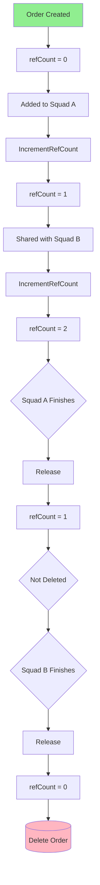
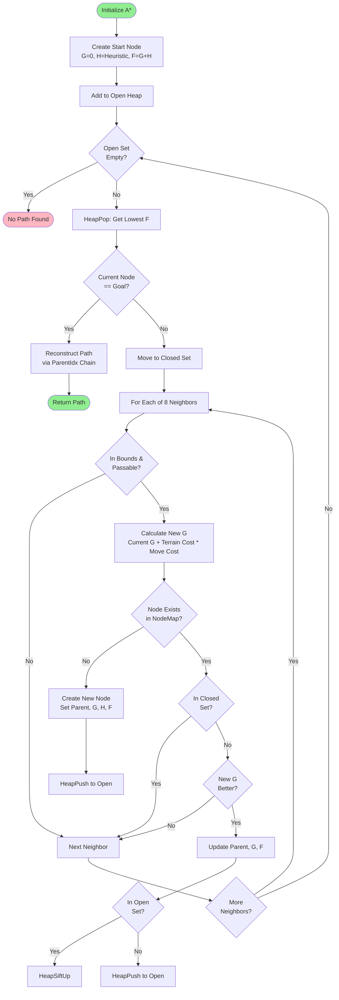
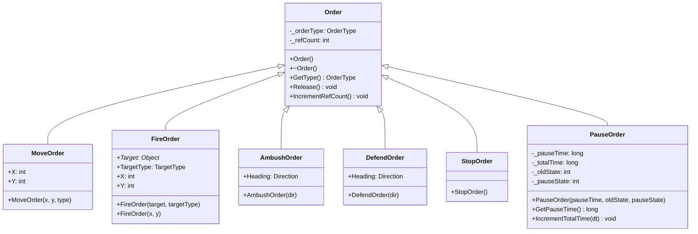
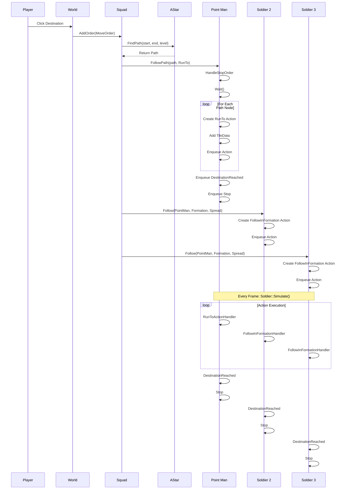
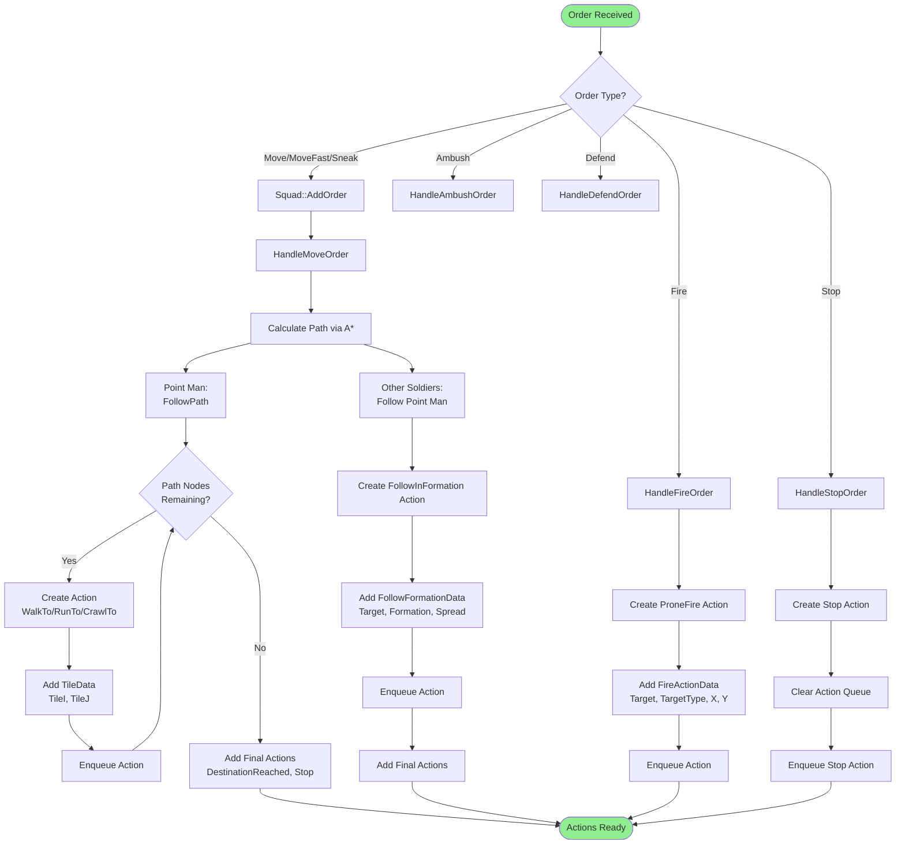

## 4. Order System and Pathfinding

### 4.1 The Concept: Commands and Movement

OpenCombat uses an RTS-style command system. As the commander, you don't individually control every unit's movements—you issue **commands**, and the units figure out how to execute them using their AI and the state machine.

**What can you tell units to do?**

| Command | Description | Gameplay Context |
|---------|-------------|------------------|
| **Move** | Walk to a destination | Standard unit movement |
| **Move Fast** | Run to a destination | Rapid repositioning |
| **Sneak** | Crawl quietly | Stealth approach to avoid detection |
| **Fire** | Attack a target | Engage enemy entities |
| **Ambush** | Wait and attack when enemies approach | Defensive positioning with surprise attack |
| **Defend** | Hold position facing a direction | Area denial and overwatch |
| **Hide** | Take cover and reduce visibility | Minimize detection risk |
| **Stop** | Halt all actions immediately | Emergency halt or cancel commands |

**Key insight**: Commands are high-level intentions, not step-by-step instructions. When you command a squad to move, you don't specify the route—pathfinding determines the best way there.

---

### 4.2 Order System: How Commands Work

#### 4.2.1 The Command Queue

Each unit maintains a queue of commands to execute. This works like a prioritized task list:

```
Unit's Command Queue:
┌─────────────────────────────────────┐
│ 1. Move to (500, 300)              │ ← Currently executing
├─────────────────────────────────────┤
│ 2. Ambush facing North             │ ← Next
├─────────────────────────────────────┤
│ 3. Stop                            │ ← Final
└─────────────────────────────────────┘
```

**Command Processing**:
1. Take the first command from the queue
2. Execute it (may take many game frames)
3. When complete, remove it and move to the next
4. Some commands (Move, Fire) get translated into lower-level **Actions**

#### 4.2.2 Shared Commands (Reference Counting)

When you select multiple squads and issue a move command, you don't create separate commands for each unit. Instead, **one command is shared across all selected units**.

**Why share commands?**
- Memory efficiency: One command object instead of dozens
- Consistency: All units get the exact same command parameters
- Synchronization: If the command is modified, all units see the change

**The challenge**: When does the command get deleted?

If 10 units share one command, we can't delete it when the first unit finishes—we must wait until **all 10 are done**. This is solved with **reference counting**:



**Critical rule**: Always increment the reference count before sharing a command with another unit.

---

### 4.3 Pathfinding Concept: How Units Find Paths

#### 4.3.1 Grid-Based Movement

The game world is divided into a grid of tiles. Each tile has properties that affect movement:

```
Tile Grid (simplified):
┌───┬───┬───┬───┬───┐
│ G │ G │ G │ G │ G │  G = Grass (easy movement)
├───┼───┼───┼───┼───┤
│ G │ T │ T │ G │ G │  T = Trees (slows movement)
├───┼───┼───┼───┼───┤
│ G │ T │ W │ W │ G │  W = Water (impassable)
├───┼───┼───┼───┼───┤
│ G │ G │ W │ G │ G │
└───┴───┴───┴───┴───┘
```

**Movement considerations**:
- **Straight moves** (up, down, left, right): Cost = 1.0
- **Diagonal moves**: Cost = 1.414 (square root of 2)
- **Terrain cost**: Trees might add 50% to movement cost
- **Posture**: Crawling, walking, and running each have different terrain penalties

#### 4.3.2 The Pathfinding Problem

Given a start tile and destination tile, find the cheapest valid path.

**Simple approach (greedy)**: Always move toward the goal. ❌ Fails with obstacles.

**Better approach**: Explore possibilities systematically, keeping track of costs. This is where the **A* algorithm** excels.

---

### 4.4 The A* Algorithm (Concept)

A* is like being a smart explorer with a map:

#### 4.4.1 Three Key Values

For each tile being considered, we track:

- **G (Actual Cost)**: How far from the start (terrain + distance)
- **H (Heuristic)**: Estimated distance to goal (straight-line distance)
- **F (Total)**: G + H (best guess of total path cost through this tile)

#### 4.4.2 Open and Closed Sets

**Open Set**: Tiles we're considering but haven't fully explored yet (like a "maybe" pile)

**Closed Set**: Tiles we've already explored and found the best path to (done)

#### 4.4.3 The Algorithm Flow

```
1. Start with the beginning tile in the Open Set
   G = 0, H = distance to goal, F = G + H

2. While Open Set is not empty:
   a. Pick the tile in Open with lowest F value
   b. If it's the goal, reconstruct the path (done!)
   c. Move it to Closed Set
   d. For each neighbor:
      - Skip if impassable or in Closed
      - Calculate new G (current G + move cost)
      - If not in Open or new G is better:
        * Set parent to current tile
        * Update G, F values
        * Add to Open

3. If Open is empty and goal not found: No path exists
```

**Example**: Finding path around a lake

```
Start → G → G → G
        ↓
        G   W   W   G
        ↓       ↓
        G   W   W   G
                ↓
Goal  ← G ← G ← G
```

The algorithm explores tiles outward from Start, always prioritizing tiles with lowest F (cheapest actual cost + best estimate to goal). It naturally routes around the water (W) because those tiles are impassable.

#### 4.4.4 Heuristic Function

The heuristic estimates distance to goal. We use **Octile distance** (good for 8-directional movement):

```
Diagonal moves cost 1.414, straight moves cost 1.0

For destination at (10, 5) from (0, 0):
dx = 10, dy = 5
min = 5, max = 10
Heuristic = 5 * 1.414 + (10-5) * 1.0 = 7.07 + 5 = 12.07
```

This gives A* a "sense of direction" while still finding the optimal path.



---

### 4.5 Concrete Example: "Player Commands Squad to Move"

Let's walk through what happens when a player clicks on the map to move a selected squad:

#### 4.5.1 Initial Click (User Interface)

```
Player Action:
1. Selects Squad A (5 soldiers)
2. Holds Shift (Move Fast modifier)
3. Clicks on destination at world coordinates (2400, 1800)
```

**What the game does**:
```cpp
// World.cpp - Mouse click handler (simplified)
void World::LeftMouseUp(int x, int y) {
    if(_selectedObjects.size() > 0 && bMoveFast) {
        // Create ONE MoveOrder for all selected objects
        IssueOrder(new MoveOrder(x, y, Orders::MoveFast));
    }
}
```

#### 4.5.2 Order Distribution (Squad Level)

```cpp
// World.cpp - Distribute to each selected object
void World::IssueOrder(Order *order) {
    // Note: AddOrder() will increment ref count for each object
    for(auto* o : _selectedObjects) {
        o->ClearOrders();  // Clear existing orders first
        o->AddOrder(order);
    }
}

// Object.cpp - Object takes shared ownership via AddOrder
void Object::AddOrder(Order *o) {
    o->IncrementRefCount();  // Take shared ownership
    _orders.push_back(o);
}

// Squad.cpp - Squad processes the order
void Squad::AddOrder(Order* o) {
    switch(o->GetType()) {
        case Orders::MoveFast:
            // Convert MoveFast to RunTo action with Purple marker
            HandleMoveOrder((MoveOrder*)o, SoldierAction::RunTo, Mark::Purple);
            break;
        // ... other cases
    }
}
```

**Reference count tracking**:
```
MoveOrder created:        refCount = 0
Squad A AddOrder():       refCount = 1  (Squad A owns it)
Squad B AddOrder():       refCount = 2  (Squad B also owns it)
```

**Note**: Unlike the explicit ref counting shown in earlier documentation, the actual implementation relies on `AddOrder()` to increment the reference count. `IssueOrder()` iterates over `_selectedObjects` (not `_selectedSquads`) and calls `ClearOrders()` before adding the new order.

#### 4.5.3 Path Calculation (One Path for the Squad)

```cpp
// Squad.cpp - Calculate a single path for the entire squad
void Squad::HandleMoveOrder(MoveOrder* order, SoldierAction::Action style, Mark::Color color) {
    // Convert world pixels to tile coordinates
    int startI, startJ, destI, destJ;
    ConvertPositionToTile(Position.x, Position.y, &startI, &startJ);
    ConvertPositionToTile(order->X, order->Y, &destI, &destJ);
    
    // Determine posture level for pathfinding
    // RunTo = High posture (standing, running)
    Element::Level level = Element::High;
    
    // Find path using A* (calculated ONCE for entire squad)
    Path* path = g_Globals->World.Pathing.FindPath(startI, startJ, destI, destJ, level);
    
    if(path == nullptr) {
        // No path found - play "no clear path" voice
        g_Globals->World.Voices->GetSound("no clear path")->Play();
        return;
    }
    
    // Assign to point man (leads the formation)
    _soldiers[_currentPointManIdx]->FollowPath(path, style);
    
    // Other soldiers follow the point man in formation
    for(int i = 0; i < _soldiers.size(); i++) {
        if(i != _currentPointManIdx) {
            _soldiers[i]->Follow(_soldiers[_currentPointManIdx], 
                                 _currentFormation, _currentFormationSpread, 
                                 formationIndex++, style);
        }
    }
}
```

#### 4.5.4 Order Translation (Soldier Level)

The point man's `FollowPath` converts the Path into individual Actions:

```cpp
// Soldier.cpp
void Soldier::FollowPath(Path* path, SoldierAction::Action style) {
    // First, stop current movement
    HandleStopOrder(nullptr);
    Wait();  // Brief pause before starting
    
    // Convert each path node to an action
    while(path != nullptr) {
        Action* action = new Action();
        action->Index = style;  // RunTo
        
        TileData* data = new TileData();
        data->TileI = path->X;
        data->TileJ = path->Y;
        action->Data = data;
        
        _actionQueue.push_back(action);
        path = path->Next;
    }
    
    // Add final actions
    _actionQueue.push_back(new Action(SoldierAction::DestinationReached, nullptr));
    _actionQueue.push_back(new Action(SoldierAction::Stop, nullptr));
}
```

**Result for point man**:
```
Action Queue:
1. Stop
2. Wait
3. RunTo tile (45, 30)
4. RunTo tile (46, 30)
5. RunTo tile (47, 31)
6. ... (more tiles)
7. DestinationReached
8. Stop
```

#### 4.5.5 Execution (Every Game Frame)

Each frame, soldiers process their action queues:

```cpp
void Soldier::Simulate(long dt, World* world) {
    // Process the current action
    if(!_actionQueue.empty()) {
        Action* action = _actionQueue.front();
        
        // Handle returns true when action completes
        if(SoldierActionHandlers::Handle(this, action, dt)) {
            _actionQueue.pop_front();
            delete action;  // Actions are NOT reference counted
        }
    }
}
```

**Example - RunToActionHandler** (pseudocode/simplified - actual implementation uses different helper functions and structure):
```cpp
// NOTE: This is conceptual pseudocode. The actual implementation in 
// SoldierActionHandlers.cpp uses different function signatures and helpers.
bool RunToActionHandler(Soldier* soldier, Action* action, long dt) {
    TileData* data = (TileData*)action->Data;

    // Set animation and action state
    soldier->_moving = true;
    soldier->_currentAnimationState = Soldier::AnimationState::Running;
    soldier->_currentAction = Unit::MovingFast;

    // Update state machine
    g_Globals->World.Actions.Soldiers.UpdateState(action->Index, &soldier->_currentState);

    // Check if at destination using helper
    if(AtDestination(soldier, data->TileI, data->TileJ)) {
        delete data;
        action->Data = nullptr;
        return true;  // Action complete
    }

    // Calculate and apply heading change using helpers
    Direction newHeading = CalculateNewHeading(soldier, data->TileI, data->TileJ);
    if(soldier->_currentHeading != newHeading) {
        soldier->_velocity.x = 0.0f;
        soldier->_velocity.y = 0.0f;
        soldier->_currentHeading = newHeading;
    }

    // Move the soldier
    MoveSoldier(soldier, dt);
    return false;  // Action continues
}
```

#### 4.5.6 Completion

When the point man reaches the destination:
1. `DestinationReached` action triggers
2. `Stop` action halts movement
3. The original `MoveOrder` is popped from the squad's command queue
4. `Release()` decrements refCount to 0
5. Command is deleted

**The formation followers** automatically stop when the point man stops (their `FollowInFormation` action monitors the leader).

---

### 4.6 Target Selection: Game Mechanics

When a player issues a Fire order, the target can be:

#### 4.6.1 Target Types

| Type | Description | Selection Method |
|------|-------------|------------------|
| **Soldier** | Specific enemy soldier | Click directly on soldier |
| **Squad** | Any soldier in enemy squad | Click on squad marker |
| **Vehicle** | Enemy vehicle | Click on vehicle |
| **Area** | Ground position | Click on empty ground |

#### 4.6.2 Target Resolution

**Target::Squad**: When you target a squad, the game picks a specific soldier:

```
FireOrder created with Target::Squad
              ↓
    Call FindTarget(squad)
              ↓
    Pick random alive soldier
              ↓
    Set FireActionData->TargetObject
              ↓
    Soldier fires at specific target
              ↓
    Target killed?
         ↓ Yes
    Call FindTarget(squad) again
         ↓ No
    Continue firing
```

**Target::Area**: Soldiers fire at the ground position, useful for:
- Suppressing an area
- Attacking suspected hidden enemies
- Creating a "beaten zone"

---

### 4.7 Implementation: C++ Code

Now that we understand the concepts, here's how they're implemented:

#### 4.7.1 Order Base Class

**Location**: `src/orders/Order.h`, `src/orders/Order.cpp`



**Note**: The `Orders::Hide` enum value exists but there is no `HideOrder` class implementation. Hide functionality is handled at the squad level by setting squad state to `Team::Hiding`.

```cpp
namespace Orders {
    enum OrderType {
        Move, MoveFast, Sneak, Fire, Ambush, Hide, 
        Smoke, Destination, Stop, Pause, Defend
    };
}
```

**Implementation Status**:
- ✅ **Fully Implemented**: Move, MoveFast, Sneak, Fire, Ambush, Defend, Stop
- ⚠️ **Partially Implemented**: Hide (squad-level state only, no HideOrder class)
- ❌ **Not Implemented**: Smoke, Pause (class exists but not processed in Squad::AddOrder)
- ✅ **Implemented**: Destination (processed in Soldier::Simulate())

class Order {
public:
    Order(void);
    virtual ~Order(void);
    inline Orders::OrderType GetType() { return _orderType; }

    // Reference counting for shared orders
    inline void Release() { 
        --_refCount; 
        if(_refCount <= 0) { delete this; } 
    }
    inline void IncrementRefCount() { ++_refCount; }

protected:
    Orders::OrderType _orderType;

private:
    int _refCount;
};
```

#### 4.7.2 Order Types

**MoveOrder** (`src/orders/MoveOrder.h`):
```cpp
class MoveOrder : public Order {
public:
    MoveOrder(int x, int y, Orders::OrderType type);
    int X, Y;
};
```

**FireOrder** (`src/orders/FireOrder.h`):
```cpp
class FireOrder : public Order {
public:
    FireOrder(Object *target, Target::Type targetType);
    FireOrder(int x, int y);  // Area target
    
    Object *Target;
    Target::Type TargetType;
    int X, Y;
};
```

**AmbushOrder** (`src/orders/AmbushOrder.h`):
```cpp
class AmbushOrder : public Order {
public:
    AmbushOrder(Direction dir);
    Direction Heading;
};
```

**DefendOrder** (`src/orders/DefendOrder.h`):
```cpp
class DefendOrder : public Order {
public:
    DefendOrder(Direction dir);
    Direction Heading;
};
```

**StopOrder** (`src/orders/StopOrder.h`):
```cpp
class StopOrder : public Order {
public:
    StopOrder(void);
};
```

**PauseOrder** (`src/orders/PauseOrder.h`):
```cpp
class PauseOrder : public Order {
public:
    PauseOrder(long pauseTime, int oldState, int pauseState);
    inline long GetPauseTime() { return _pauseTime; }
    inline void IncrementTotalTime(long dt) { _totalTime += dt; }

protected:
    long _pauseTime;
    long _totalTime;
    int _oldState;
    int _pauseState;
};
```

#### 4.7.3 Order Processing in Soldier

**Location**: `src/objects/Soldier.cpp`

```cpp
void Soldier::Simulate(long dt, World* world) {
    // Process orders first
    if(!_orders.empty()) {
        Order* order = _orders.front();
        bool handled = false;
        
        switch(order->GetType()) {
            case Orders::Destination:
                handled = HandleDestinationOrder((MoveOrder*)order);
                break;
            case Orders::Stop:
                handled = HandleStopOrder((StopOrder*)order);
                break;
            case Orders::Fire:
                handled = HandleFireOrder((FireOrder*)order);
                break;
            case Orders::Move:
            case Orders::MoveFast:
            case Orders::Sneak:
                // These orders should NEVER reach Soldier::Simulate()
                // They are converted to actions at the Squad level
                assert(0);  // Crash if we get here - indicates a bug
                break;
        }
        
        if(handled) {
            _orders.pop_front();
            order->Release();  // Decrement ref count, may delete
        }
    }
    
    // Process action queue
    if(!_actionQueue.empty()) {
        Action* action = _actionQueue.front();
        if(SoldierActionHandlers::Handle(this, action, dt)) {
            _actionQueue.pop_front();
            delete action;
        }
    }
}
```

**Order Handlers**:
```cpp
bool Soldier::HandleDestinationOrder(MoveOrder* order) {
    Vector2 range;
    range.x = (float)(Position.x - order->X);
    range.y = (float)(Position.y - order->Y);
    
    // Within 5 pixels of destination
    if(range.Magnitude() < 5.01f) {
        AddOrder(new StopOrder());
        return true;  // Order complete
    }
    return false;  // Keep order active
}

bool Soldier::HandleStopOrder(StopOrder* order) {
    Action* action = new Action();
    action->Index = SoldierAction::Stop;
    action->Data = NULL;
    
    _actionQueue.clear();
    _actionQueue.push_back(action);
    
    return true;
}

bool Soldier::HandleFireOrder(FireOrder* order) {
    Action* action = new Action();
    action->Index = SoldierAction::ProneFire;
    
    FireActionData* data = new FireActionData();
    data->TargetObject = order->Target;
    data->TargetType = order->TargetType;
    data->X = order->X;
    data->Y = order->Y;
    action->Data = data;
    
    HandleStopOrder(NULL);
    _actionQueue.push_back(action);
    
    return true;
}
```

#### 4.7.4 Squad-Level Order Distribution

**Location**: `src/objects/Squad.cpp`

```cpp
void Squad::AddOrder(Order* o) {
    _bShowMark = false;
    
    switch(o->GetType()) {
        case Orders::Ambush:
            HandleAmbushOrder((AmbushOrder*)o);
            for(auto* vehicle : _vehicles) vehicle->AddOrder(o);
            return;
            
        case Orders::Defend:
            HandleDefendOrder((DefendOrder*)o);
            for(auto* vehicle : _vehicles) vehicle->AddOrder(o);
            return;
            
        case Orders::Fire:
            {
                FireOrder* f = (FireOrder*)o;
                _currentAction = Team::Firing;
                _currentTarget = f->Target;
                _currentTargetType = f->TargetType;
                _currentTargetX = f->X;
                _currentTargetY = f->Y;
                _markColor = Mark::Red;
                _bShowMark = true;
            }
            break;
            
        case Orders::Move:
            HandleMoveOrder((MoveOrder*)o, SoldierAction::WalkTo, Mark::Blue);
            for(auto* vehicle : _vehicles) vehicle->AddOrder(o);
            return;
            
        case Orders::MoveFast:
            HandleMoveOrder((MoveOrder*)o, SoldierAction::RunTo, Mark::Purple);
            for(auto* vehicle : _vehicles) vehicle->AddOrder(o);
            return;
            
        case Orders::Sneak:
            HandleMoveOrder((MoveOrder*)o, SoldierAction::CrawlTo, Mark::Yellow);
            for(auto* vehicle : _vehicles) vehicle->AddOrder(o);
            return;
            
        case Orders::Hide:
            _currentAction = Team::Hiding;
            break;
    }
    
    // Default: propagate to all members
    for(auto* vehicle : _vehicles) vehicle->AddOrder(o);
    for(auto* soldier : _soldiers) soldier->AddOrder(o);
}
```

#### 4.7.5 Path Creation and Distribution

```cpp
void Squad::HandleMoveOrder(MoveOrder* order, 
                            SoldierAction::Action movementStyle,
                            Mark::Color color) {
    int i=0, j=0, di=0, dj=0;

    _currentAction = Team::Moving;
    _currentTargetX = order->X;
    _currentTargetY = order->Y;

    // Find a path
    FreePath(_currentPath, true);
    g_Globals->World.CurrentWorld->ConvertPositionToTile(Position.x, Position.y, &i, &j);
    g_Globals->World.CurrentWorld->ConvertPositionToTile(_currentTargetX, _currentTargetY, &di, &dj);
    
    // Determine posture level for pathfinding
    Element::Level level = Element::Medium;
    switch(movementStyle) {
        case SoldierAction::Crawl:
        case SoldierAction::CrawlTo:
            level = Element::Prone;
            break;
        case SoldierAction::Run:
        case SoldierAction::RunTo:
            level = Element::High;
            break;
        case SoldierAction::WalkSlow:
        case SoldierAction::WalkSlowTo:
            level = Element::Low;
            break;
        default:
            level = Element::Medium;
            break;
    }

    // Calculate path once for entire squad
    _currentPath = g_Globals->World.Pathing.FindPath(i, j, di, dj, level);
    if(nullptr == _currentPath) {
        g_Globals->World.Voices->GetSound("no clear path")->Play();
        return;
    }

    // Set mark colors
    _markColor = color;
    _bShowMark = true;
    _bMarkTargetPosition = false;

    // Point man follows actual path
    _soldiers[_currentPointManIdx]->FollowPath(_currentPath, movementStyle);
    
    // Others follow point man in formation
    int formationIndex = 1;
    for(size_t idx = 0; idx < _soldiers.size(); ++idx) {
        if(static_cast<int>(idx) != _currentPointManIdx && !_soldiers[idx]->IsDead()) {
            _soldiers[idx]->Follow(_soldiers[_currentPointManIdx],
                                   _currentFormation,
                                   _currentFormationSpread,
                                   formationIndex++,
                                   movementStyle);
        }
    }
}
```

#### 4.7.6 A* Pathfinding Implementation

**Location**: `src/ai/AStar.h`, `src/ai/AStar.cpp`

**Node Structure**:
```cpp
struct Node {
    int X, Y;
    float F, G, H;
    size_t ParentIdx;  // max value if no parent
    size_t HeapIndex;  // Position in the heap
    bool InOpenSet;
    bool InClosedSet;

    Node() : X(0), Y(0), F(0), G(0), H(0), 
             ParentIdx(std::numeric_limits<size_t>::max()), 
             HeapIndex(std::numeric_limits<size_t>::max()), 
             InOpenSet(false), InClosedSet(false) {}
};
```

**Coordinate Packing for Hash Lookup**:
```cpp
struct CoordinatePacker {
    size_t operator()(const std::pair<int, int>& p) const {
        return (static_cast<size_t>(p.first) << 32) | static_cast<size_t>(p.second);
    }
};
```

**AStar Class**:
```cpp
class AStar {
public:
    Path *FindPath(int x0, int y0, int x1, int y1, Element::Level level);

protected:
    float GetTerrainCost(int x, int y);
    float Heuristic(int x, int y);

    // Binary min-heap for open set (stores node indices)
    std::vector<size_t> _openHeap;
    
    // All nodes stored here
    std::vector<Node> _nodes;
    
    // Map from (x,y) to node index for O(1) lookup
    std::unordered_map<std::pair<int, int>, size_t, CoordinatePacker> _nodeMap;
    
    int _destX, _destY;
    Element::Level _level;

    // Heap operations
    void HeapPush(size_t nodeIdx);
    size_t HeapPop();
    void HeapSiftUp(size_t heapIdx);
    void HeapSiftDown(size_t heapIdx);
};
```

**Main Pathfinding Algorithm**:
```cpp
Path *AStar::FindPath(int x0, int y0, int x1, int y1, Element::Level level) {
    _level = level;
    _destX = x1;
    _destY = y1;
    
    // Clear previous state
    _nodes.clear();
    _nodeMap.clear();
    _openHeap.clear();
    
    // Create start node
    Node startNode;
    startNode.X = x0;
    startNode.Y = y0;
    startNode.G = 0;
    startNode.H = Heuristic(x0, y0);
    startNode.F = startNode.G + startNode.H;
    startNode.ParentIdx = std::numeric_limits<size_t>::max();
    
    _nodes.push_back(startNode);
    _nodeMap[{x0, y0}] = 0;
    HeapPush(0);
    
    // Directions: 8-connected grid
    const int dx[8] = {-1, 0, 1, -1, 1, -1, 0, 1};
    const int dy[8] = {-1, -1, -1, 0, 0, 1, 1, 1};
    const float moveCost[8] = {1.414f, 1.0f, 1.414f, 1.0f, 1.0f, 1.414f, 1.0f, 1.414f};
    
    while (!_openHeap.empty()) {
        size_t currentIdx = HeapPop();
        Node& current = _nodes[currentIdx];
        current.InClosedSet = true;
        
        // Check if we reached the destination
        if (current.X == x1 && current.Y == y1) {
            // Reconstruct path
            Path *path = nullptr;
            size_t idx = currentIdx;
            
            while (idx != std::numeric_limits<size_t>::max()) {
                Node& n = _nodes[idx];
                Path *p = AllocatePath();
                p->X = n.X;
                p->Y = n.Y;
                p->Next = path;
                path = p;
                idx = n.ParentIdx;
            }
            return path;
        }
        
        // Generate successors
        for (int i = 0; i < 8; ++i) {
            int nx = current.X + dx[i];
            int ny = current.Y + dy[i];
            
            // Check bounds and passability
            if (nx < 0 || ny < 0 || 
                nx >= g_Globals->World.CurrentWorld->NumTiles.x || 
                ny >= g_Globals->World.CurrentWorld->NumTiles.y) {
                continue;
            }
            
            if (!g_Globals->World.CurrentWorld->IsPassable(nx, ny)) {
                continue;
            }
            
            // Calculate new G score
            float tentativeG = current.G + GetTerrainCost(nx, ny) * moveCost[i];
            
            // Check if this node exists
            auto it = _nodeMap.find({nx, ny});
            if (it != _nodeMap.end()) {
                size_t neighborIdx = it->second;
                Node& neighbor = _nodes[neighborIdx];
                
                if (neighbor.InClosedSet) {
                    continue;
                }
                
                if (tentativeG < neighbor.G) {
                    // Better path found
                    neighbor.ParentIdx = currentIdx;
                    neighbor.G = tentativeG;
                    neighbor.F = neighbor.G + neighbor.H;
                    
                    if (neighbor.InOpenSet) {
                        HeapSiftUp(neighbor.HeapIndex);
                    } else {
                        HeapPush(neighborIdx);
                    }
                }
            } else {
                // Create new node
                Node newNode;
                newNode.X = nx;
                newNode.Y = ny;
                newNode.G = tentativeG;
                newNode.H = Heuristic(nx, ny);
                newNode.F = newNode.G + newNode.H;
                newNode.ParentIdx = currentIdx;
                
                size_t newIdx = _nodes.size();
                _nodes.push_back(newNode);
                _nodeMap[{nx, ny}] = newIdx;
                HeapPush(newIdx);
            }
        }
    }
    
    // No path found
    return nullptr;
}
```

**Terrain Cost Calculation**:
```cpp
float AStar::GetTerrainCost(int x, int y) {
    Element *e = g_Globals->World.CurrentWorld->GetTileElement(x, y);
    return static_cast<float>(e->Hindrance[_level]) / 100.0f;
}
```

**Heuristic Function**:
```cpp
float AStar::Heuristic(int x, int y) {
    // Octile distance (allows diagonal with proper cost)
    int dx = std::abs(x - _destX);
    int dy = std::abs(y - _destY);
    float diag = static_cast<float>(std::min(dx, dy));
    float straight = static_cast<float>(dx + dy);
    return sqrtf(2.0f) * diag + (straight - 2.0f * diag);
}
```

#### 4.7.7 Path Structure

**Location**: `src/ai/Path.h`

```cpp
struct Path {
    int X, Y;
    struct Path *Next;
};

Path *AllocatePath();
void FreePath(Path *path, bool recurse);
```

**Memory management**: Paths are singly-linked lists allocated individually. `FreePath` recursively frees the entire path.



#### 4.7.8 Order-to-Action Translation

**Location**: `src/objects/Soldier.cpp`



**FollowPath**:
```cpp
void Soldier::FollowPath(Path *path, SoldierAction::Action movementStyle) {
    // First stop current movement
    HandleStopOrder(nullptr);
    Wait();
    
    // Convert each path node to an action
    while(path != nullptr) {
        Action *action = new Action();
        action->Index = movementStyle;
        SoldierActionHandlers::TileData *data = new SoldierActionHandlers::TileData();
        data->TileI = path->X;
        data->TileJ = path->Y;
        action->Data = data;
        path = path->Next;
        
        _actionQueue.push_back(action);
    }

    // Add final actions
    _actionQueue.push_back(new Action(SoldierAction::DestinationReached, nullptr));
    _actionQueue.push_back(new Action(SoldierAction::Stop, nullptr));
}
```

**Follow** (Formation Following):
```cpp
void Soldier::Follow(Object *object, Formation::Type formationType, 
                     float formationSpread, int formationIdx, 
                     SoldierAction::Action movementStyle) {
    HandleStopOrder(nullptr);
    Wait();
    
    Action *action = new Action(SoldierAction::FollowInFormation, nullptr);
    SoldierActionHandlers::FollowFormationData *data = 
        new SoldierActionHandlers::FollowFormationData();
    data->TargetObject = object;
    data->TargetFormation = formationType;
    data->FormationIndex = formationIdx;
    data->FormationSpread = formationSpread;
    data->MovementStyle = movementStyle;
    action->Data = data;
    _actionQueue.push_back(action);

    _pathComplete = false;
    _actionQueue.push_back(new Action(SoldierAction::DestinationReached, nullptr));
    _actionQueue.push_back(new Action(SoldierAction::Stop, nullptr));
}
```

#### 4.7.9 Target Selection Implementation

**Location**: `src/objects/Soldier.cpp`

```cpp
Soldier *Soldier::FindTarget(Squad *squad) {
    if(nullptr == squad) {
        return nullptr;
    }

    bool anyAlive = false;
    std::vector<Soldier*> *soldiers = squad->GetSoldiers();
    for(int i = static_cast<int>(soldiers->size())-1; i >= 0 ; --i) {
        if(!(*soldiers)[i]->IsDead()) {
            anyAlive = true;
            break;
        }
    }
    
    if(anyAlive) {
        Soldier *o;
        for(;;) {
            if(!((o = (*soldiers)[rand()%static_cast<int>(soldiers->size())])->IsDead())) {
                return o;
            }
        }
    }
    return nullptr;
}
```

---

### 4.8 Complete Order-to-Movement Flow

```
1. User clicks destination
   |
2. World::LeftMouseUp() calls IssueOrder(new MoveOrder(x, y))
   |
3. For each selected squad:
   └── Squad::AddOrder(MoveOrder)
       |
4. Squad::HandleMoveOrder():
   ├── Convert world to tile coordinates
   ├── Determine Element::Level from movement style
   │   ├── CrawlTo → Element::Prone
   │   ├── RunTo → Element::High
   │   └── WalkTo → Element::Medium
   ├── AStar::FindPath(start, end, level)
   │   ├── Create start node, add to open heap
   │   ├── While open heap not empty:
   │   │   ├── HeapPop() to get lowest F node
   │   │   ├── Check if goal reached
   │   │   ├── Generate 8-direction successors
   │   │   ├── Bounds/passability check
   │   │   ├── Calculate G cost with terrain hindrance
   │   │   ├── Check _nodeMap for existing node
   │   │   └── HeapPush() new or updated nodes
   │   └── Reconstruct path via ParentIdx chain
   ├── Point man: FollowPath(path, movementStyle)
   │   └── Converts each Path node to WalkTo/RunTo/CrawlTo action with TileData
   └── Others: Follow(pointMan, formation, spread, idx, movementStyle)
       └── Creates FollowInFormation action with FollowFormationData
   |
5. Each frame, Soldier::Simulate():
   ├── Process Orders (if any)
   └── Process Action queue via SoldierActionHandlers::Handle()
       ├── WalkToActionHandler: Move to specific tile
       ├── RunToActionHandler: Move quickly to tile
       ├── FollowInFormationActionHandler: Maintain formation position
       └── StopActionHandler: Halt movement
   |
6. At each tile:
   └── Action completes
   └── Next action begins
   |
7. At final destination:
   └── DestinationReached action
   └── Stop action
   └── _pathComplete = true
```

---

### 4.9 Key Design Insights

1. **Commands are high-level, Actions are low-level**: Commands represent player intent; Actions represent concrete behaviors.

2. **Reference counting enables sharing**: Multiple units can share the same MoveOrder. The command lives until all units finish.

3. **Pathfinding happens at squad level**: One A* calculation per squad, not per soldier. Formation following handles the rest.

4. **Binary min-heap for efficiency**: The open set uses a heap for O(log n) insertion and extraction of the best node.

5. **Terrain costs vary by posture**: Crawling, walking, and running each have different terrain hindrance penalties.

---

**Next**: [Chapter 5: Graphics and Rendering System](./05-graphics.md)
