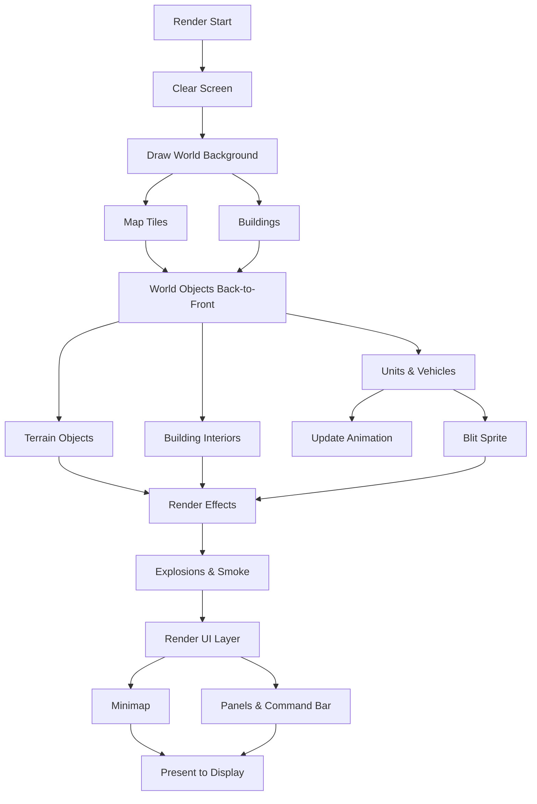
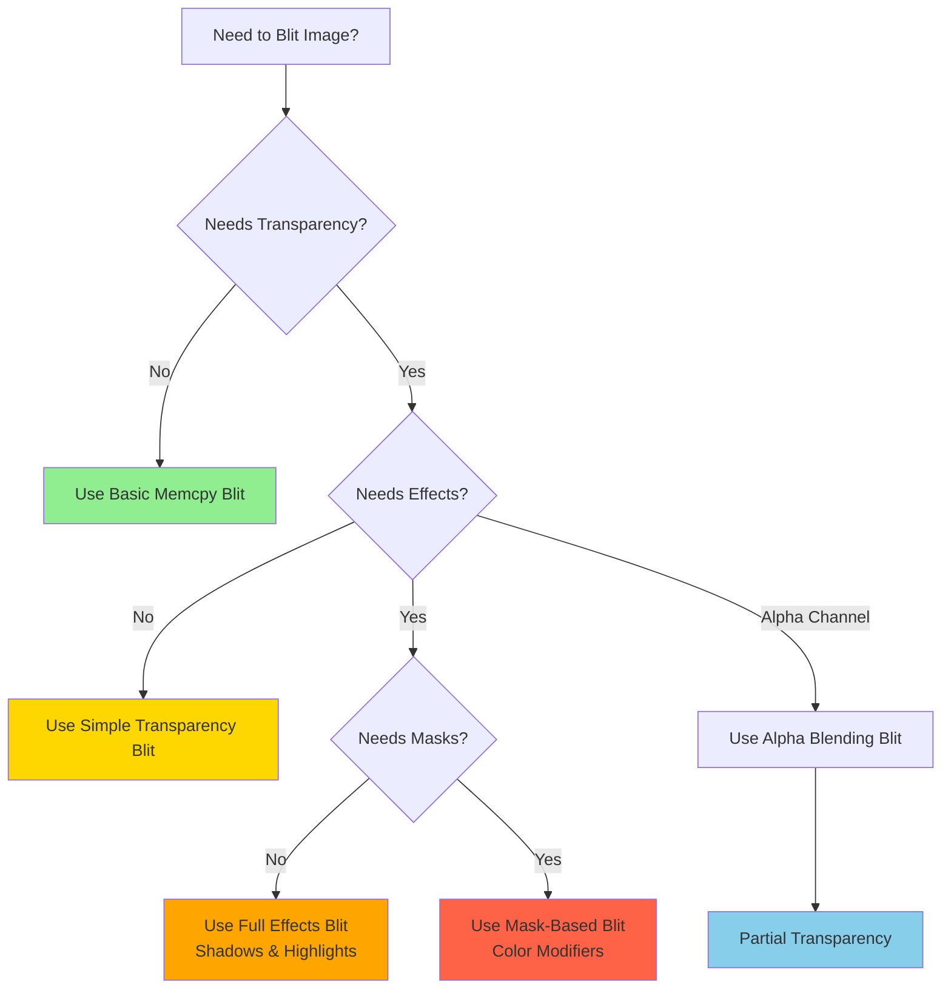
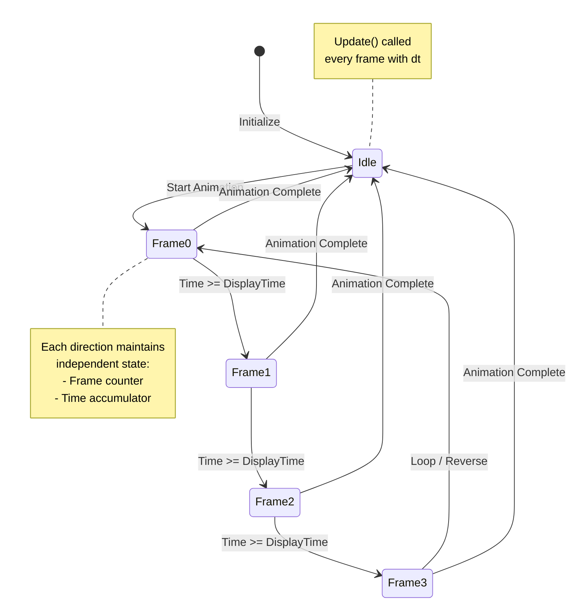
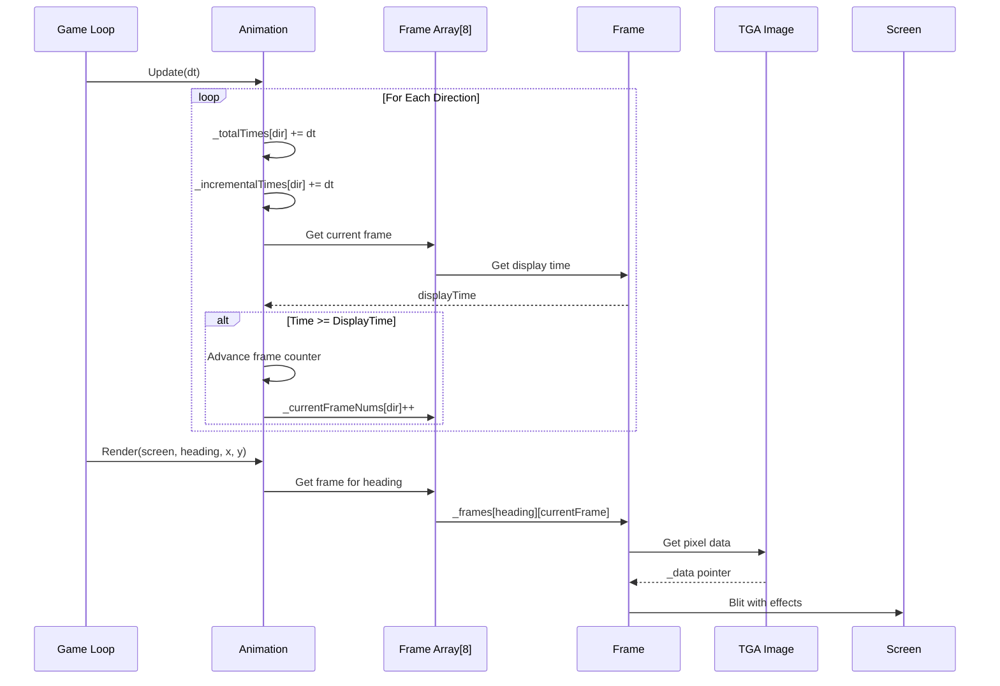
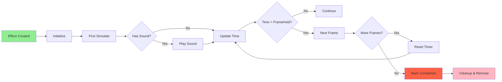
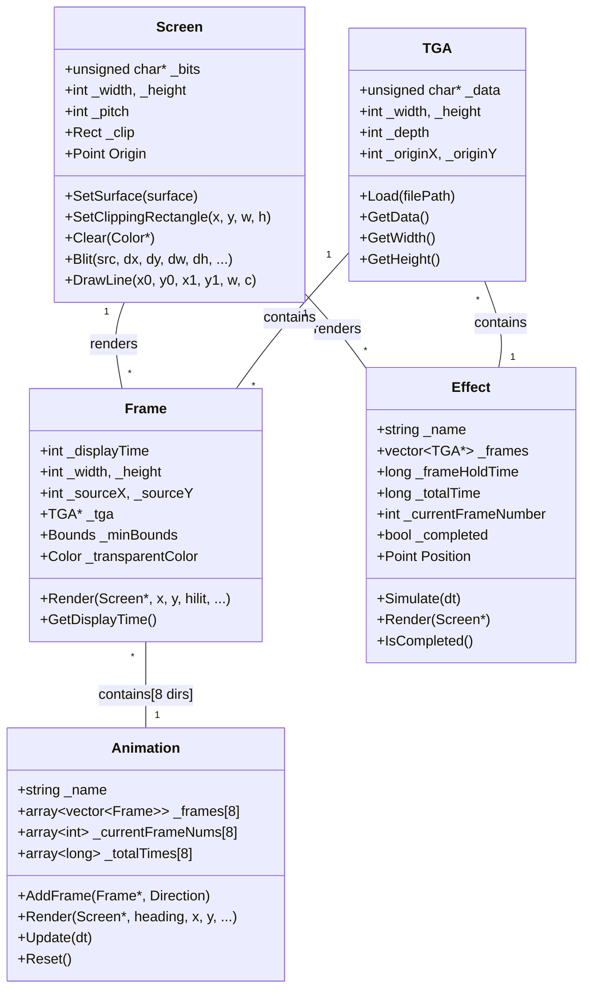
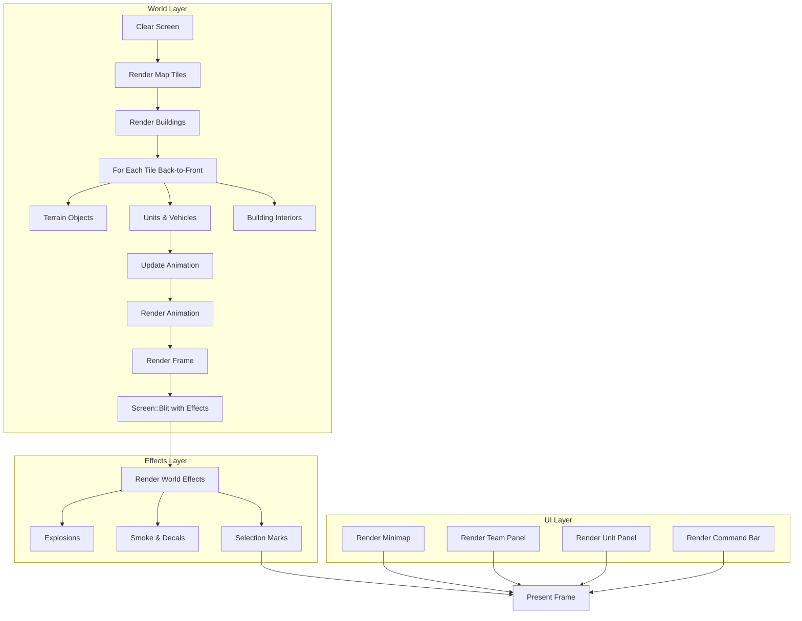

## 5. Graphics and Rendering System

### 5.1 Concept: How the Game Displays Things

OpenCombat uses a **sprite-based rendering system** where 2D images represent game entities:

- **Sprites**: Static images (soldiers, vehicles, trees, buildings)
- **Animations**: Sequences of sprites that create movement (walking, shooting)
- **Effects**: Short animations for events (explosions, muzzle flashes, smoke)

The game doesn't draw directly to the screen. Instead, it builds an image in memory (a **pixel buffer**), then displays that buffer all at once. This approach is called **software rendering** - the CPU manually copies pixels rather than using the GPU.

#### Why Software Rendering?

OpenCombat was originally written for Windows using DirectX. During the SDL2 port, we kept the software renderer for several reasons:

1. **Compatibility**: Works on any system without GPU requirements
2. **Determinism**: Every pixel is exactly where we put it (important for tactical games)
3. **Simplicity**: No shader complexity, easier to debug pixel-perfect issues
4. **Legacy**: Large existing art asset pipeline optimized for this approach

The trade-off is that software rendering is CPU-intensive. Modern GPUs can process millions of pixels in parallel, while the CPU processes them one at a time. For a tactical wargame with limited units on screen, this is acceptable.

---

### 5.2 Rendering Pipeline: What Gets Drawn and When

Each frame (typically 60 times per second), the game follows this sequence:

```
┌─────────────────────────────────────────────────────────────┐
│  RENDERING ORDER (Painter's Algorithm - Back to Front)     │
├─────────────────────────────────────────────────────────────┤
│  1. Clear screen to background color                        │
│     └─ Fill entire pixel buffer with solid color           │
│                                                             │
│  2. Render world background                                 │
│     ├─ Map tiles (grass, dirt, roads)                      │
│     └─ Buildings (exterior walls)                          │
│                                                             │
│  3. Render world objects (back-to-front order)              │
│     ├─ Terrain objects (trees, rocks)                      │
│     ├─ Units and vehicles                                  │
│     │   └─ Update animation state                          │
│     │   └─ Blit sprite to screen                           │
│     └─ Building interiors (when occupied)                  │
│                                                             │
│  4. Render effects                                          │
│     └─ Explosions, muzzle flashes, smoke                   │
│                                                             │
│  5. Render UI layer                                         │
│     ├─ Minimap                                             │
│     ├─ Team/unit panels                                    │
│     └─ Command bar                                         │
│                                                             │
│  6. Present to display                                      │
│     └─ SDL_RenderPresent() copies buffer to monitor        │
└─────────────────────────────────────────────────────────────┘
```

**Key Principle**: Objects are drawn from back to front. This ensures that a soldier standing in front of a tree appears in front, not behind.

#### Rendering Pipeline Flowchart



---

### 5.3 Algorithm: How Software Rendering Works

Before diving into C++ code, let's understand the fundamental algorithms.

#### 5.3.1 The Pixel Buffer

A pixel buffer is simply a block of memory where each group of bytes represents one pixel on screen.

```
┌────────────────────────────────────────────────────────────┐
│  PIXEL BUFFER LAYOUT (32-bit color, 800x600 screen)        │
├────────────────────────────────────────────────────────────┤
│                                                            │
│  Memory: [B0 G0 R0 A0][B1 G1 R1 A1][B2 G2 R2 A2]...       │
│           ↑                                                │
│           Pixel 0 (top-left corner)                        │
│                                                            │
│  To access pixel at (x, y):                                │
│  offset = (y * width * 4) + (x * 4)                        │
│                                                            │
│  Byte layout per pixel:                                    │
│  [0] = Blue   (0-255)                                      │
│  [1] = Green  (0-255)                                      │
│  [2] = Red    (0-255)                                      │
│  [3] = Alpha  (0-255, 0 = transparent, 255 = opaque)       │
│                                                            │
│  Note: BGR order (not RGB) for historical reasons          │
└────────────────────────────────────────────────────────────┘
```

**Screen Resolution**: The game typically runs at 800x600 or higher. At 32-bit color, that's:
- 800 × 600 × 4 bytes = 1,920,000 bytes (about 1.8 MB) per frame

#### 5.3.2 What is Blitting?

**Blit** = **B**lock **I**mage **T**ransfer. It's the fundamental operation of copying pixels from one buffer to another. The process involves:

1. A source image buffer containing the sprite data
2. A destination buffer (the screen or pixel buffer)
3. Destination coordinates (x, y) where the source image should be placed

```
┌────────────────────────────────────────────────────────────┐
│  BASIC BLIT OPERATION                                      │
├────────────────────────────────────────────────────────────┤
│                                                            │
│  Source (Sprite):            Destination (Screen):         │
│  ┌─────┐                     ┌───────────────────────┐    │
│  │  A  │                     │                       │    │
│  │ B C │    ──BLIT(10,5)──►  │         A             │    │
│  │  D  │                     │        B C            │    │
│  └─────┘                     │         D             │    │
│                              └───────────────────────┘    │
│                                                            │
│  The sprite is copied to position (10, 5) on screen        │
│  Pixel A goes to screen[10, 5]                             │
│  Pixel B goes to screen[10, 6]                             │
│  Pixel C goes to screen[11, 6]                             │
│  Pixel D goes to screen[10, 7]                             │
└────────────────────────────────────────────────────────────┘
```

#### 5.3.3 How Transparency Works

Real game sprites aren't rectangular. A soldier sprite has an irregular shape with transparent areas around it.

```
┌────────────────────────────────────────────────────────────┐
│  TRANSPARENCY CONCEPT                                      │
├────────────────────────────────────────────────────────────┤
│                                                            │
│  Sprite with magenta as transparent color:                 │
│                                                            │
│  Source:              Destination (grass tile):    Result: │
│  ┌───────┐            ┌───────┐                    ┌───────┐│
│  │ ████  │            │░░░░░░░│                    │ ████  ││
│  │██M███ │    BLIT    │░▒▒▒▒▒░│            =      │██▒███ ││
│  │ MMMM  │    ───►    │░▒▒▒▒▒░│                   │ ▒▒▒▒  ││
│  │█████  │            │░░░░░░░│                    │█████  ││
│  └───────┘            └───────┘                    └───────┘│
│                                                            │
│  Legend:                                                   │
│  M = Magenta (RGB 255,0,255) - transparent, not copied     │
│  █ = Visible pixels - copied to destination                │
│  ░ = Background grass - preserved where M was              │
│  ▒ = Grass showing through transparent areas               │
│                                                            │
│  Algorithm:                                                │
│  For each pixel in source:                                 │
│    If pixel color != transparent_color:                    │
│      Copy pixel to destination                             │
│    Else:                                                   │
│      Skip (leave destination pixel unchanged)              │
└────────────────────────────────────────────────────────────┘
```

**Key Point**: Transparency is implemented by checking each pixel's color before copying. If it matches the "magic" transparent color (magenta by convention), that pixel is skipped.

#### 5.3.4 Alpha Blending (Smooth Transparency)

The simple transparency above is binary - a pixel is either fully visible or fully invisible. **Alpha blending** allows for partial transparency:

```
┌────────────────────────────────────────────────────────────┐
│  ALPHA BLENDING                                            │
├────────────────────────────────────────────────────────────┤
│                                                            │
│  Each pixel has an alpha value (0-255):                    │
│  0   = Fully transparent                                   │
│  128 = 50% transparent (semi-transparent)                  │
│  255 = Fully opaque                                        │
│                                                            │
│  Formula for blending source over destination:             │
│                                                            │
│  Result = (Alpha × Source + (255 - Alpha) × Destination)   │
│           ────────────────────────────────────────────     │
│                            255                             │
│                                                            │
│  Example:                                                  │
│  Source (smoke): RGBA(100, 100, 100, 128) - 50% gray       │
│  Destination:    RGB(0, 255, 0) - green grass              │
│                                                            │
│  Result Red   = (128×100 + 127×0)   / 255 = 50             │
│  Result Green = (128×100 + 127×255) / 255 = 177            │
│  Result Blue  = (128×100 + 127×0)   / 255 = 50             │
│                                                            │
│  Final color: RGB(50, 177, 50) - greenish gray             │
│                                                            │
│  This creates the appearance of smoke over grass.          │
└────────────────────────────────────────────────────────────┘
```

#### 5.3.5 Sprite Sheets

Rather than storing each animation frame as a separate file, games use **sprite sheets** - one large image containing many frames:

```
┌────────────────────────────────────────────────────────────┐
│  SPRITE SHEET EXAMPLE                                      │
├────────────────────────────────────────────────────────────┤
│                                                            │
│  TGA File: "soldier_walk.tga" (256×128 pixels)            │
│                                                            │
│  ┌─────────────────────────────────────────────────────┐  │
│  │ Frame 0 │ Frame 1 │ Frame 2 │ Frame 3 │ Frame 4 │   │  │
│  │  (0,0)  │ (64,0)  │ (128,0) │ (192,0) │ (0,64)  │   │  │
│  │  64×64  │  64×64  │  64×64  │  64×64  │  64×64  │   │  │
│  ├─────────┴─────────┴─────────┴─────────┴─────────┘   │  │
│  │                                                     │  │
│  │              [rest of image unused]                 │  │
│  │                                                     │  │
│  └─────────────────────────────────────────────────────┘  │
│                                                            │
│  Each frame is 64×64 pixels.                               │
│  To render frame 2:                                        │
│    Source X = 128, Source Y = 0                            │
│    Width = 64, Height = 64                                 │
│                                                            │
│  Advantages of sprite sheets:                              │
│  1. Fewer file operations (faster loading)                 │
│  2. Better memory locality (caching)                       │
│  3. Easier asset management                                │
└────────────────────────────────────────────────────────────┘
```

#### Blitting Decision Tree



---

### 5.4 Animation System

#### 5.4.1 Concept: How Animation Works

Animation is simply displaying different images in rapid succession:

```
┌────────────────────────────────────────────────────────────┐
│  ANIMATION TIMING                                          │
├────────────────────────────────────────────────────────────┤
│                                                            │
│  Frame:   [0]    [1]    [2]    [3]    [0]    [1]...       │
│  Time:    0ms   150ms  300ms  450ms  600ms  750ms         │
│           │      │      │      │      │      │             │
│  Display: ▓▓▓▓▓▓▓▓▓▓▓▓▓▓▓▓▓▓▓▓▓▓▓▓▓▓▓▓▓▓▓▓▓▓▓▓▓▓▓▓▓▓▓▓│
│                                                            │
│  Each frame has a "display time" in milliseconds:          │
│  - Frame 0: 150ms                                          │
│  - Frame 1: 150ms                                          │
│  - Frame 2: 150ms                                          │
│  - Frame 3: 150ms (then loop back to 0)                    │
│                                                            │
│  Total animation cycle: 600ms (about 1.67 cycles/sec)      │
└────────────────────────────────────────────────────────────┘
```

#### 5.4.2 Directional Animation

Units can face 8 directions. Each direction has its own set of frames:

```
┌────────────────────────────────────────────────────────────┐
│  8-DIRECTIONAL ANIMATION                                   │
├────────────────────────────────────────────────────────────┤
│                                                            │
│              North (180°)                                  │
│                 ↑                                          │
│                 │                                          │
│    NorthWest    │    NorthEast                            │
│      (135°)     │     (225°)                               │
│                 │                                          │
│  West ─────────┼───────── East                             │
│   (90°)         │          (270°)                          │
│                 │                                          │
│    SouthWest    │    SouthEast                            │
│      (45°)      │     (315°)                               │
│                 │                                          │
│                 ↓                                          │
│              South (0°)                                    │
│                                                            │
│  Each direction has:                                       │
│  - Independent frame counter                               │
│  - Independent timing accumulator                          │
│                                                            │
│  This allows a soldier facing East to be on frame 3        │
│  while the same soldier's North animation is on frame 1.   │
└────────────────────────────────────────────────────────────┘
```

#### Animation State Machine



#### Animation Update Flow



---

### 5.5 Masks and Color Modification

#### 5.5.1 Concept: Why Use Masks?

The mask system enables runtime recoloring of sprite regions to create visual variety without duplicating art assets. This is particularly useful for distinguishing different factions or applying camouflage patterns while maintaining a single base sprite set.

Two approaches exist:
1. Create separate sprites for each variant (inefficient, memory-intensive)
2. Use masks to recolor specific regions programmatically (efficient)

```
┌────────────────────────────────────────────────────────────┐
│  MASK SYSTEM CONCEPT                                       │
├────────────────────────────────────────────────────────────┤
│                                                            │
│  Base Sprite:              Mask:                   Output: │
│  ┌─────────┐              ┌─────────┐              ┌───────┐│
│  │  Head   │              │  HEAD   │   Apply    │ Head   ││
│  │  Body   │      +       │  BODY   │   ───►     │ Body   ││
│  │  Legs   │              │  LEGS   │  Color     │ Legs   ││
│  │  Boots  │              │  BOOTS  │  Mods      │ Boots  ││
│  │ Weapon  │              │ WEAPON  │              │ Weapon ││
│  └─────────┘              └─────────┘              └───────┘│
│                                                            │
│  The mask uses special color codes to identify regions:    │
│  - RGB(100, 0, 0) = Body area → apply body color modifier  │
│  - RGB(120, 0, 0) = Legs area → apply legs color modifier  │
│  - RGB(140, 0, 0) = Head area → apply head color modifier  │
│  - etc.                                                    │
│                                                            │
│  Color Modifiers are RGB adjustments:                      │
│  Wehrmacht:  Body(+20, +10, -5), Legs(+15, +8, -3)...      │
│  Soviet:     Body(-10, +20, +40), Legs(-8, +15, +35)...    │
│                                                            │
│  Base art + different modifiers = faction variants         │
└────────────────────────────────────────────────────────────┘
```

#### 5.5.2 Effect Colors

Masks also handle visual effects:

```
┌────────────────────────────────────────────────────────────┐
│  MASK EFFECTS                                              │
├────────────────────────────────────────────────────────────┤
│                                                            │
│  MASK_SHADOW (0, 127, 0):                                  │
│  ┌─────────────────────────────────────────────────────┐  │
│  │  When the mask pixel is dark green:                 │  │
│  │                                                     │  │
│  │  Destination pixel becomes 25% darker              │  │
│  │  Formula: color = (color >> 2) * 3                 │  │
│  │                                                     │  │
│  │  Example: RGB(200, 150, 100)                      │  │
│  │           >> 2 → RGB(50, 37, 25)                   │  │
│  │           * 3 → RGB(150, 111, 75)                  │  │
│  └─────────────────────────────────────────────────────┘  │
│                                                            │
│  MASK_EDGE (0, 200, 0) + MASK_SHADOW_EDGE (31, 255, 31):   │
│  ┌─────────────────────────────────────────────────────┐  │
│  │  When soldier is selected:                          │  │
│  │                                                     │  │
│  │  Edge pixels light up with highlight color         │  │
│  │  Creates "glowing outline" effect                  │  │
│  │                                                     │  │
│  │  Not selected: Draw shadow (darken)                │  │
│  │  Selected:     Draw highlight color                │  │
│  └─────────────────────────────────────────────────────┘  │
└────────────────────────────────────────────────────────────┘
```

---

### 5.6 Implementation: C++ Rendering Code

Now that we understand the concepts, let's examine the actual implementation.

#### 5.6.1 Screen Class Overview

**Location**: `src/graphics/Screen.h`, `src/graphics/Screen.cpp`

```cpp
class Screen
{
public:
    Screen(void);
    virtual ~Screen(void);
    
    // Surface management
    virtual void SetSurface(SDL_Surface* surface);
    virtual void SetCapabilities(unsigned char* bits, int width, int height, 
                                  int format, int pitch);
    
    // Clipping
    virtual void SetClippingRectangle(int x, int y, int w, int h);
    
    // Utility
    virtual void Clear(Color* c);
    virtual int GetWidth();
    virtual int GetHeight();
    
    // Camera offset
    Point Origin;
    void SetOrigin(int x, int y);
    
    // BLIT METHODS - 9 variants for different use cases
    // (Detailed in following sections)
    
protected:
    SDL_Surface* _surface;
    int _width, _height;
    int _format;
    int _bytes_per_pixel;
    int _pitch;
    unsigned char* _bits;    // The pixel buffer
    Rect _clip;
};
```

#### 5.6.2 Pixel Format Detection

The Screen class automatically detects the pixel format:

```cpp
void Screen::SetCapabilities(unsigned char* bits, int width, int height, 
                              int format, int pitch)
{
    _bits = bits;
    _width = width;
    _height = height;
    _format = format;
    _pitch = pitch;
    
    switch(format) {
        case SDL_PIXELFORMAT_ARGB8888:
        case SDL_PIXELFORMAT_RGBA8888:
        case SDL_PIXELFORMAT_ABGR8888:
        case SDL_PIXELFORMAT_BGRA8888:
            _bytes_per_pixel = 4;
            break;
        case SDL_PIXELFORMAT_RGB565:
        case SDL_PIXELFORMAT_BGR565:
            _bytes_per_pixel = 2;
            break;
        default:
            _bytes_per_pixel = 4;
            break;
    }
}
```

**Note on BGR Order**: The pixel buffer uses BGR (Blue-Green-Red) byte order:
```cpp
// For position (x, y):
pixel_offset = (y * _pitch) + (x * _bytes_per_pixel);

_bits[pixel_offset + 0] = Blue   (0-255)
_bits[pixel_offset + 1] = Green  (0-255)
_bits[pixel_offset + 2] = Red    (0-255)
_bits[pixel_offset + 3] = Alpha  (0-255, if present)
```

#### 5.6.3 Blit Method 1: Basic Memcpy

The simplest blit uses `memcpy` for fast copying when no transparency is needed:

```cpp
void Screen::Blit(unsigned char* src, int dx, int dy, int dw, int dh,
                  int sw, int sh, int sbytes_per_pixel)
{
    assert(_bytes_per_pixel == sbytes_per_pixel);

    // Bounds checking - skip if completely off-screen
    if (dx >= _width || dy >= _height || dx + dw <= 0 || dy + dh <= 0)
        return;

    // Clamp to screen bounds
    int srcX = 0, srcY = 0;
    if (dx < 0) {
        srcX = -dx;      // Skip pixels off left edge
        dw += dx;        // Reduce width
        dx = 0;          // Start at left edge
    }
    if (dy < 0) {
        srcY = -dy;      // Skip pixels off top edge
        dh += dy;        // Reduce height
        dy = 0;          // Start at top edge
    }
    if (dx + dw > _width)
        dw = _width - dx;    // Clamp right edge
    if (dy + dh > _height)
        dh = _height - dy;   // Clamp bottom edge

    // Copy row by row
    for(int j = 0; j < dh; ++j) {
        memcpy(&(_bits[(j+dy)*_pitch+dx*_bytes_per_pixel]), 
               &(src[(j+srcY)*sw*sbytes_per_pixel + srcX*sbytes_per_pixel]), 
               dw*_bytes_per_pixel);
    }
}
```

**Why row-by-row?** Because the source and destination may have different "pitch" (bytes per row). We can't do one big memcpy.

#### 5.6.4 Blit Method 2: With Transparency

```cpp
void Screen::Blit(unsigned char* src, int dx, int dy, int dw, int dh,
                  int sw, int sh, int sbytes_per_pixel,
                  Color* transparentColor)
{
    unsigned char r,g,b;
    int sx=0,sy=0;

    // Apply clipping rectangle (omitted for brevity)

    for(int j = 0; j < dh; ++j) {
        for(int i = 0; i < dw; ++i) {
            // Read source pixel (BGR order)
            r = src[(sy+j)*sw*sbytes_per_pixel + (sx+i)*sbytes_per_pixel + 2];
            g = src[(sy+j)*sw*sbytes_per_pixel + (sx+i)*sbytes_per_pixel + 1];
            b = src[(sy+j)*sw*sbytes_per_pixel + (sx+i)*sbytes_per_pixel + 0];
            
            // Check transparency - skip if matches transparent color
            if(r != transparentColor->red || 
               g != transparentColor->green || 
               b != transparentColor->blue) {
                // Write to destination (BGR order)
                _bits[(dy+j)*_pitch+(dx+i)*_bytes_per_pixel + 2] = r;
                _bits[(dy+j)*_pitch+(dx+i)*_bytes_per_pixel + 1] = g;
                _bits[(dy+j)*_pitch+(dx+i)*_bytes_per_pixel + 0] = b;
            }
        }
    }
}
```

**Performance Note**: This checks every pixel individually, which is much slower than memcpy. Use only when transparency is needed.

#### 5.6.5 Blit Method 3: Full Effects

This variant handles shadow and highlight effects:

```cpp
void Screen::Blit(unsigned char* src, int dx, int dy, int dw, int dh,
                  int sx, int sy, int sw, int sh,
                  Color* transparentColor, Color* shadowColor,
                  Color* hilitColor, Color* hilitShadowColor,
                  bool bHilit, int sbytes_per_pixel)
{
    for(int j = startY; j < endY; ++j) {
        for(int i = startX; i < endX; ++i) {
            // Read source pixel
            r = src[... + 2];  // Red
            g = src[... + 1];  // Green
            b = src[... + 0];  // Blue

            // Skip transparent pixels
            if(r == transparentColor->red && 
               g == transparentColor->green && 
               b == transparentColor->blue) {
                continue;
            }
            
            // Check if this is a shadow pixel
            if(r == shadowColor->red && 
               g == shadowColor->green && 
               b == shadowColor->blue) {
                // Darken destination by 25%
                (_bits[... + 2] >>= 2) *= 3;  // Red
                (_bits[... + 1] >>= 2) *= 3;  // Green
                (_bits[... + 0] >>= 2) *= 3;  // Blue
            } else {
                // Handle highlighting
                if(bHilit) {
                    if(r == hilitShadowColor->red && 
                       g == hilitShadowColor->green && 
                       b == hilitShadowColor->blue) {
                        // Draw with highlight color
                        _bits[... + 2] = hilitColor->red;
                        _bits[... + 1] = hilitColor->green;
                        _bits[... + 0] = hilitColor->blue;
                    } else {
                        // Draw normal color
                        _bits[... + 2] = r;
                        _bits[... + 1] = g;
                        _bits[... + 0] = b;
                    }
                } else {
                    // Not highlighted - remove any highlight color
                    if(r != hilitColor->red || g != hilitColor->green || 
                       b != hilitColor->blue) {
                        if(r == hilitShadowColor->red && 
                           g == hilitShadowColor->green && 
                           b == hilitShadowColor->blue) {
                            // Apply shadow instead
                            (_bits[... + 2] >>= 2) *= 3;
                            (_bits[... + 1] >>= 2) *= 3;
                            (_bits[... + 0] >>= 2) *= 3;
                        } else {
                            // Normal pixel
                            _bits[... + 2] = r;
                            _bits[... + 1] = g;
                            _bits[... + 0] = b;
                        }
                    }
                }
            }
        }
    }
}
```

**Effect Colors** (defined in Frame.cpp):
- Shadow: RGB(0, 127, 0) - Darkens by 25%
- Highlight: RGB(0, 200, 0) - Applied when bHilit is true
- Highlight Shadow: RGB(31, 255, 31) - Combined effect

#### 5.6.6 Blit Method 4: Alpha Blending

```cpp
void Screen::Blit(unsigned char* src, int dx, int dy, int dw, int dh,
                  int sx, int sy, int sw, int sh, int sbytes_per_pixel,
                  bool useAlpha)
{
    if(!useAlpha) {
        // Delegate to basic blit if alpha not needed
        Blit(src, dx, dy, dw, dh, sx, sy, sw, sh, sbytes_per_pixel);
    } else {
        unsigned char r,g,b,a,origR,origG,origB;

        for(int j = startY; j < endY; ++j) {
            for(int i = startX; i < endX; ++i) {
                // Read source with alpha
                a = src[... + 3];  // Alpha
                r = src[... + 2];  // Red
                g = src[... + 1];  // Green
                b = src[... + 0];  // Blue
                 
                // Read destination
                origR = _bits[... + 2];
                origG = _bits[... + 1];
                origB = _bits[... + 0];
    
                // Alpha blend: new = alpha * src + (1 - alpha) * dst
                // Implemented as: (alpha * (dst - src) >> 8) + src
                _bits[... + 2] = (a*(origR-r) >> 8) + r;  // Red
                _bits[... + 1] = (a*(origG-g) >> 8) + g;  // Green
                _bits[... + 0] = (a*(origB-b) >> 8) + b;  // Blue
            }
        }
    }
}
```

The formula `(a*(origR-r) >> 8) + r` is equivalent to:
- `((a/255) * (origR - r)) + r`
- Which equals: `(a/255) * origR + (1 - a/255) * r`
- Standard alpha compositing: source over destination

#### 5.6.7 Blit Method 5: Mask-Based (Soldier Rendering)

**Location**: `src/graphics/SoldierMasks.h`

```cpp
// Mask color definitions
constexpr unsigned int MASK_SHADOW      = 0x007F00;  // 0, 127, 0
constexpr unsigned int MASK_EDGE        = 0x00C800;  // 0, 200, 0
constexpr unsigned int MASK_SHADOW_EDGE = 0x1FFF1F;  // 31, 255, 31
constexpr unsigned int MASK_BODY        = 0x640000;  // 100, 0, 0
constexpr unsigned int MASK_LEGS        = 0x780000;  // 120, 0, 0
constexpr unsigned int MASK_HEAD        = 0x8C0000;  // 140, 0, 0
constexpr unsigned int MASK_BELT        = 0xA00000;  // 160, 0, 0
constexpr unsigned int MASK_BOOTS       = 0xB40000;  // 180, 0, 0
constexpr unsigned int MASK_WEAPON      = 0xC80000;  // 200, 0, 0
constexpr unsigned int MASK_TRANSPARENT = 0xFFFFFF;  // 255, 255, 255
```

**Color Modifiers Structure**:
```cpp
struct ColorModifier {
    int Red;
    int Green;
    int Blue;
};

struct ColorModifiers {
    std::string Name;
    ColorModifier Body;
    ColorModifier Legs;
    ColorModifier Head;
    ColorModifier Belt;
    ColorModifier Boots;
    ColorModifier Weapon;
};
```

**Mask-Based Blit Implementation**:
```cpp
void Screen::Blit(unsigned char* src, unsigned char* mask,
                  int dx, int dy, int dw, int dh,
                  int sx, int sy, int sw, int sh,
                  bool bHilit, Color* hilitColor,
                  int sbytes_per_pixel, int modifierIdx)
{
    unsigned int *isrc = (unsigned int *)src;
    unsigned int *imask = (unsigned int *)mask;
    unsigned int msk;
    int r,g,b;

    for(int j = 0; j < dh; ++j) {
        for(int i = 0; i < dw; ++i) {
            // Read mask value (24-bit RGB)
            msk = (imask[(sy+j)*sw + sx+i]) & 0xFFFFFF;

            // Read source pixel
            r = src[... + 2];
            g = src[... + 1];
            b = src[... + 0];
            
            // Process based on mask value
            switch(msk) {
            case MASK_SHADOW:
                // Darken destination by 25%
                (_bits[... + 2] >>= 2) *= 3;
                (_bits[... + 1] >>= 2) *= 3;
                (_bits[... + 0] >>= 2) *= 3;
                break;
                
            case MASK_BODY:
                r += g_ColorModifiers[modifierIdx].Body.Red;
                g += g_ColorModifiers[modifierIdx].Body.Green;
                b += g_ColorModifiers[modifierIdx].Body.Blue;
                CLAMP_AND_WRITE(r, g, b);
                break;
                
            case MASK_LEGS:
                r += g_ColorModifiers[modifierIdx].Legs.Red;
                g += g_ColorModifiers[modifierIdx].Legs.Green;
                b += g_ColorModifiers[modifierIdx].Legs.Blue;
                CLAMP_AND_WRITE(r, g, b);
                break;
                
            // ... similar for HEAD, BELT, BOOTS, WEAPON
            
            case MASK_TRANSPARENT:
                continue;  // Skip this pixel
                
            default:
                // Regular pixel - copy as-is
                _bits[... + 2] = (unsigned char)r;
                _bits[... + 1] = (unsigned char)g;
                _bits[... + 0] = (unsigned char)b;
                break;
            }
        }
    }
}
```

#### 5.6.8 Remaining Blit Variants

**Rotation Blit**:
```cpp
void Screen::Blit(unsigned char* src, int dx, int dy, int dw, int dh,
                  int sw, int sh, int sbytes_per_pixel,
                  Color* transparentColor,
                  int rotx, int roty, double angle);
```
Uses trigonometry to rotate each pixel position around a pivot point.

**Mask-Based Shadow Blit**:
```cpp
void Screen::Blit(unsigned char* src, int dx, int dy, int dw, int dh, 
                  int sx, int sy, int sw, int sh, int sbytes_per_pixel, 
                  bool bUseShadow, bool bUseTransparency);
```
Uses embedded mask data in the source image's lower 24 bits.

**SDL Surface Blit**:
```cpp
void Screen::BlitSurface(SDL_Surface* src, int dx, int dy);
```
For rendering text from SDL_ttf with proper alpha handling.

---

### 5.7 TGA Image Loading

**Location**: `src/misc/TGA.h`, `src/misc/TGA.cpp`

The game uses TGA (Targa) format for all sprites because:
1. Simple format, easy to parse
2. Supports alpha channel
3. No compression artifacts
4. Historical reasons (original game used TGA)

#### 5.7.1 TGA Header Structure

```cpp
typedef struct {
    char  idlength;              // ID field length
    char  colourmaptype;         // Color map type (0 = none)
    char  datatypecode;          // Image type (2 = uncompressed RGB)
    short int colourmaporigin;
    short int colourmaplength;
    char  colourmapdepth;
    short int x_origin;          // X origin
    short int y_origin;          // Y origin
    short width;                 // Image width
    short height;                // Image height
    char  bitsperpixel;          // 16, 24, or 32
    char  imagedescriptor;       // Image descriptor
} HEADER;
```

#### 5.7.2 Loading Process

```cpp
TGA* TGA::Create(const std::filesystem::path& filePath)
{
    HEADER header;
    
    std::ifstream file(filePath, std::ios::binary);
    if (!file.is_open()) return nullptr;

    TGA* tga = new TGA();

    // Read header
    header.idlength = static_cast<char>(file.get());
    header.colourmaptype = static_cast<char>(file.get());
    header.datatypecode = static_cast<char>(file.get());
    // ... read remaining header fields
    
    tga->_width = header.width;
    tga->_height = header.height;
    tga->_depth = 4;  // Always convert to 32-bit

    // Allocate 32-bit buffer
    tga->_data = new unsigned char[header.width * header.height * 4]();

    // Skip ID field and color map
    int skipover = header.idlength;
    skipover += header.colourmaptype * header.colourmaplength;
    file.seekg(skipover, std::ios::cur);

    // Read pixel data
    int n = 0, w = 0, h = 0;
    unsigned int bytes2read = header.bitsperpixel / 8;
    unsigned char p[5];

    while(n < header.width * header.height) {
        file.read(reinterpret_cast<char*>(p), bytes2read);
        
        // Convert to 32-bit BGRA and flip vertically
        int dstIdx = (header.height - h - 1) * header.width * 4 + w * 4;
        
        if(header.bitsperpixel == 32) {
            memcpy(&tga->_data[dstIdx], p, 4);
        }
        else if(header.bitsperpixel == 24) {
            memcpy(&tga->_data[dstIdx], p, 3);
            tga->_data[dstIdx + 3] = 0xFF;  // Alpha = 255
        }
        // ... handle 16-bit
        
        n++;
        w++;
    }

    // Parse origin from filename (see below)
    ParseOriginFromFilename(tga, filePath);
    
    return tga;
}
```

**Key Points**:
- Always converts to 32-bit (4 bytes per pixel)
- Flips vertically (TGA stores bottom-up, we need top-down)
- Adds full alpha (255) for 24-bit images

#### 5.7.3 Filename Origin Parsing

**CRITICAL**: Strip `.tga` extension BEFORE parsing coordinates.

**Filename format**: `name.x.y.tga` where x and y are origin coordinates.

```cpp
void ParseOriginFromFilename(TGA* tga, const std::filesystem::path& filePath)
{
    std::string fName = filePath.filename().string();
    
    // Step 1: Strip .tga extension
    size_t extDot = fName.rfind('.');
    if(extDot != std::string::npos) {
        fName = fName.substr(0, extDot);
        
        // Step 2: Find Y coordinate (after last dot)
        size_t yDot = fName.rfind('.');
        if(yDot != std::string::npos) {
            std::string yStr = fName.substr(yDot + 1);
            
            // Step 3: Find X coordinate
            fName = fName.substr(0, yDot);
            size_t xDot = fName.rfind('.');
            if(xDot != std::string::npos) {
                std::string xStr = fName.substr(xDot + 1);
                
                tga->SetOrigin(atoi(xStr.c_str()), atoi(yStr.c_str()));
            }
        }
    }
}
```

**Example**: `soldier.-15.-3.tga` → origin = (-15, -3)

The origin is the "hotspot" - the point that aligns with the entity's world position.

---

### 5.8 Animation System Implementation

**Location**: `src/graphics/Animation.h`, `src/graphics/Animation.cpp`

#### 5.8.1 Direction Enum

```cpp
enum class Direction {
    South = 0,      // 0 degrees (facing down)
    SouthWest,      // 45 degrees
    West,           // 90 degrees
    NorthWest,      // 135 degrees
    North,          // 180 degrees (facing up)
    NorthEast,      // 225 degrees
    East,           // 270 degrees
    SouthEast,      // 315 degrees
    NumDirections   // 8 total directions
};
```

#### 5.8.2 Animation Class

```cpp
class Animation
{
public:
    Animation(const std::string &name);
    ~Animation(void);
    
    void AddFrame(Frame* f, Direction dir);
    Animation* Clone();
    
    void Render(Screen* screen, Direction heading, int x, int y,
                bool hilit, Color* hilitColor, int camouflageIdx);
    
    void Update(long dt);  // Call per frame with dt in milliseconds
    void Reset();
    void SetReverse(bool b);

protected:
    // 8-directional frame arrays
    std::array<std::vector<std::unique_ptr<Frame>>, 
               static_cast<size_t>(Direction::NumDirections)> _frames;
    
    std::string _name;
    
    // Per-direction animation state
    std::array<int, 8> _currentFrameNums;
    std::array<long, 8> _totalTimes;
    std::array<long, 8> _incrementalTimes;
    
    bool _reverse;
};
```

#### 5.8.3 Frame Update Logic

```cpp
void Animation::Update(long dt)
{
    for(size_t heading = 0; heading < 8; ++heading) {
        
        if(_frames[heading].empty()) continue;

        _incrementalTimes[heading] += dt;
        _totalTimes[heading] += dt;

        // Check if current frame's display time has elapsed
        if(_totalTimes[heading] >= 
           _frames[heading][_currentFrameNums[heading]]->GetDisplayTime()) {
            
            // Reset timers
            _totalTimes[heading] = 0;
            _incrementalTimes[heading] = 0;
            
            // Advance to next frame
            if(_reverse) {
                _currentFrameNums[heading]--;
                if(_currentFrameNums[heading] < 0) {
                    _currentFrameNums[heading] += 
                        static_cast<int>(_frames[heading].size());
                }
            } else {
                _currentFrameNums[heading] = 
                    (_currentFrameNums[heading] + 1) % 
                    static_cast<int>(_frames[heading].size());
            }
        }
    }
}
```

**Key Points**:
- Each direction maintains independent animation state
- Animation loops automatically using modulo operator
- Reverse playback supported for special animations
- All directions update simultaneously (but independently)

#### 5.8.4 Frame Rendering

```cpp
void Animation::Render(Screen* screen, Direction heading, int x, int y,
                       bool hilit, Color* hilitColor, int camouflageIdx)
{
    if(_frames[static_cast<size_t>(heading)].empty()) return;
    
    _frames[static_cast<size_t>(heading)]
           [_currentFrameNums[static_cast<size_t>(heading)]]
           ->Render(screen, x, y, hilit, hilitColor, camouflageIdx);
}
```

---

### 5.9 Frame Class

**Location**: `src/graphics/Frame.h`, `src/graphics/Frame.cpp`

A Frame represents a single animation frame within a TGA image.

```cpp
class Frame
{
public:
    Frame(TGA* source, int displayTime, int width, int height,
          int sourceX, int sourceY, Color* transparentColor);
    ~Animation(void);
    
    Frame* Clone();
    void Render(Screen* screen, int x, int y, bool hilit, 
                Color* hilitColor, int camouflageIdx);
    int GetDisplayTime();
    void GetExtents(int x, int y, Region* r);

protected:
    int _displayTime;        // Milliseconds to display this frame
    TGA* _tga;              // Source image (not owned by Frame)
    int _width, _height;    // Frame dimensions in source
    int _sourceX, _sourceY; // Position in source TGA (sprite sheet)
    Bounds _minBounds;      // Tight bounds (excludes transparent pixels)
    
    Color _transparentColor;
    Color _shadowColor;
    Color _hilitColor;
    Color _hilitShadowColor;
};
```

#### 5.9.1 Minimum Bounds Calculation

Frames calculate tight bounding boxes for efficient rendering:

```cpp
Frame::Frame(TGA* source, int displayTime, int width, int height,
             int sourceX, int sourceY, Color* transparentColor)
{
    _tga = source;
    _displayTime = displayTime;
    _width = width;
    _height = height;
    _sourceX = sourceX;
    _sourceY = sourceY;
    _transparentColor = *transparentColor;

    // Hardcoded effect colors
    _shadowColor.red = 0;       _shadowColor.green = 127;   _shadowColor.blue = 0;
    _hilitColor.red = 0;        _hilitColor.green = 200;    _hilitColor.blue = 0;
    _hilitShadowColor.red = 31; _hilitShadowColor.green = 255; _hilitShadowColor.blue = 31;

    // Calculate minimum bounds by scanning for non-transparent pixels
    int xorigin = _sourceX + _width;
    int yorigin = _sourceY + _height;
    int xend = 0, yend = 0;
    unsigned char* bits = _tga->GetData();
    
    for(int j = _sourceY; j < _sourceY + _height; ++j) {
        for(int i = _sourceX; i < _sourceX + _width; ++i) {
            int idx = j * _tga->GetWidth() * _tga->GetDepth() + i * _tga->GetDepth();
            
            // Check if pixel is not transparent AND not shadow
            bool isTransparent = 
                (bits[idx + 2] == _transparentColor.red && 
                 bits[idx + 1] == _transparentColor.green && 
                 bits[idx + 0] == _transparentColor.blue);
            bool isShadow = 
                (bits[idx + 2] == _shadowColor.red && 
                 bits[idx + 1] == _shadowColor.green && 
                 bits[idx + 0] == _shadowColor.blue);
            
            if(!isTransparent && !isShadow) {
                if(i < xorigin) xorigin = i - 1;
                if(i > xend) xend = i + 1;
                if(j < yorigin) yorigin = j - 1;
                if(j > yend) yend = j + 1;
            }
        }
    }
    
    _minBounds.x0 = xorigin;
    _minBounds.y0 = yorigin;
    _minBounds.x1 = xend;
    _minBounds.y1 = yend;
}
```

#### 5.9.2 Frame Rendering

```cpp
void Frame::Render(Screen* screen, int x, int y, bool hilit,
                   Color* hilitColor, int camouflageIdx)
{
    // Calculate centered position using minimum bounds
    int dx = x - ((_sourceX + (_width >> 1)) - _minBounds.x0);
    int dy = y - ((_sourceY + (_height >> 1)) - _minBounds.y0);
    int dw = _minBounds.x1 - _minBounds.x0;
    int dh = _minBounds.y1 - _minBounds.y0;
    
    // Blit with full effects
    screen->Blit(_tga->GetData(),
                 dx, dy, dw, dh,
                 _minBounds.x0, _minBounds.y0,
                 _tga->GetWidth(), _tga->GetHeight(),
                 &_transparentColor, &_shadowColor,
                 &_hilitColor, &_hilitShadowColor,
                 hilit, _tga->GetDepth());
}
```

---

### 5.10 Effect System

**Location**: `src/graphics/Effect.h`, `src/graphics/Effect.cpp`

Effects are short animated sequences that play independently.

```cpp
class Effect
{
public:
    Effect(const std::string &name);
    ~Effect(void);
    
    Effect* Clone();
    void AddFrame(TGA* tga, long frameHoldTime);
    void Render(Screen* screen);
    void Simulate(long dt);
    bool IsCompleted();
    
    bool IsDynamic();
    void SetDynamic(bool d);
    bool IsPlaceOnTurret();
    void SetPlaceOnTurret(bool p);
    void SetSound(const std::string &name);
    void SetPosition(int x, int y);
    
    Point Position;

protected:
    std::string _name;
    std::string _sound;
    long _frameHoldTime;
    long _totalTime;
    long _incrementalTime;
    bool _completed;
    std::vector<TGA*> _frames;
    int _currentFrameNumber;
    bool _dynamic;
    bool _bPlaceOnTurret;
};
```

#### 5.10.1 Effect Types

**Static Effects**: Fixed world position
```cpp
Effect* explosion = new Effect("explosion");
explosion->SetPosition(worldX, worldY);
explosion->SetDynamic(false);
```

**Dynamic Effects**: Offset from parent entity
```cpp
Effect* muzzleFlash = new Effect("muzzle_flash");
muzzleFlash->SetPosition(offsetX, offsetY);  // Relative to entity
muzzleFlash->SetDynamic(true);
```

**Turret-Placed Effects**: Follows turret rotation
```cpp
Effect* tankFlash = new Effect("cannon_flash");
tankFlash->SetPosition(offsetX, offsetY);
tankFlash->SetDynamic(true);
tankFlash->SetPlaceOnTurret(true);
```

#### 5.10.2 Effect Lifecycle



```cpp
void Effect::Simulate(long dt)
{
    // Play sound on first update
    if(_totalTime == 0 && !_sound.empty()) {
        g_Globals->World.SoundEffects->GetSound(_sound)->Play();
    }

    _totalTime += dt;
    _incrementalTime += dt;
    
    // Advance to next frame
    if(_incrementalTime > _frameHoldTime) {
        _incrementalTime = 0;
        _currentFrameNumber++;

        // Mark completed when all frames shown
        if(_currentFrameNumber >= static_cast<int>(_frames.size())) {
            _completed = true;
        }
    }
}

void Effect::Render(Screen* screen)
{
    if(_completed || _frames.empty()) return;

    TGA* tga = _frames[_currentFrameNumber];
    
    // Apply origin offset and screen origin
    int x = Position.x - tga->GetOriginX() - screen->Origin.x;
    int y = Position.y - tga->GetOriginY() - screen->Origin.y;
    
    // Render with alpha blending
    screen->Blit(tga->GetData(),
                 x, y,
                 tga->GetWidth(), tga->GetHeight(),
                 0, 0, 
                 tga->GetWidth(), tga->GetHeight(),
                 tga->GetDepth(), true);
}
```

#### Graphics Class Relationships



---

### 5.11 Rendering Pipeline Details

#### 5.11.1 Complete Frame Rendering Order

```
1. Clear screen to background color
   │
2. World::Render(screen, clip)
   ├── Render map background tiles
   ├── Render buildings (exterior walls)
   ├── For each visible tile (back-to-front):
   │   ├── Render terrain objects (trees, rocks)
   │   ├── Render objects on tile
   │   │   └── Object::Render()
   │   │       ├── Update animation
   │   │       ├── Animation::Render()
   │   │       │   └── Frame::Render()
   │   │       │       └── Screen::Blit() with effects
   │   │       └── Render attached effects
   │   └── Render building interiors (if occupied)
   ├── Render world effects (explosions, decals)
   └── Render selection marks/waypoints
   │
3. Render UI Layer
   ├── Minimap
   ├── Team panel
   ├── Unit panel
   └── Bottom command bar
   │
4. Present to screen (SDL_RenderPresent)
```

#### Complete Rendering Flow



#### 5.11.2 Object Rendering Example

```cpp
void Soldier::Render(Screen* screen, Rect* clip)
{
    // Update animation state
    _animations[_currentAnimationState]->Update(SIMULATION_TIMESTEP_MS);
    
    // Determine highlight color
    Color* hilitColor = nullptr;
    if(_isSelected) {
        hilitColor = GetSelectionColor();
    } else if(_bHighlight) {
        hilitColor = &_highlightColor;
    }
    
    // Render animation at world position
    _animations[_currentAnimationState]->Render(
        screen, 
        _currentHeading,
        Position.x - screen->Origin.x,
        Position.y - screen->Origin.y,
        _isSelected || _bHighlight,
        hilitColor,
        _camoIdx);
    
    // Render attached effects
    for(auto& effect : _effects) {
        effect->Render(screen);
    }
}
```

---

### 5.12 Font Rendering

**Location**: `src/graphics/FontManager.h`, `src/graphics/FontManager.cpp`

Uses SDL_ttf for TrueType font rendering.

```cpp
enum class FontSize {
    Small = 0,   // 9pt - UI panels, labels
    Large = 1,   // 14pt - Victory locations, headers
    Count = 2
};

class FontManager
{
public:
    FontManager(void);
    ~FontManager(void);

    void Initialize(void* data);  // Load DejaVuSans.ttf
    
    void Render(Screen* screen, const std::string &msg, 
                int x, int y, Color* c, 
                FontSize size = FontSize::Small);
    
    void GetTextSize(const std::string &msg, int *w, int *h,
                     FontSize size = FontSize::Small);

protected:
    std::array<TTF_Font*, 2> _fonts;
    TTF_Font* LoadFont(int pointSize);
};
```

#### 5.12.1 Text Rendering

```cpp
void FontManager::Render(Screen* screen, const std::string &msg,
                         int x, int y, Color* c, FontSize size)
{
    SDL_Color sdlColor = {c->red, c->green, c->blue, 255};
    
    // Render to SDL surface with anti-aliasing and alpha
    SDL_Surface* textSurface = TTF_RenderText_Blended(
        _fonts[static_cast<size_t>(size)], 
        msg.c_str(), 
        sdlColor);
    
    if(textSurface) {
        screen->BlitSurface(textSurface, x, y);
        SDL_FreeSurface(textSurface);
    }
}
```

**Font**: DejaVuSans.ttf (9pt and 14pt)

---

### 5.13 Line Drawing and Primitives

#### 5.13.1 Bresenham's Algorithm

```cpp
void Screen::DrawLine(int startX, int startY, int endX, int endY, 
                      int width, Color* c)
{
    int x0 = startX, y0 = startY;
    int x1 = endX, y1 = endY;
    
    int dx = abs(x1 - x0);
    int dy = abs(y1 - y0);
    int sx = (x0 < x1) ? 1 : -1;
    int sy = (y0 < y1) ? 1 : -1;
    int err = dx - dy;
    
    while (true) {
        // Draw thick line
        if (width > 1) {
            int halfWidth = width / 2;
            for (int wy = -halfWidth; wy <= halfWidth; wy++) {
                for (int wx = -halfWidth; wx <= halfWidth; wx++) {
                    int px = x0 + wx;
                    int py = y0 + wy;
                    if (px >= _clip.x && px < _clip.x + _clip.w && 
                        py >= _clip.y && py < _clip.y + _clip.h) {
                        _bits[py*_pitch + px*_bytes_per_pixel + 0] = c->blue;
                        _bits[py*_pitch + px*_bytes_per_pixel + 1] = c->green;
                        _bits[py*_pitch + px*_bytes_per_pixel + 2] = c->red;
                    }
                }
            }
        }
        
        if (x0 == x1 && y0 == y1) break;
        int e2 = 2 * err;
        if (e2 > -dy) { err -= dy; x0 += sx; }
        if (e2 < dx) { err += dx; y0 += sy; }
    }
}
```

#### 5.13.2 Point-in-Region Testing

```cpp
bool Screen::PointInRegion(int x, int y, Region* r)
{
    int i, j = 0;
    bool oddNodes = false;
    int polySides = 4;

    for(i = 0; i < polySides; i++) {
        j++; 
        if (j == polySides) j = 0;
        if ((r->points[i].y < y && r->points[j].y >= y) || 
            (r->points[j].y < y && r->points[i].y >= y)) {
            if (r->points[i].x + (y - r->points[i].y) / 
                (r->points[j].y - r->points[i].y) * 
                (r->points[j].x - r->points[i].x) < x) {
                oddNodes = !oddNodes;
            }
        }
    }
    return oddNodes;
}
```

Uses the **Ray Casting Algorithm** (odd-crossing rule) to determine if a point is inside a polygon.

---

**Next**: [Chapter 6: World, Map, and Terrain System](./06-world-terrain.md)
