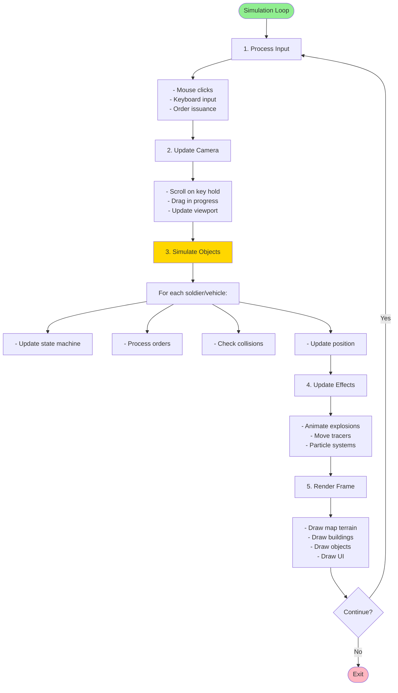
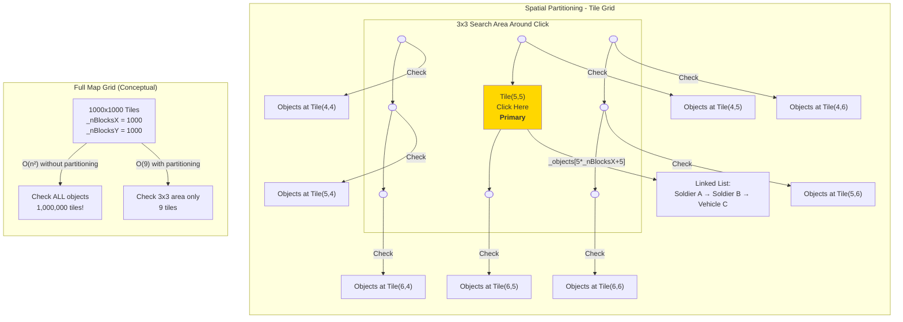
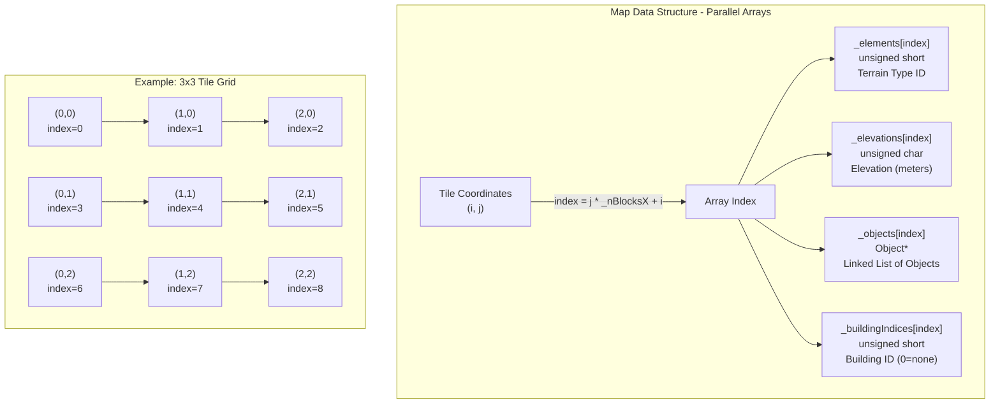
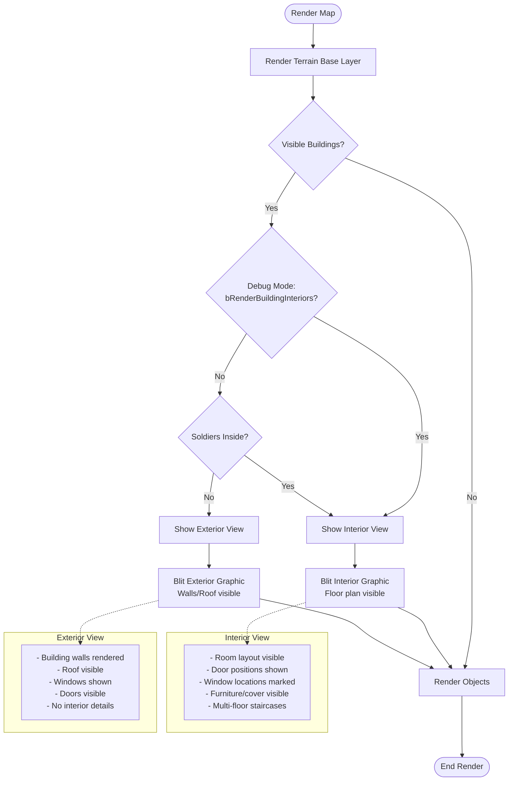
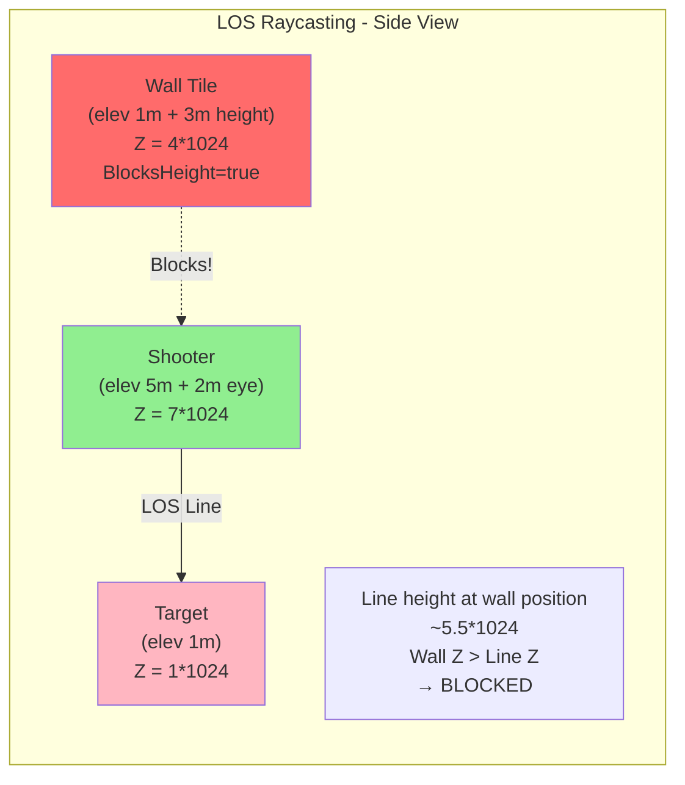
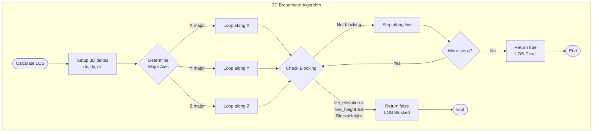

## 6. World, Map, and Terrain System

### 6.1 Concept: The Game World as a Digital Environment

The game world is a digital simulation of a tactical battlefield environment. It consists of terrain features, elevation changes, buildings, and open areas. Soldiers and vehicles navigate this virtual landscape, taking cover behind walls, moving through forests, and fighting for control of strategic locations.

**What does the World manage?**

The World is the central simulation manager that coordinates all gameplay systems:

| Responsibility | Description |
|---------------|-------------|
| **Time** | Advances the simulation clock, updating all entities each frame |
| **Objects** | Tracks all soldiers, vehicles, squads, and buildings |
| **Simulation** | Handles movement, combat, line-of-sight calculations |
| **Interaction** | Processes player input (selection, orders, camera control) |
| **Terrain** | Provides queries about passability, cover, and elevation |

**The Map as Digital Terrain**

The Map represents the virtual battlefield—a data structure where each tile stores:
- **Terrain type**: Grass, dirt, water, walls, etc.
- **Elevation**: Height in meters (affects line of sight and movement)
- **Objects**: Soldiers and vehicles currently occupying that tile
- **Buildings**: Whether this tile is part of a structure

### 6.2 Terrain System in Practice

The following example demonstrates how the terrain system affects gameplay mechanics:

**Movement Through Grass Field**

When a unit moves through grass terrain:
- **50% cover** when prone
- **0% cover** when standing
- **Normal prone movement speed** (1.0x multiplier for prone movement)

The pathfinding system evaluates each tile:
- Passable: Yes, grass is walkable
- Movement cost: 1.0 (normal speed)

**Entering High Grass**

When a unit enters high grass terrain:
- **53% cover** when prone
- **53% cover** when crouching
- **Reduced movement speed** (0.667x multiplier)

The movement speed reduction reflects the difficulty of navigating dense vegetation, while the improved cover percentage provides tactical benefits.

**Crossing Obstacles**

Stone walls demonstrate terrain blocking:
- **Impassable** for direct movement
- **93% cover** for all stances (Prone, Low, Medium, High)
- **Blocks line of sight** for units on opposite sides

Units must navigate around obstacles or use climbing mechanics (with associated time costs and exposure).

**Building Interiors**

Buildings provide strategic advantages:
- **Interior view** displays floor plan layout when occupied
- **Multiple rooms** offer varied defensive positions
- **Windows** enable firing at external targets while maintaining protection

Occupying buildings provides substantial defensive bonuses and tactical positioning options.

### 6.3 Terrain System: How Terrain Works

#### 6.3.1 The Three Pillars of Terrain

Every terrain type (called an "Element") defines three key gameplay properties:

**1. Cover**

Cover represents how much protection the terrain provides against enemy fire. Different stances benefit differently:

| Stance | Description | Typical Cover |
|--------|-------------|---------------|
| **Prone** | Laying flat on ground | Highest (50-80%) |
| **Low** | Crawling/low crouch | Moderate (20-50%) |
| **Medium** | Normal crouch | Low (0-20%) |
| **High** | Standing upright | Usually none |

*Example*: A trench offers 78% cover for Prone, Low, and Medium stances, but only 10% when standing (High stance).

**2. Hindrance**

Hindrance affects how quickly soldiers can move through terrain:

| Terrain | Movement Speed | Hindrance Value |
|---------|---------------|-----------------|
| Paved road | 100% | 0 |
| Grass field | 100% | 0 |
| High grass | 67% | 2 |
| Mud | 40% | 5 |
| Deep water | Impassable | — |

**3. Elevation**

Elevation creates tactical advantages:
- **Higher ground** provides better line of sight
- **Slopes** slow movement
- **Cliffs** may be impassable
- **Buildings** offer elevated firing positions

#### 6.3.2 Line of Sight: Visibility Calculations

The line of sight (LOS) system determines visibility between two points in the game world:

**Core Visibility Check**: Given a source position (x1, y1) and target position (x2, y2), can the target be seen?

Factors affecting visibility:

1. **Distance**: Target must be within visual range
2. **Elevation**: Relative height difference between positions
3. **Blocking terrain**: Walls, hills, or buildings between the points
4. **Stance**: Target posture affects visibility (standing vs. prone)

**Example Scenario**: A unit on a hill (elevation 5m) observing a field below (elevation 1m) has clear visibility. However, if the target position is behind a stone wall (height 3m) between the two points, the wall blocks the line of sight—even though the observer is at higher elevation.

**LOS Calculation**: Line-of-sight is calculated at runtime using a 3D Bresenham algorithm. The `CalculateLOSForTile()` method traces a ray between two points to determine visibility. While an export function exists for precomputation, the current implementation uses live runtime calculation.

#### 6.3.3 Buildings as Strategic Points

Buildings are more than just obstacles—they're tactical objectives.

**Building Interiors**

When soldiers enter a building, the view changes:
- **Exterior view**: Shows the building from outside (walls, roof visible)
- **Interior view**: Shows the floor plan (walls cut away, rooms visible)

This transition happens automatically when:
- A soldier moves inside the building, OR
- The player enables "show interiors" debug mode

**Tactical Value**:
- **Protection**: Buildings provide excellent cover
- **Elevation**: Upper floors offer vantage points
- **Choke points**: Doorways and windows create defensive positions
- **Concealment**: Enemies can't see inside unless they have line of sight

**Example**: A farmhouse might have:
- Ground floor with multiple entry points (harder to defend)
- Upper floor with limited access (excellent defensive position)
- Windows providing firing positions in multiple directions

### 6.4 World Simulation Loop

The simulation advances time in discrete steps. Here's how the world updates each frame:

**Update Cycle**:



```
1. Process Input
   └── Handle mouse clicks, keyboard, orders

2. Update Camera
   └── Scroll if keys held or drag in progress

3. Simulate Objects
   └── For each soldier/vehicle:
       ├── Update state machine
       ├── Process orders
       ├── Check collisions
       └── Update position

4. Update Effects
   └── Animate explosions, tracers, etc.

5. Render Frame
   └── Draw map, objects, UI
```

**Spatial Partitioning**: Objects are stored in a grid structure for efficient lookup. Instead of checking every entity on the map, the game only checks the 3x3 tile area around a position.



**Example**: When a unit fires a weapon, the game only checks for hit detection against entities in nearby tiles, not the entire map grid.

### 6.5 Implementation: C++ Classes

Now that we understand the concepts, let's examine the actual implementation.

#### 6.5.1 World Class

**Location**: `src/world/World.h`, `src/world/World.cpp`

The World class is the central coordinator:

```cpp
class World {
public:
    World(void);
    ~World(void);
    
    // Lifecycle
    void Load(const std::filesystem::path& fileName,
              SoldierManager* soldierManager,
              AnimationManager* animationManager);
    void Simulate(long dt);           // Advance simulation by dt milliseconds
    void Render(Screen* screen, Rect* clip);
    
    // Object management
    void AddObject(Object* o);
    void MoveObject(Object* object, Point* from, Point* to);
    bool TryMove(Object* o, int x, int y);  // STUB: Currently always returns true
    
    // Input handling
    void LeftMouseDown(int x, int y);
    void LeftMouseUp(int x, int y);
    void LeftMouseDrag(int x, int y);
    void RightMouseDown(int x, int y);
    void RightMouseUp(int x, int y);
    void KeyDown(int key);
    void KeyUp(int key);
    
    // Orders
    void IssueOrder(Order* o);
    
    // Camera control
    void SetOrigin(int x, int y);     // Move camera/viewport
    
    // Terrain queries
    bool IsPassable(int i, int j) { 
        return _currentMap->GetTileElement(i,j)->Passable; 
    }
    Element* GetTileElement(int i, int j) {
        return _currentMap->GetTileElement(i,j);
    }
    
    // Public properties
    Point NumTiles;                   // Map dimensions in tiles
    Size TileSize;                    // Size of each tile in pixels
    InterfaceState State;             // Current UI state

protected:
    Map* _currentMap;                 // The map itself
    std::vector<Object*> _mobileObjects;    // Soldiers, vehicles, squads
    std::vector<Object*> _staticObjects;    // Buildings, obstacles
    std::vector<Object*> _selectedObjects;  // Currently selected (non-owning)
    WorldState _currentState;         // Normal, ContextSelecting, etc.
    LineOfSight* _lineOfSight;        // LOS calculation system
    
    // Managers
    SquadManager *_squadManager;      // Squad creation and management
    EffectManager *_effectManager;    // Visual effects
    WeaponManager *_weaponManager;    // Weapon templates
    VehicleManager *_vehicleManager;  // Vehicle templates
    ColorManager *_colorManager;      // Color modifications
    
    // UI/Input state
    bool _scrollLeft, _scrollRight, _scrollUp, _scrollDown;  // Scroll key states
    bool _middleDragActive;           // Middle mouse drag state
    int _middleDragLastX, _middleDragLastY;
    
    // Visual markers
    std::vector<Point> _markPoints;
    std::vector<Mark::Color> _markColors;
    std::vector<Effect*> _effects;         // Active visual effects
    Direction _currentHeadingArc;          // Current camera heading
    
    // Scroll state
    bool _scrollRepeating;                 // Auto-scroll repeat flag
    long _scrollTimer;                     // Scroll timing
    
    // Viewport state
    int _originX, _originY;                // Camera/world offset in pixels
    int _screenWidth, _screenHeight;       // Screen dimensions
    int _viewWidth, _viewHeight;           // Viewport dimensions
    
    // UI components
    CombatContextMenu* _contextMenu;       // Right-click context menu
    ContextMenuChoice _currentChoice;      // Current menu selection
    
    // Element and minimap
    ElementManager* _elementManager;       // Terrain element definitions
    MiniMap* _currentMiniMap;              // Minimap display
    
    // Ranger/markering system
    int _rangerX, _rangerY;                // Ranger cursor position
    Object* _rangerSelectedObject;         // Object under ranger
    Color _rangerColor;                    // Ranger highlight color
};
```

**World States**: The world operates in different states that change how input is handled:

```cpp
// Defined inside World class (accessed as World::WorldState)
enum WorldState {
    Normal,             // Default gameplay
    ContextSelecting,   // Right-click menu open
    ContextSelected,    // Menu item selected
    Ambushing,          // Choosing ambush direction
    Defending           // Choosing defend direction
};
```

**Object Ownership**: The World owns all game objects through collections:

```mermaid
classDiagram
    class World {
        +Simulate(dt)
        +Render(screen, clip)
        +AddObject(o)
        +MoveObject(object, from, to)
        +IssueOrder(order)
        +SetOrigin(x, y)
        +IsPassable(i, j)
        +GetTileElement(i, j)
        #UpdateFireCursor(cursorX, cursorY, hasTarget)
        +ConvertTileToPosition(i, j, x, y)
        +ConvertPositionToTile(x, y, i, j)
        +AddMark(markColor, x, y)
        +ClearMarks()
        -Map* _currentMap
        -vector~Object*~ _mobileObjects
        -vector~Object*~ _staticObjects
        -vector~Object*~ _selectedObjects
        -LineOfSight* _lineOfSight
        -WorldState _currentState
        -CombatContextMenu* _contextMenu
        -ContextMenuChoice _currentChoice
        -SquadManager* _squadManager
        -EffectManager* _effectManager
        -WeaponManager* _weaponManager
        -VehicleManager* _vehicleManager
        -ElementManager* _elementManager
        -ColorManager* _colorManager
        -MiniMap* _currentMiniMap
        -int _rangerX, _rangerY
        -Object* _rangerSelectedObject
        -Color _rangerColor
        -vector~Point~ _markPoints
        -vector~Mark::Color~ _markColors
        #CalculateHitChance(shooterX, shooterY, targetX, targetY, hasLOS)
    }
    
    class Object {
        <<abstract>>
        +virtual Simulate(dt)
        +Render(screen)
        +GetTeam()
        +Contains(x, y)
        +NextObject
        +PrevObject
    }
    
    class Map {
        +Render(screen, clip)
        +GetTileElement(i, j)
        +GetTileElevation(i, j)
        +MoveObject(object, from, to)
        +PlaceObject(object, to)
        +SelectObjects(x, y, dest)
        -int _nBlocksX, _nBlocksY
        -unsigned short* _elements
        -unsigned char* _elevations
        -Object** _objects
        -unsigned short* _buildingIndices
        -vector~Building*~ _buildings
    }
    
    class LineOfSight {
        +CalculateLOSForTile(x1, y1, x2, y2)
        +Export(map, filename)
    }
    
    class Soldier {
        +Simulate(dt)
        +Render(screen)
        +IssueOrder(order)
        +SetSquad(squad)
    }
    
    class Vehicle {
        +Simulate(dt)
        +Render(screen)
    }
    
    class Building {
        +Position
        +BoundaryPoints
        +Tiles
    }
    
    World --> Map : owns
    World --> LineOfSight : owns
    World --> "*" Object : _mobileObjects
    World --> "*" Object : _staticObjects
    World --> "*" Object : _selectedObjects
    Object <|-- Soldier
    Object <|-- Vehicle
    Map --> "*" Building : owns (not inherited)

#### 6.5.2 Map Class and Tile Storage

**Location**: `src/world/Map.h`, `src/world/Map.cpp`

The Map stores terrain data using **parallel arrays** for memory efficiency:

```cpp
class Map {
public:
    static Map *Create(const std::filesystem::path& fileName);
    void Render(Screen *screen, Rect *clip);
    
    // Dimensions
    inline int GetWidth() { return _mapImage->GetWidth(); }
    inline int GetHeight() { return _mapImage->GetHeight(); }
    
    // Tile access
    Element* GetTileElement(int i, int j);
    int GetTileElevation(int i, int j);
    bool IsTileBlockHeight(int i, int j);
    
    // Object management
    void SelectObjects(int x, int y, std::vector<Object*>* dest);
    void MoveObject(Object* object, Point* from, Point* to);

protected:
    int _nBlocksX, _nBlocksY;              // Tile grid dimensions
    int _nPixelsPerBlockX, _nPixelsPerBlockY;  // Tile size (default 10x10)
    
    // Per-tile parallel arrays - indexed by j*_nBlocksX + i
    unsigned short* _elements;             // Element type indices
    unsigned char* _elevations;            // Base elevation in meters
    Object** _objects;                     // Linked list of objects on tile
    unsigned short* _buildingIndices;      // 1-based building index (0 = none)
    
    std::vector<Building*> _buildings;
    TGA* _mapImage;
};
```

**Array Indexing**: All arrays use the same indexing formula:



```cpp
// Convert tile coordinates to array index
int index = j * _nBlocksX + i;

// Access data
unsigned short elementIdx = _elements[index];        // Terrain type
unsigned char elevation = _elevations[index];        // Height in meters
Object* objectList = _objects[index];                // Objects on this tile
unsigned short buildingIdx = _buildingIndices[index]; // Building reference
```

**Spatial Object Organization**: Objects are stored in intrusive linked lists per tile for efficient spatial queries:

```cpp
void Map::MoveObject(Object* object, Point* from, Point* to) {
    int oi = from->x / _nPixelsPerBlockX;
    int oj = from->y / _nPixelsPerBlockY;
    int ni = to->x / _nPixelsPerBlockX;
    int nj = to->y / _nPixelsPerBlockY;
    
    if(oi == ni && oj == nj) return;  // Same tile, no update needed
    
    int oldIdx = oj * _nBlocksX + oi;
    int newIdx = nj * _nBlocksX + ni;
    
    // Remove from old tile's linked list
    if(object->PrevObject != NULL) {
        object->PrevObject->NextObject = object->NextObject;
    } else {
        _objects[oldIdx] = object->NextObject;
    }
    if(object->NextObject != NULL) {
        object->NextObject->PrevObject = object->PrevObject;
    }
    
    // Add to new tile (at head of list)
    object->PrevObject = NULL;
    object->NextObject = _objects[newIdx];
    if(object->NextObject != NULL) {
        object->NextObject->PrevObject = object;
    }
    _objects[newIdx] = object;
}
```

**Selection**: When the player clicks, the game searches a 3x3 tile area and selects entire squads:

```cpp
void Map::SelectObjects(int x, int y, std::vector<Object*>* dest) {
    int ci = x / _nPixelsPerBlockX;
    int cj = y / _nPixelsPerBlockY;
    
    // Search 3x3 area around click
    int si = (ci - 1) >= 0 ? (ci - 1) : 0;
    int sj = (cj - 1) >= 0 ? (cj - 1) : 0;
    int di = (ci + 1) < _nBlocksX ? (ci + 1) : _nBlocksX - 1;
    int dj = (cj + 1) < _nBlocksY ? (cj + 1) : _nBlocksY - 1;
    
    for(int j = sj; j <= dj; ++j) {
        for(int i = si; i <= di; ++i) {
            Object* object = _objects[j * _nBlocksX + i];
            while(object != nullptr) {
                // Only select objects that are part of our team
                if(object->GetTeam() == g_Globals->World.CurrentPlayer 
                   && object->Contains(x, y)) {
                    // Get the squad that this object belongs to
                    Squad* s = object->GetSquad();
                    
                    // Check if squad already added to selection
                    bool bAdd = true;
                    for(size_t k = 0; k < dest->size(); ++k) {
                        if((*dest)[k]->GetID() == s->GetID()) {
                            bAdd = false;
                            break;
                        }
                    }
                    
                    // Add squad if not already selected
                    if(bAdd) {
                        s->Select(x, y);
                        dest->push_back(s);
                    }
                }
                object = object->NextObject;
            }
        }
    }
}
```

#### 6.5.3 Element Class (Terrain Types)

**Location**: `src/world/Element.h`, `src/world/Element.cpp`

Elements define terrain properties:

```cpp
class Element {
public:
    // Stance/height levels for different calculations
    enum Level { 
        Prone = 0,   // On ground (0)
        Low,         // Crawling/crouching low (1)
        Medium,      // Crouching (2)
        High,        // Standing (3)
        Top          // Elevated position (4) - protection only
    };
    
    int Index;                    // Database index
    int Height;                   // Visual height in meters
    std::string Name;             // Human-readable name
    bool BlocksHeight;            // Blocks line of sight?
    bool Passable;                // Can units walk through?
    
    unsigned char Cover[4];       // Cover % by stance (Prone, Low, Medium, High)
    unsigned char Hindrance[4];   // Movement hindrance by stance
    unsigned short Protection[5]; // Damage protection by stance (includes Top)
    float Movement[3];            // Speed multipliers: Prone, Crouch, Standing
};
```

**Stance Level System**:

| Level | Enum | Cover | Hindrance | Protection | Movement |
|-------|------|-------|-----------|------------|----------|
| Prone | 0 | ✓ | ✓ | ✓ | Index 0 |
| Low | 1 | ✓ | ✓ | ✓ | Index 1 |
| Medium | 2 | ✓ | ✓ | ✓ | Index 2 |
| High | 3 | ✓ | ✓ | ✓ | — |
| Top | 4 | — | — | ✓ | — |

**Example Terrain Definitions**:

| Name | Passable | BlocksHeight | Cover(Prone) | Move(Prone) |
|------|----------|--------------|--------------|-------------|
| Grass Field | true | false | 50% | 1.0x |
| High Grass | true | false | 53% | 0.667x |
| Stone Wall | false | true | 93% | 0.5x |
| Deep Water | false | false | 0% | 0.0x |
| Trench | true | false | 78% | 0.4x |

```mermaid
classDiagram
    class Element {
        +int Index
        +int Height
        +string Name
        +bool BlocksHeight
        +bool Passable
        +unsigned char[4] Cover
        +unsigned char[4] Hindrance
        +unsigned short[5] Protection
        +float[3] Movement
    }
    
    class Level {
        <<enumeration>>
        Prone = 0
        Low = 1
        Medium = 2
        High = 3
        Top = 4
    }
    
    Element --> Level : uses
    
    note for Element "Cover[Hindrance/Protection] indexed by Level\nMovement indexed by Prone/Crouch/Standing"

graph LR
    subgraph "Terrain Type Hierarchy"
        A["Ground Elements"] --> B["Grass Field"]
        A --> C["High Grass"]
        A --> D["Dirt"]
        A --> E["Mud"]
        
        F["Obstacle Elements"] --> G["Stone Wall"]
        F --> H["Fence"]
        F --> I["Hedge"]
        
        J["Water Elements"] --> K["Shallow Water"]
        J --> L["Deep Water"]
        
        M["Trench Elements"] --> N["Trench"]
        M --> O["Foxhole"]
        
        P["Building Elements"] --> Q["Floor"]
        P --> R["Roof"]
    end
    
    style B fill:#90EE90
    style C fill:#228B22
    style G fill:#808080
    style L fill:#4169E1
```

#### 6.5.4 Building System

**Location**: `src/world/Building.h`, `src/world/Building.cpp`

Buildings are defined by boundary polygons and have both exterior and interior graphics:

```cpp
class Building {
public:
    Point Position;                    // Upper-left corner (world coords)
    std::vector<Point> BoundaryPoints; // Polygon vertices
    std::vector<int> Tiles;            // Tile indices belonging to building
    
    void SetInterior(TGA* tga) { _interiorGraphic = tga; }
    TGA* GetInterior() { return _interiorGraphic; }

protected:
    TGA* _interiorGraphic;             // Floor plan view
};
```

**Building Index Population**: The map determines which tiles belong to each building using point-in-polygon tests:

```cpp
void Map::PopulateBuildingsIndices() {
    for(size_t i = 0; i < _buildings.size(); i++) {
        Building* building = _buildings[i];
        
        // Calculate bounding box in tile coordinates
        int si = building->Position.x / _nPixelsPerBlockX;
        int sj = building->Position.y / _nPixelsPerBlockY;
        int ni = building->GetInterior()->GetWidth() / _nPixelsPerBlockX;
        int nj = building->GetInterior()->GetHeight() / _nPixelsPerBlockY;
        
        // Test each tile in bounding box
        for(int n = sj; n <= (sj + nj); n++) {
            for(int m = si; m <= (si + ni); m++) {
                // Point-in-polygon test at tile center
                int tileCenterX = m * _nPixelsPerBlockX + _nPixelsPerBlockX / 2;
                int tileCenterY = n * _nPixelsPerBlockY + _nPixelsPerBlockY / 2;
                
                if(Screen::PointInRegion(tileCenterX, tileCenterY, 
                                         &(building->BoundaryPoints))) {
                    // Mark tile as belonging to this building (1-based index)
                    _buildingIndices[n * _nBlocksX + m] = (unsigned short)i + 1;
                    building->Tiles.push_back(n * _nBlocksX + m);
                }
            }
        }
    }
}
```

**Interior/Exterior Rendering**: Buildings switch views based on occupancy:



```cpp
// PSEUDOCODE - Simplified for documentation
// NOTE: This is a simplified representation. Actual rendering logic is more complex.
void Map::Render(Screen *screen, Rect *clip) {
    // ... render map background ...
    
    // Determine which buildings need interior view
    std::vector<Building*> buildingsToDraw;
    for(each tile in visible area) {
        if(tile has building) {
            Building* b = _buildings[_buildingIndices[index] - 1];
            
            // Show interior if: debug mode OR soldiers inside
            bool showInterior = g_Globals->World.bRenderBuildingInteriors;
            if(!showInterior) {
                for(each tile in building) {
                    if(_objects[tile] != nullptr) {
                        showInterior = true;
                        break;
                    }
                }
            }
            
            if(showInterior) {
                buildingsToDraw.push_back(b);
            }
        }
    }
    
    // Render interiors
    for(Building* b : buildingsToDraw) {
        TGA* tga = b->GetInterior();
        screen->Blit(tga->GetData(), b->Position.x - _originX, 
                     b->Position.y - _originY, tga->GetWidth(), 
                     tga->GetHeight(), tga->GetDepth());
    }
}
```

**Interior View Gameplay**: When soldiers enter a building, players can see:
- Room layouts and door positions
- Cover positions (walls, furniture)
- Window locations for firing
- Staircases for multi-level buildings

This provides tactical information for positioning soldiers defensively.

#### 6.5.5 Line of Sight System

**Location**: `src/world/LineOfSight.h`, `src/world/LineOfSight.cpp`

The LOS system uses a 3D Bresenham algorithm to trace lines through terrain:

```cpp
class LineOfSight {
public:
    // Calculate LOS between two tiles
    // Returns true if clear, false if blocked (outputs blocking position)
    bool CalculateLOSForTile(int x1, int y1, int x2, int y2,
                             int *ox, int *oy, int *oz, Map* map);
    
    // Precompute LOS for entire map (export to file)
    void Export(Map* map, const std::filesystem::path& fileName);
};
```

**Algorithm**: Traces a line in 3D space, checking if terrain blocks the view:

```cpp
bool LineOfSight::CalculateLOSForTile(int x1, int y1, int x2, int y2,
                                      int *outx, int *outy, int *outz, Map* map) {
    // Calculate elevations with eye height offset (+2m for shooter)
    int z1 = (map->GetTileElevation(x1, y1) + 2) * HEIGHT_MODIFIER;
    int z2 = map->GetTileElevation(x2, y2) * HEIGHT_MODIFIER;
    
    // 3D Bresenham setup
    int dx = x2 - x1, dy = y2 - y1, dz = z2 - z1;
    int x_inc = (dx < 0) ? -1 : 1;
    int y_inc = (dy < 0) ? -1 : 1;
    int z_inc = (dz < 0) ? -1 : 1;
    int l = abs(dx), m = abs(dy), n = abs(dz);
    
    int pixel[3] = {x1, y1, z1};
    int dx2 = l << 1, dy2 = m << 1, dz2 = n << 1;
    
    // Trace along major axis
    if(l >= m && l >= n) {  // X is major
        int err_1 = dy2 - l, err_2 = dz2 - l;
        for(int i = 0; i < l; i++) {
            // Check if current tile blocks LOS
            int z3 = map->GetTileElevation(pixel[0], pixel[1]) * HEIGHT_MODIFIER;
            if(z3 > pixel[2] && map->IsTileBlockHeight(pixel[0], pixel[1])) {
                *outx = pixel[0]; *outy = pixel[1]; *outz = pixel[2];
                return false;  // Blocked!
            }
            
            // Step along line
            if(err_1 > 0) { pixel[1] += y_inc; err_1 -= dx2; }
            if(err_2 > 0) { pixel[2] += z_inc; err_2 -= dx2; }
            err_1 += dy2; err_2 += dz2; pixel[0] += x_inc;
        }
    }
    // Similar for Y-major and Z-major axes...
    
    return true;  // LOS is clear
}
```

**Key Points**:
- **HEIGHT_MODIFIER** = 1024 (scales elevation for precision)
- **Eye height** = +2 meters added to shooter position
- Blocking occurs when: `tile_elevation > line_height && tile.BlocksHeight == true`





**Runtime Calculation**: LOS is calculated at runtime using the 3D Bresenham algorithm described above. While an `Export()` method exists for precomputing LOS data to a file, the current implementation calculates visibility on-demand during gameplay.

### 6.6 Coordinate Systems

The game uses multiple coordinate systems that convert between each other:

| System | Units | Description | Conversion |
|--------|-------|-------------|------------|
| **World** | Pixels | Absolute map coordinates | Base system |
| **Tiles** | 10x10 px | Grid-based terrain storage | `i = x / 10` |
| **Mega-tiles** | 12x12 tiles | Strategic objectives | `mi = i / 12` |
| **Screen** | Pixels | Viewport-relative display | `screenX = worldX - originX` |

**Coordinate Conversion Methods**:

| Method | Description |
|--------|-------------|
| `ConvertTileToPosition(i, j, x, y)` | Convert tile coordinates to world pixel position |
| `ConvertPositionToTile(x, y, i, j)` | Convert world pixel position to tile coordinates |
| `Map::ConvertMegaTileToPosition(mi, mj, x, y)` | Convert mega-tile coordinates to world pixel position (Map method) |

**Elevation Calculation**:
```cpp
// Total elevation at a tile
int baseElevation = _elevations[index];           // From heightmap
int elementHeight = element->Height;              // From terrain type
int totalElevation = baseElevation + elementHeight;

// For LOS calculations
int losElevation = (totalElevation + 2) * 1024;   // +2m eye height, scaled
```

### 6.7 Victory Locations

**Location**: `src/world/VictoryLocation.h`

Strategic objectives that provide victory points or campaign links:

```cpp
class VictoryLocation {
public:
    VictoryLocation(void);
    ~VictoryLocation(void);
    
    std::string Name;                    // Display name
    int X, Y;                           // Mega-tile coordinates (12x12 blocks)
    int Value;                          // Strategic value
    int ControllingTeam;                // -1 = neutral, else team index
    
    // Campaign linking
    std::string LinksToMapName;
    std::string LinksToVictoryLocationName;
};
```

Victory locations render as flags on the map and can link to other maps in campaign mode.

---

**Next**: [Chapter 7: Configuration Files and Data Schemas](./07-configuration.md)
