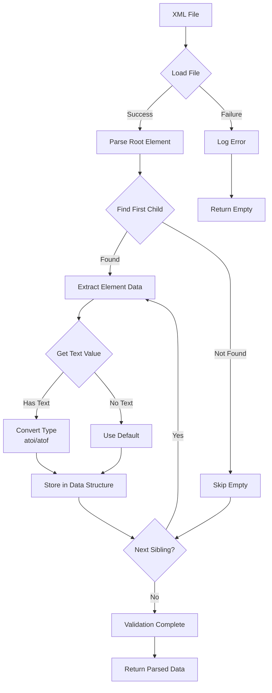
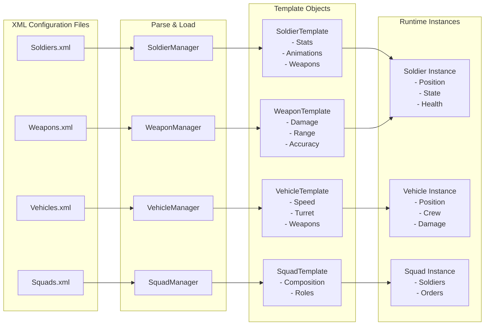
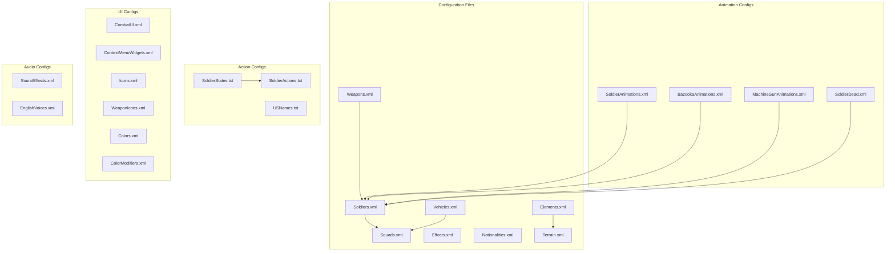

## 7. Configuration and Data Schemas

### 7.1 Overview: What Is Configuration?

Configuration files define the **rules, stats, and definitions** that make the game work. These are human-readable data files that control gameplay without requiring code changes.

| Category | Files | What They Define |
|----------|-------|------------------|
| **Units** | Soldiers.xml, Weapons.xml, Vehicles.xml | Unit types, stats, capabilities |
| **Combat** | Squads.xml, Effects.xml, Elements.xml | Squad compositions, effects, terrain |
| **World** | Nationalities.xml, Terrain.xml | Factions, terrain sprites |
| **UI** | CombatUI.xml, Icons.xml, Colors.xml | Interface layout and graphics |
| **Audio** | SoundEffects.xml, EnglishVoices.xml | Sound mappings |
| **Animation** | *Animations.xml | Animation timing and frames |
| **Actions** | SoldierStates.txt, SoldierActions.txt | State machine and action rules |

**Key Principle**: Configuration is **what** the game contains. Assets (Chapter 8) are **how it looks and sounds**.

**Loading**: Configuration is loaded by individual Manager classes (e.g., `SoldierManager`, `WeaponManager`) rather than a centralized Config class. Configuration paths are stored in `ApplicationGlobals.ConfigDirectory`.

---

### 7.2 Unit Configuration

#### 7.2.1 Soldiers.xml

**Purpose**: Defines 6 soldier types with animations, movement speeds, and capabilities.

**Schema**:

```xml
<Soldiers>
  <Soldier>
    <Name>string</Name>                           <!-- Type identifier -->
    <PrimaryWeapon>string</PrimaryWeapon>         <!-- References Weapons.xml -->
    <PrimaryWeaponNumClips>int</PrimaryWeaponNumClips>
    <States>
      <State>
        <Name>string</Name>                       <!-- State name -->
        <Animation reverse="true|false">string</Animation>
      </State>
      <!-- 14 states minimum -->
    </States>
    <Attributes>
      <WalkingSpeed>float</WalkingSpeed>          <!-- m/s -->
      <WalkingAcceleration>float</WalkingAcceleration>
      <SneakingSpeed>float</SneakingSpeed>
      <SneakingAcceleration>float</SneakingAcceleration>
      <RunningSpeed>float</RunningSpeed>          <!-- 5.36 = historical max -->
      <RunningAcceleration>float</RunningAcceleration>
      <CanMove />      <!-- Boolean flag (empty element) -->
      <CanMoveFast />
      <CanDefend />
      <CanSmoke />
      <CanFire />
      <CanSneak />
      <CanAmbush />
    </Attributes>
  </Soldier>
</Soldiers>
```

**Soldier Types**:

| Name | Primary Weapon | Clips | Speeds (W/R/S) m/s | Capabilities |
|------|----------------|-------|-------------------|--------------|
| Garand | M1 Garand | 4 | 2.5/5.36/1.0 | All 7 flags |
| Carbine | M1A1 Carbine | 4 | 2.5/5.36/1.0 | All 7 flags |
| Thompson | Thompson M1A1 | 4 | 2.5/5.36/1.0 | All 7 flags |
| BAR | BAR | 6 | 2.5/5.36/1.0 | All 7 flags |
| Bazooka | Bazooka | 8 | 2.5/5.36/1.0 | All 7 flags |
| .30 Cal MG | .30 Cal MG | 8 | 2.5/5.36/1.0 | All 7 flags |

**Animation Mapping**:

Each soldier type maps game states to animation names:

| State | Animation | Notes |
|-------|-----------|-------|
| Standing | Standing Rest | - |
| Prone | Prone Rest | - |
| Standing Firing | Standing Firing | - |
| Prone Firing | Prone Firing | - |
| Standing Reloading | Standing Reloading | 5 frames |
| Prone Reloading | Prone Reloading | 5 frames |
| Standing Up | Standing Up | 8 frames |
| Lying Down | Standing Up | reverse="true" |
| Sneaking | Crawling | - |
| Walking | Walking | 12 frames |
| Running | Running | 8 frames, 150ms |
| Dying Blown Up | Dying Blown Up | - |
| Dying Backward | Dying Backward | - |
| Dying Forward | Dying Forward | - |
| Dead | Dead | Static |

**Special Cases**:
- **Bazooka**: Animation names prefixed with "Bazooka "
- **.30 Cal MG**: Animation names prefixed with "Machine Gun "

---

#### 7.2.2 Weapons.xml

**Purpose**: Defines 8 weapon types with combat statistics.

**Schema**:

```xml
<Weapons>
  <!-- All times in milliseconds -->
  <!-- Ranges in meters, Weights in pounds -->
  <!-- BaseAccuracy is MOA (minutes of angle) -->
  <Weapon earthShaker="true|false">
    <Name>string</Name>              <!-- Weapon identifier -->
    <Icon>string</Icon>              <!-- UI icon name -->
    <Sound>string</Sound>            <!-- Sound effect key -->
    <Animation>string</Animation>    <!-- Effect type: Rifle/Machine Gun/Bazooka/Muzzle -->
    <RoundsPerClip>int</RoundsPerClip>
    <RoundsPerBurst>int</RoundsPerBurst>
    <ReloadTimeChamber>int</ReloadTimeChamber>  <!-- ms -->
    <ReloadTimeClip>int</ReloadTimeClip>        <!-- ms -->
    <TimeToFire>int</TimeToFire>                <!-- ms between shots -->
    <MaxEffectiveRange>int</MaxEffectiveRange>  <!-- meters -->
    <WeaponWeight>float</WeaponWeight>          <!-- pounds -->
    <ClipWeight>float</ClipWeight>             <!-- pounds -->
    <CoolRate>int</CoolRate>                    <!-- ms per cool tick -->
    <HeatRate>int</HeatRate>                    <!-- ms per heat tick -->
    <BaseAccuracy>float</BaseAccuracy>          <!-- MOA -->
  </Weapon>
</Weapons>
```

**Note**: The following fields exist in the XML schema but are **NOT currently parsed** by WeaponManager: MaxEffectiveRange, WeaponWeight, ClipWeight, CoolRate, HeatRate, BaseAccuracy. Only the following are loaded: Name, Icon, Sound, Animation, TimeToFire, RoundsPerBurst, RoundsPerClip, ReloadTimeClip, ReloadTimeChamber, and earthShaker attribute.

**Weapon Definitions**:

| Name | Rounds/Clip | Burst | Reload(C/C) ms | Fire ms | Range | Weight lb | Heat/Cool ms | Acc | earthShaker |
|------|-------------|-------|----------------|---------|-------|-----------|--------------|-----|-------------|
| M1 Garand | 8 | 1 | 400/8000 | 400 | 460m | 10.0/1.0 | 300/500 | 1.00 | No |
| Blank | 0 | 0 | 0/0 | 0 | 0 | 0.0/0.0 | 0/0 | 0.00 | No |
| Thompson M1A1 | 30 | 5 | 500/10000 | 800 | 50m | 11.0/4.0 | 300/500 | 3.00 | No |
| M1A1 Carbine | 15 | 1 | 200/10000 | 500 | 200m | 5.2/3.0 | 300/500 | 1.00 | No |
| BAR | 20 | 3 | 200/10000 | 300 | 80m | 19.4/4.0 | 300/500 | 2.00 | No |
| Bazooka | 1 | 1 | 20000/10000 | 1000 | 80m | 9.0/2.0 | 1500/1000 | 2.00 | No |
| .30 Cal MG | 250 | 4 | 300/15000 | 300 | 80m | 45.0/4.0 | 300/700 | 2.00 | No |
| 7.5cm L48 | 1 | 1 | 8000/8000 | 500 | 80m | 0.0/5.0 | 1000/500 | 2.00 | **Yes** |

---

#### 7.2.3 Vehicles.xml

**Purpose**: Defines vehicle types with turret/hull mechanics.

**Schema**:

```xml
<Vehicles>
  <Vehicle>
    <Name>Panzer IVG</Name>
    <MaxRoadSpeed>10.55</MaxRoadSpeed>    <!-- m/s -->
    <Acceleration>1.32</Acceleration>      <!-- m/s^2 -->
    <Turret>
      <Graphic>Vehicles/panzer_IVG_turret.8.30.tga</Graphic>
      <PositionX>12</PositionX>            <!-- Turret offset on hull -->
      <PositionY>21</PositionY>
      <PrimaryMuzzleX>0</PrimaryMuzzleX>   <!-- Muzzle flash offset -->
      <PrimaryMuzzleY>33</PrimaryMuzzleY>
      <RotationRate>1000</RotationRate>    <!-- ms per 22.5 degrees -->
      <Weapon slot="0" clips="32">7.5cm L48</Weapon>
    </Turret>
    <Hull>
      <Graphic>Vehicles/panzer_IVG_hull.12.21.tga</Graphic>
      <RotationRate>2000</RotationRate>    <!-- ms per 22.5 degrees -->
      <Weapon slot="1" clips="8">.30 Cal MG</Weapon>
    </Hull>
    <Wreck>
      <Graphic>Vehicles/panzer_IVG_wreck.11.21.tga</Graphic>
    </Wreck>
  </Vehicle>
</Vehicles>
```

**Vehicle Types**: Currently 1 (Panzer IVG)

---

### 7.3 Combat Configuration

#### 7.3.1 Squads.xml

**Purpose**: Defines 4 squad compositions linking soldiers and vehicles.

**Schema**:

```xml
<Squads>
  <Squad>
    <Name>string</Name>
    <Icon>string</Icon>
    
    <!-- Infantry (0-32 per squad) -->
    <Soldier>
      <Title>string</Title>          <!-- Leader/Assistant Leader/Gunner/Soldier -->
      <Rank>string</Rank>            <!-- Sergeant Major/Corporal/PFC/Private -->
      <Type>string</Type>            <!-- From Soldiers.xml -->
      <Camo>string</Camo>            <!-- Camouflage pattern -->
    </Soldier>
    
    <!-- Vehicle (0-1 per squad) -->
    <Vehicle>
      <Type>string</Type>            <!-- From Vehicles.xml -->
      <Soldier slot="int">           <!-- -1=driver, 0=gunner, 1=loader -->
        <Title>string</Title>
        <Rank>string</Rank>
        <Type>string</Type>
        <Camo>string</Camo>
      </Soldier>
    </Vehicle>
  </Squad>
</Squads>
```

**Squad Types**:

| Name | Icon | Composition |
|------|------|-------------|
| BAR Rifle | Rifle Squad | 7 soldiers: Leader (Thompson), Asst (BAR), Gunner (BAR), Carbine, 3x Garand |
| Bazooka | Bazooka Squad | 2 soldiers: Leader (Thompson), Gunner (Bazooka) |
| .30 Cal MG | .30 Cal MG Squad | 3 soldiers: Leader (Garand), Asst (Garand), Gunner (.30 Cal) |
| Panzer IVG | Panzer IVG Squad | 1 vehicle: Panzer IVG with 3 crew (gunner slot=0, loader slot=1, driver slot=-1) |

---

#### 7.3.2 Effects.xml

**Purpose**: Defines 34 visual effects with directional variants (2 static + 32 directional across 5 weapon types).

**Schema**:

```xml
<Effects>
  <!-- Static: Fixed position (explosions, dust clouds) -->
  <Effect type="static">
    <Name>string</Name>
    <FrameHold>int</FrameHold>        <!-- ms per frame (typically 33ms = 30fps) -->
    <Sound>string</Sound>             <!-- Optional: sound key -->
    <Graphic>path.x.y.tga</Graphic>   <!-- One or more explicit frames -->
  </Effect>
  
  <!-- Dynamic: Follows entity (muzzle flashes, rocket trails) -->
  <Effect type="dynamic" place="turret|none">
    <Name>string</Name>
    <FrameHold>int</FrameHold>
    <Graphic>path.x.y.tga</Graphic>   <!-- Multiple frames per effect -->
  </Effect>
</Effects>
```

**Effect Categories**:

| Category | Count | Description | Frames Each |
|----------|-------|-------------|-------------|
| Static | 2 | Explosion 60m (33 frames), Dust Cloud (20 frames) | 20-33 |
| Rifle Directional | 8 | N, NE, E, SE, S, SW, W, NW muzzle flashes | 5 |
| Bazooka Directional | 8 | Rocket backblast directions | 12 |
| Machine Gun Directional | 8 | Uses same graphics as rifle | 5 |
| Muzzle Directional | 8 | Tank cannon flashes (place="turret") | 17 |

---

#### 7.3.3 Elements.xml

**Purpose**: Defines 159 terrain element types with cover, protection, and movement properties.

**Schema**:

```xml
<Elements>
  <Element>
    <Name>string</Name>
    <Height>int</Height>                          <!-- Visual height -->
    <Passable>true|false</Passable>               <!-- Can traverse? -->
    <Blocks_Height>true|false</Blocks_Height>     <!-- Blocks LOS? -->
    
    <!-- Cover by stance (Prone/Low/Medium/High) - 0-93 scale -->
    <Cover_Prone>int</Cover_Prone>
    <Cover_Low>int</Cover_Low>
    <Cover_Medium>int</Cover_Medium>
    <Cover_High>int</Cover_High>
    
    <!-- Protection by level (Prone/Low/Medium/High/Top) - 0-50 scale -->
    <Protection_Prone>int</Protection_Prone>
    <Protection_Low>int</Protection_Low>
    <Protection_Medium>int</Protection_Medium>
    <Protection_High>int</Protection_High>
    <Protection_Top>int</Protection_Top>
    <Protection_Flag>Behind|Elevated|Sunken|InElement|None</Protection_Flag>
    <!-- Note: Protection_Flag field exists in XML schema but is NOT currently parsed by ElementManager -->
    
    <!-- Hindrance by stance - 0-59 scale -->
    <Hindrance_Prone>int</Hindrance_Prone>
    <Hindrance_Low>int</Hindrance_Low>
    <Hindrance_Medium>int</Hindrance_Medium>
    <Hindrance_High>int</Hindrance_High>
    
    <!-- Movement multipliers (speed factor) -->
    <Soldier_Move_Prone>float</Soldier_Move_Prone>
    <Soldier_Move_Crouch>float</Soldier_Move_Crouch>
    <Soldier_Move_Standing>float</Soldier_Move_Standing>
  </Element>
</Elements>
```

**Element Categories** (159 total):

| Category | Examples |
|----------|----------|
| Ground | Grass Field, Dirt, Mud, Sand, Pavement |
| Water | Shallow Water, Deep Water, Marsh |
| Vegetation | Bush, High Grass, Crops, Brush |
| Obstacles | Stone Fence, Wood Fence, Barbed Wire, Minefield |
| Debris | Wood Rubble, Stone Rubble, Brick Rubble, Wreck |
| Roads | Dirt Road, Paved Road, Muddy Road, Rail |
| Structures | Wood/Stone/Brick Wall (L1-L3), Door (L1-L3) |
| Floors | Wood/Stone/Brick Floor (L1-L3) |
| Defensive | Trench, Newly Dug Trench, Weapon Pit, Shellhole |
| Bridges | Bridge, Bridge Wall, Bridge Rubble, Wood Bridge |

---

### 7.4 World Configuration

#### 7.4.1 Nationalities.xml

**Purpose**: Defines faction graphics for UI.

```xml
<Nationalities>
  <Nationality>
    <Name>American</Name>
    <VictoryLocation>UI/Flags/Static/american.14.9.tga</VictoryLocation>
    <MiniMap>UI/Flags/Static/minimap_american.tga</MiniMap>
  </Nationality>
  <Nationality>
    <Name>German</Name>
    <VictoryLocation>UI/Flags/Static/german.14.9.tga</VictoryLocation>
    <MiniMap>UI/Flags/Static/minimap_german.tga</MiniMap>
  </Nationality>
  <Nationality>
    <Name>Soviet</Name>
    <VictoryLocation>UI/Flags/Static/soviet.14.9.tga</VictoryLocation>
    <MiniMap>UI/Flags/Static/minimap_soviet.tga</MiniMap>
  </Nationality>
</Nationalities>
```

---

#### 7.4.2 Terrain.xml

**Purpose**: Maps terrain element indices to graphics.

```xml
<Widgets>
  <Widget>
    <Name>Small Tree 1</Name>
    <Graphic>Terrain/big_tree_3 (471).17.18.tga</Graphic>
    <Index>106</Index>
  </Widget>
</Widgets>
```

---

### 7.5 Animation Configuration

#### 7.5.1 SoldierAnimations.xml

**Purpose**: Defines animation timing and frame organization.

```xml
<Animations dir="Soldiers/Rifle" image="spr*" mask="msk*">
  <Animation>
    <Name>Standing Rest</Name>
    <Directions>8</Directions>
    <NumFrames>1</NumFrames>                    <!-- Number of frames per direction -->
    <Time>200</Time>
    <FirstDirection>North</FirstDirection>
    <TransparentColor>16777215</TransparentColor>  <!-- White (RGB) -->
  </Animation>
</Animations>
```

**Attributes**:
- **dir**: Subdirectory in graphics/
- **image**: Sprite file pattern (e.g., "spr*" matches spr0000.x.y.tga)
- **mask**: Mask file pattern (e.g., "msk*" matches msk0000.x.y.tga)
- **Directions**: Number of directional variants (8)
- **NumFrames**: Number of frames per direction
- **Time**: Milliseconds per frame
- **FirstDirection**: Starting direction
- **TransparentColor**: 24-bit RGB color key (16777215 = white)

**Additional Animation XMLs**:
- **BazookaAnimations.xml**: `dir="Soldiers/Bazooka"`
- **MachineGunAnimations.xml**: `dir="Soldiers/MG"`
- **SoldierDead.xml**: Single static death pose (no animation sequence)
- **SoldierDeaths.xml**: Death animation sequences

---

### 7.6 UI Configuration

#### 7.6.1 CombatUI.xml

**Purpose**: Defines UI widget positions and graphics for the combat interface.

---

#### 7.6.2 ContextMenuWidgets.xml

**Purpose**: Defines context menu widget graphics (light/dark/negative states).

---

#### 7.6.3 Icons.xml

**Purpose**: UI icon definitions.

---

#### 7.6.4 WeaponIcons.xml

**Purpose**: Weapon icon mappings.

---

#### 7.6.5 Colors.xml

**Purpose**: Color palette definitions.

---

#### 7.6.6 ColorModifiers.xml

**Purpose**: Color modification rules.

---

### 7.7 Audio Configuration

#### 7.7.1 SoundEffects.xml

**Purpose**: Maps 8 sound names to WAV files.

```xml
<Sounds>
    <Sound>
        <Name>explosion</Name>
        <File>Effects/explosion-0050.wav</File>
    </Sound>
    <Sound>
        <Name>Rifle</Name>
        <File>Effects/rifle-0028.wav</File>
    </Sound>
    <!-- 8 total sound mappings -->
</Sounds>
```

**Sound Types**: explosion, Rifle, Thompson, BAR, Dying, Bazooka, .30 Cal MG, Large Tank Gun

---

#### 7.7.2 EnglishVoices.xml

**Purpose**: Voice line definitions.

```xml
<Sounds>
    <Sound>
        <Name>awaiting orders</Name>
        <File>English Voices/0041 - awaiting orders.wav</File>
    </Sound>
    <!-- Voice line mappings -->
</Sounds>
```

**Voice Categories**:
- **Orders**: Move, attack, hold position
- **Status**: Out of ammo, taking fire, man down
- **Reactions**: Screams, surrender, panic
- **Environmental**: Mud, snow, blocked path
- **Command**: Rank callouts, area secured

---

### 7.8 Action Configuration

#### 7.8.1 SoldierStates.txt

**Purpose**: Line-number indexed (1-based) state definitions, 23 total states.

```
1: Standing
2: Prone
3: Stopped
4: Moving
5: Firing
6: Walking
7: WalkingSlow
8: Crawling
9: Running
10: Reloading
11: DyingBlownUp
12: DyingBackward
13: DyingForward
14: Dead
15: Reloaded
16: OutOfAmmo
17: NoTarget
18: FindingCover
19: Following
20: FollowingInFormation
21: Defending
22: Ambushing
23: Waiting
```

---

#### 7.8.2 SoldierActions.txt

**Purpose**: Tab-separated action definitions with requirements and state changes.

```
Name                    Group   Time    Requirements                    Changes
StandingFire            Fire    0       Stopped,Standing,Reloaded       +Firing,-NoTarget
ProneFire               Fire    0       Stopped,Prone,Reloaded          +Firing,-NoTarget
Run                     Move    0       Standing                        +Running,-Walking,-WalkingSlow,-Crawling,-Stopped,+Moving,-Firing
...
```

---

#### 7.8.3 USNames.txt

**Purpose**: Pool of 473 American surnames for random soldier naming.

Read until `#` marker.

---

### 7.9 Implementation: XML Loading

#### 7.9.1 XML Loading Flowchart



#### 7.9.2 Manager Class Diagram

```mermaid
classDiagram
    class SoldierManager {
        +LoadSoldiers(xmlFile)
        +GetSoldier(name)
        -_soldiers: vector~SoldierTemplate~
    }
    class WeaponManager {
        +LoadWeapons(xmlFile)
        +GetWeapon(name)
        -_weapons: vector~WeaponTemplate~
    }
    class VehicleManager {
        +Load(xmlFile)
        +GetVehicle(name)
        -_vehicles: vector~VehicleTemplate~
    }
    class SquadManager {
        +LoadSquads(xmlFile)
        +GetSquad(name)
        -_squads: vector~SquadTemplate~
    }
    class EffectManager {
        +LoadEffects(xmlFile)
        +GetEffect(name)
        -_effects: vector~EffectTemplate~
    }
    class ElementManager {
        +Load(xmlFile)
        +GetElement(name)
        -_elements: vector~ElementTemplate~
    }
    class AnimationManager {
        +LoadAnimations(xmlFile)
        +GetAnimation(name)
        -_animations: vector~AnimationTemplate~
    }
    
    class BuildingManager {
        +{static} LoadBuildings(xmlFile, vector~Building*~*)
    }

    class MapManager {
        +{static} Parse(configFile): MapAttributes*
    }
    
    SoldierManager --> WeaponManager : references
    SquadManager --> SoldierManager : references
    SquadManager --> VehicleManager : references
    BuildingManager --> MapManager : loads for maps
```

#### 7.9.3 Data Flow: XML → Template → Instance



#### 7.9.4 File Dependency Diagram



#### 7.9.5 TinyXML2 Parser

**Library**: TinyXML2 (version 11.0.0)  
**Location**: `src/misc/tinyxml2.h`, `src/misc/tinyxml2.cpp`

All XML parsing uses TinyXML2 with consistent patterns. Paths use `std::filesystem::path` with forward slashes.

**Common Pattern**:

```cpp
using namespace tinyxml2;

XMLDocument doc;
if (doc.LoadFile(fileName.c_str()) != XML_SUCCESS) {
    ERROR("Failed to load file: " + fileName.string());
}

XMLElement* root = doc.FirstChildElement("RootElement");
if (!root) return;

// Iterate through child elements
for (XMLElement* elem = root->FirstChildElement("ElementName");
     elem != nullptr;
     elem = elem->NextSiblingElement("ElementName")) 
{
    XMLElement* child = elem->FirstChildElement("ChildName");
    if (child && child->GetText()) {
        const char* value = child->GetText();
        // Process value (use atoi, atof for conversion)
    }
}
```

**Key Conventions**:
- All paths use `std::filesystem::path` with forward slashes
- Text values converted using `atoi()`, `atof()`, `static_cast<float>(atof())`
- Always check `GetText()` returns non-null before accessing
- Use `FirstChildElement()` and `NextSiblingElement()` for iteration

---

### 7.10 Configuration Summary

| File | Count | Purpose |
|------|-------|---------|
| Soldiers.xml | 6 soldier types | Soldier definitions |
| Weapons.xml | 8 weapons | Weapon statistics |
| Vehicles.xml | 1 vehicle | Vehicle definitions |
| Squads.xml | 4 squads | Squad compositions |
| Elements.xml | 159 elements | Terrain properties |
| Effects.xml | 34 effects | Visual effect definitions (2 static + 32 directional) |
| Nationalities.xml | 3 nationalities | Faction definitions (American, German, Soviet) |
| Animation XMLs | 4 files | Animation configs |
| UI XMLs | 6 files | Interface definitions |
| Audio XMLs | 2 files | Sound mappings |
| SoldierStates.txt | 23 states | State definitions |
| SoldierActions.txt | 21 actions | Action definitions |
| USNames.txt | 473 names | Name pool |

---

### 7.11 Modding Perspective

**What to Change for Gameplay Mods**:

| Goal | File(s) to Edit |
|------|-----------------|
| Change weapon stats (damage, range, accuracy) | `Weapons.xml` |
| Change soldier speeds or capabilities | `Soldiers.xml` |
| Add new squad compositions | `Squads.xml` |
| Modify terrain cover/protection values | `Elements.xml` |
| Adjust effect timing | `Effects.xml` |
| Change vehicle speed or weapons | `Vehicles.xml` |
| Add new soldier names | `USNames.txt` |
| Modify action requirements | `SoldierActions.txt` |

**Important Notes**:
- All XML files are validated at load time - invalid entries will be skipped
- Weapon names referenced in Soldiers.xml must exist in Weapons.xml
- Animation names must match entries in Animation XMLs
- File paths are relative to the graphics/ or sounds/ directories
- Changes take effect on game restart (no hot-reload)

---

**Next**: [Chapter 8: Asset Structure and File Formats](./08-assets.md)
