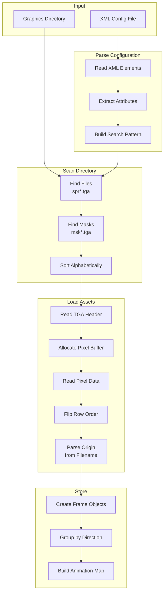
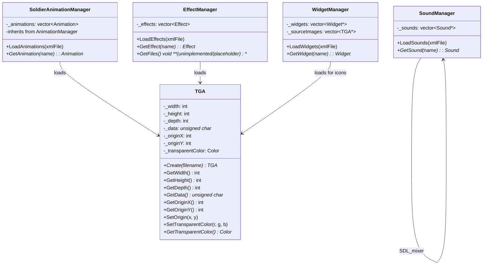

## 8. Asset Organization and File Formats

### 8.1 Overview: What Are Assets?

Assets are **binary data files** that the game loads but does not parse as text. Unlike configuration files (Chapter 7), assets are:

- **Graphics**: TGA images for sprites, animations, UI, terrain
- **Audio**: WAV files for sound effects and voice lines
- **Fonts**: TTF files for text rendering

**Key Principle**: Assets are **how things look and sound**. Configuration (Chapter 7) is **what things are**.

| Type | Extension | Location | Purpose |
|------|-----------|----------|---------|
| **Graphics** | .tga | graphics/ | Sprites, animations, UI, terrain |
| **Sounds** | .wav | sounds/ | Effects and voice lines |
| **Fonts** | .ttf | graphics/UI/ | Text rendering |

---

### 8.2 Directory Structure

#### 8.2.1 Directory Structure

```mermaid
flowchart TD
    root["assets/"] --> graphics["graphics/"]
    root --> sounds["sounds/"]

    graphics --> Soldiers["Soldiers/"]
    Soldiers --> Rifle["Rifle/ (~1,520 files)"]
    Soldiers --> MG["MG/ (~657 files)"]
    Soldiers --> Bazooka["Bazooka/ (~656 files)"]
    Soldiers --> Dying["Dying/ (~480 files)"]
    Soldiers --> Dead["Dead 1-6/"]
    Soldiers --> Flame["Flame/"]
    Soldiers --> Burned["Burned/"]
    Soldiers --> Surrendering["Surrendering/"]
    Soldiers --> Mine["Kneeling Mine/Prone Mine/"]

    graphics --> Effects["Effects/ (25 dirs)"]
    Effects --> RifleDir["rifle_[directions]/"]
    Effects --> BazookaDir["bazooka_[directions]/"]
    Effects --> Muzzle["muzzle_[directions]/"]
    Effects --> Explosion["Explosion/ (33 frames)"]
    Effects --> Dustcloud["Dustcloud/ (20 frames)"]

    graphics --> Terrain["Terrain/ (5 files)"]

    graphics --> UI["UI/"]
    UI --> Actions["Actions/"]
    UI --> Cursors["Cursors/ (16 files)"]
    UI --> Flags["Flags/"]
    Flags --> Animated["Animated/"]
    Flags --> Static["Static/"]
    UI --> Ranks["Ranks/"]
    UI --> Status["Status/"]
    UI --> Teams["Teams/"]
    UI --> Weapons["Weapons/"]

    graphics --> Vehicles["Vehicles/ (3 files)"]
    Vehicles --> Hull["panzer_IVG_hull.12.21.tga"]
    Vehicles --> Turret["panzer_IVG_turret.8.30.tga"]
    Vehicles --> Wreck["panzer_IVG_wreck.11.21.tga"]

    graphics --> Resources["Resources/"]
    Resources --> Icon["app_icon.tga"]

    sounds --> Sfx["Effects/ (25 files)"]
    Sfx --> RifleSnd["rifle-0028.wav"]
    Sfx --> ExplosionSnd["explosion-0050.wav"]

    sounds --> Voices["English Voices/ (101 files)"]
```



#### 8.2.2 Graphics Directory

```
graphics/
├── CombatContextMenu/         # Context menu UI elements
├── Effects/                   # Visual effects (25 subdirectories)
│   ├── rifle_n/               # Rifle muzzle flashes (5 frames)
│   ├── rifle_ne/
│   ├── ... (8 directions)
│   ├── bazooka_n/             # Rocket backblast (12 frames)
│   ├── ... (8 directions)
│   ├── muzzle_n/              # Tank muzzle flashes (17 frames)
│   ├── ... (8 directions)
│   ├── Explosion/             # 33 explosion frames
│   └── Dustcloud/             # 20 dust cloud frames
├── Resources/                 # Application icon
│   └── app_icon.tga
├── Soldiers/                  # Soldier animations (19 subdirectories)
│   ├── Rifle/                 # ~1,520 files - Standard infantry
│   ├── MG/                    # ~657 files - Machine gunner
│   ├── Bazooka/               # ~656 files - Anti-tank
│   ├── Dying/                 # ~480 files - Death animations
│   ├── Dead 1/ ... Dead 6/    # Static dead poses
│   ├── Flame/                 # ~1,120 files - Flamethrower
│   ├── Burned/                # Charred corpses
│   ├── Standing Burning/      # On fire animations
│   ├── Prone Burning/
│   ├── Surrendering/          # ~145 files
│   ├── Kneeling Mine/         # Mine placement
│   └── Prone Mine/
├── Terrain/                   # Tree sprites (5 files)
├── UI/                        # User interface
│   ├── Actions/               # Action indicators
│   ├── Cursors/               # Mouse cursors (16 files)
│   ├── Flags/                 # National flags
│   │   ├── Animated/          # Animated flags
│   │   └── Static/            # Static icons
│   ├── Ranks/                 # Military rank icons
│   ├── Status/                # Status indicators
│   ├── Teams/                 # Team panel graphics
│   ├── Weapons/               # Weapon icons
│   ├── DejaVuSans.ttf         # UI font
│   └── ui_game_*.tga          # UI elements
└── Vehicles/                  # Tank graphics (3 files)
    ├── panzer_IVG_hull.12.21.tga
    ├── panzer_IVG_turret.8.30.tga
    └── panzer_IVG_wreck.11.21.tga
```

**Total TGA Files**: 5,647

---

#### 8.2.3 Sounds Directory

```
sounds/                         # Note: lowercase 'sounds'
├── Effects/                    # 25 sound effect files (8 weapon + 17 dying variants)
│   ├── 30 cal MG-0010.wav
│   ├── bar-0008.wav
│   ├── bazooka-0011.wav
│   ├── dying-00XX.wav          (multiple variants)
│   ├── explosion-0050.wav
│   ├── large tank gun-0014.wav
│   ├── rifle-0028.wav
│   └── thompson-0005.wav
└── English Voices/             # 101 voice line files
    ├── 0000 - scream.wav
    ├── 0001 - bailing out.wav
    ├── 0003 - no prisoners.wav
    ├── ...
    └── 0100 - divebomber.wav
```

**Total WAV Files**: 126 (25 effects + 101 voice files)

**Note**: The directory is `sounds/` (lowercase), not `Sounds/`.

---

### 8.3 File Naming Conventions

#### 8.3.1 TGA Naming Format

```
{name}.{originX}.{originY}.tga
```

Where:
- `name`: Base filename (may contain dots and spaces)
- `originX`: X coordinate for drawing origin (pixels)
- `originY`: Y coordinate for drawing origin (pixels)
- `.tga`: Extension

**Critical Rule**: The origin coordinates are the **last two numeric values** before `.tga`.

**Examples**:

| Filename | X Origin | Y Origin | Purpose |
|----------|----------|----------|---------|
| `spr0000.39.33.tga` | 39 | 33 | Soldier sprite origin |
| `image001.-15.-3.tga` | -15 | -3 | Muzzle flash offset |
| `big_tree_3 (471).17.18.tga` | 17 | 18 | Tree with ID in name |
| `panzer_IVG_turret.8.30.tga` | 8 | 30 | Tank turret pivot point |
| `panzer_IVG_hull.12.21.tga` | 12 | 21 | Tank hull origin |

---

#### 8.3.2 Sprite and Mask Pairs

Animation files come in pairs:
- **Sprite**: `spr{index}.{x}.{y}.tga` - Visible image
- **Mask**: `msk{index}.{x}.{y}.tga` - Collision/selection mask

Example:
```
spr0000.39.33.tga  <-- Sprite
msk0000.39.33.tga  <-- Mask (same origin coordinates)
```

---

#### 8.3.3 Sound Naming

**Effects**: `{description}-{number}.wav`
- Examples: `rifle-0028.wav`, `explosion-0050.wav`

**Voices**: `{number} - {description}.wav`
- Examples: `0041 - awaiting orders.wav`, `0000 - scream.wav`

---

### 8.4 TGA File Format

#### 8.4.1 Format Support

**Supported Formats**:
- **Type 2** (Uncompressed RGB): Fully supported
- **Type 10** (RLE Compressed): Parsed but not fully implemented
- **32-bit BGRA**: Native format with alpha
- **24-bit BGR**: Converted to 32-bit with 0xFF alpha
- **16-bit RGB**: Converted to 32-bit with bit expansion

**Internal Storage**:
- TGA files are stored as BGRA on disk (native TGA format)
- Data stays in BGRA format in memory (no channel reordering)
- Pixel data as `unsigned char*` array
- Row order flipped during load (TGA stores bottom-to-top, converted to top-to-bottom)

---

#### 8.4.2 TGA Header Structure

```cpp
typedef struct {
    char  idlength;              // ID field length (0)
    char  colourmaptype;         // 0 = none
    char  datatypecode;          // 2 = uncompressed RGB
    short int colourmaporigin;   // 0
    short int colourmaplength;   // 0
    char  colourmapdepth;        // 0
    short int x_origin;          // 0
    short int y_origin;          // 0
    short width;                 // Image width
    short height;                // Image height
    char  bitsperpixel;          // 16, 24, or 32
    char  imagedescriptor;       // Image descriptor
} HEADER;  // Note: struct is named HEADER in actual code, not TGA_HEADER
```

---

#### 8.4.3 Pixel Layout

BGRA order in file (unchanged in memory):

```
File Byte 0: Blue   -> Memory Byte 0: Blue
File Byte 1: Green  -> Memory Byte 1: Green
File Byte 2: Red    -> Memory Byte 2: Red
File Byte 3: Alpha  -> Memory Byte 3: Alpha
```

**Note**: TGA pixel data is loaded directly without channel reordering. The BGRA format from the file is preserved in memory.

#### 8.4.4 TGA Format Structure

```mermaid
flowchart LR
    subgraph Header["TGA Header (18 bytes)"]
        H1["ID Length<br/>1 byte"]
        H2["Color Map Type<br/>1 byte"]
        H3["Data Type<br/>1 byte<br/>2=RGB 10=RLE"]
        H4["Color Map Spec<br/>5 bytes"]
        H5["X Origin<br/>2 bytes"]
        H6["Y Origin<br/>2 bytes"]
        H7["Width<br/>2 bytes"]
        H8["Height<br/>2 bytes"]
        H9["Bits/Pixel<br/>1 byte<br/>16/24/32"]
        H10["Descriptor<br/>1 byte"]
    end
    
    subgraph ID["ID Field"]
        I1["0+ bytes<br/>Usually empty"]
    end
    
    subgraph ColorMap["Color Map"]
        C1["0+ bytes<br/>Usually empty"]
    end
    
    subgraph PixelData["Pixel Data"]
        P1["Width × Height × BPP/8<br/>BGRA order<br/>Bottom-to-Top rows"]
    end
    
    Header --> ID --> ColorMap --> PixelData
```



---

### 8.5 Asset Loading Implementation

#### 8.5.1 Asset Loading Pipeline



#### 8.5.2 Asset Manager Relationships

**Note**: There is no unified `AssetManager` class and no common base class for all managers. Each manager (`SoldierAnimationManager`, `EffectManager`, `WidgetManager`, `SoundManager`) is a standalone class without a common base class.



#### 8.5.3 Origin Parsing (Critical)

**Parse coordinates from RIGHT TO LEFT** (find last two dots):

```cpp
// NOTE: This is pseudocode. Actual parsing is inline within TGA::Create()
// CORRECT parsing - right to left
void ParseOriginFromFilename(TGA* tga, const std::string& fName) {
    // Find last dot (before .tga)
    size_t lastDot = fName.find_last_of('.');
    if (lastDot == std::string::npos) return;
    
    // Find second-to-last dot (before Y coordinate)
    size_t secondDot = fName.find_last_of('.', lastDot - 1);
    if (secondDot == std::string::npos) return;
    
    // Find third-to-last dot (before X coordinate)
    size_t thirdDot = fName.find_last_of('.', secondDot - 1);
    if (thirdDot == std::string::npos) return;
    
    // Extract coordinates
    int x = atoi(fName.substr(thirdDot + 1, secondDot - thirdDot - 1).c_str());
    int y = atoi(fName.substr(secondDot + 1, lastDot - secondDot - 1).c_str());
    
    tga->SetOrigin(x, y);
}
```

---

#### 8.5.4 Animation Loading Sequence

```cpp
SoldierAnimationManager::LoadAnimations(xmlFile) {
    1. Parse XML configuration
       - Read dir, image, mask attributes from <Animations>
       - Parse each <Animation> element for name, directions, frames, time
    
    2. Scan directory
       searchPattern = graphicsDir / directory / "spr*"
       for each .tga starting with "spr":
           add to files[]
           create mask filename (replace "spr" with "msk")
           add to masks[]
       sort(files)  // Alphabetical
       sort(masks)
    
    3. Load TGA files
       for each frame:
           TGA *tga = TGA::Create(fName)
           TGA *mtga = TGA::Create(mName)
           ParseOriginFromFilename(tga, fName)  // Extract X,Y from name.X.Y.tga
           Create MaskFrame with both images
    
    4. Create Animation objects
       group frames by direction (8 dirs)
       store in _animations vector
}
```

---

#### 8.5.5 Effect Loading Sequence

```cpp
EffectManager::LoadEffects(xmlFile) {
    1. Parse XML
       - type="static" or type="dynamic"
       - place="turret" attribute for tank effects
       - FrameHold (ms per frame)
       - Optional <Sound> element
    
    2. Static effects
       - Read explicit <Graphic> elements
       - Load each TGA
       - Parse origin from filename
    
    3. Dynamic effects
       - Parse <Graphics> wildcard or individual <Graphic> entries
       - Collect all matching files
       - Sort alphabetically
       - Load each TGA
    
    4. Parse origin from filenames
       - Find last two dots
       - Extract X, Y coordinates
}
```

---

#### 8.5.6 Path Handling

All paths use `std::filesystem::path` with forward slashes:

```cpp
// Global directories (from Globals.h)
std::filesystem::path CurrentDirectory;      // Working directory
std::filesystem::path ConfigDirectory;       // config/
std::filesystem::path GraphicsDirectory;     // graphics/
std::filesystem::path MapsDirectory;         // maps/
std::filesystem::path SoundsDirectory;       // sounds/

// Building file paths
std::filesystem::path path = g_Globals->Application.ConfigDirectory / "Soldiers.xml";
std::filesystem::path fullPath = g_Globals->Application.GraphicsDirectory / "Soldiers/Rifle";
```

---

### 8.6 Map Assets

#### 8.6.1 Map Directory Structure

```
maps/{MapName}/
├── {MapName}.xml              # Map metadata
├── {MapName}.bgm.tga          # Background image (7200x6840)
├── {MapName}.mmm.tga          # Minimap image
├── {MapName}.ovm.tga          # Overland/strategic view
├── {MapName}.txt              # Terrain element data
├── {MapName}.buildings.xml    # Building definitions
└── building_graphics/         # Building interior/exterior sprites
    ├── exterior_000.tga
    ├── interior_000.tga
    └── ... (62 files for Acqueville)
```

---

#### 8.6.2 Map Image Formats

| File | Size | Purpose |
|------|------|---------|
| `.bgm.tga` | 7200x6840 | Full battlefield background |
| `.mmm.tga` | ~600x570 | Minimap overview |
| `.ovm.tga` | Variable | Strategic/overland view |

**Coordinate System**:
- MegaTile = 12x12 tiles = 120x120 pixels
- Map dimensions: 60x57 MegaTiles = 720x684 tiles = 7200x6840 pixels

---

### 8.7 Asset Creation Guidelines

#### 8.7.1 Soldier Animation Assets

1. **File Naming**:
   - Format: `spr{index}.{originX}.{originY}.tga`
   - Matching mask: `msk{index}.{originX}.{originY}.tga`
   - Keep indices sequential (0000, 0001, 0002...)
   - Origin coordinates are relative to bottom-center of sprite

2. **Origin Points**:
   - Origin (0,0) = feet position for standing soldiers
   - Negative Y = up (for muzzle flashes, weapon offsets)
   - Positive X = right
   - Examples: spr0000.39.33.tga means origin at (39,33) from top-left

3. **Color Key**:
   - White (255,255,255) = transparent for soldiers
   - Black (0,0,0) = transparent for effects

4. **Frame Counts**:
   - Must be multiples of 8 for 8-directional
   - Walking: 12 frames per direction = 96 total
   - Running: 8 frames per direction = 64 total
   - Firing: 1 frame per direction = 8 total

---

#### 8.7.2 Effect Assets

1. **Filename Format**:
   - `image{NNN}.{originX}.{originY}.tga`
   - NNN should be sequential (001, 002, 003...)

2. **Origin Rules**:
   - Muzzle flashes: origin at barrel tip (negative Y)
   - Explosions: origin at center of effect
   - Dust clouds: origin at base

3. **Frame Timing**:
   - Standard: 33ms per frame (30 fps)
   - Explosions: Same timing for all frames
   - Muzzle flashes: Single cycle, not looping

---

#### 8.7.3 Sound Assets

1. **Format**: WAV, 16-bit PCM, mono or stereo
2. **Effects**: Short sounds (gunshots, explosions)
3. **Voices**: Clear speech, normalized volume
4. **Naming**: Use descriptive names, sequential numbers for variants

---

### 8.8 Asset Summary

| Asset Type | Count | Location | Notes |
|------------|-------|----------|-------|
| TGA Images | 5,647 | graphics/ | Sprites, animations, UI |
| WAV Sounds | 126 | sounds/ | 25 effects + 101 voices |
| TTF Fonts | 1 | graphics/UI/ | DejaVuSans.ttf |
| Map Files | 3+ | maps/{name}/ | Per-map backgrounds and data |

---

### 8.9 Modding Perspective

**What to Change for Graphics/Sound Mods**:

| Goal | What to Do |
|------|------------|
| Replace soldier sprites | Edit files in `graphics/Soldiers/Rifle/`, `MG/`, `Bazooka/` |
| Change weapon sounds | Replace files in `sounds/Effects/` and update `config/SoundEffects.xml` |
| Add new voice lines | Add WAV files to `sounds/English Voices/` and update `config/EnglishVoices.xml` |
| Modify UI graphics | Edit files in `graphics/UI/` |
| Create new terrain | Add TGA files to `graphics/Terrain/` and update `config/Terrain.xml` |
| Create new effects | Add TGA files to `graphics/Effects/` and update `config/Effects.xml` |
| Create new maps | Create directory in `maps/`, add .bgm.tga, .txt, .xml files |

**Asset Creation Workflow**:

1. **Graphics**: Create TGA files with proper naming (name.X.Y.tga)
2. **Sounds**: Export WAV files at appropriate quality
3. **Update Config**: Add references to new assets in XML files (Chapter 7)
4. **Test**: Run game and verify assets load correctly

**Technical Constraints**:

- TGA files must use the `.X.Y.tga` naming convention for origin parsing
- Sprite/mask pairs must have matching indices and origins
- Animation frame counts must be multiples of 8 (for 8 directions)
- Sound files must be WAV format (PCM)
- Map backgrounds must be 7200x6840 pixels (60x57 MegaTiles)

---

**Next**: [Chapter 9: UI System and Combat Module](./09-ui-combat.md)
