## 9. UI System and Combat Module

This chapter covers the user interface system and input handling architecture for the combat module.

---

## 9.1 The Battlefield Interface

### 9.1.1 Combat Interface Layout

The combat interface organizes information across several screen regions:

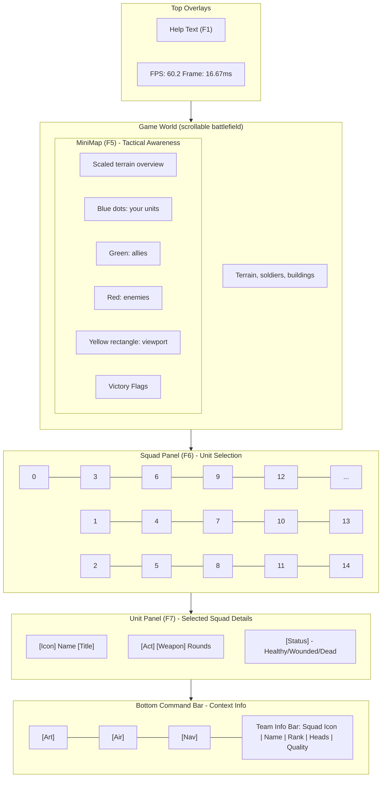

**Panel Visibility Controls** (F-keys):
- **F5**: Toggle minimap on/off
- **F6**: Toggle squad panel on/off  
- **F7**: Toggle unit panel on/off
- **F1**: Toggle help text showing all controls

### 9.1.2 Input Flow Model

The input system uses a **three-step interaction model**:

1. **Selection** → Left-click on a squad in the world or squad panel
2. **Action Selection** → Right-click to open context menu
3. **Target Specification** → Click destination/target for the order

**Command Flow Example: Movement**

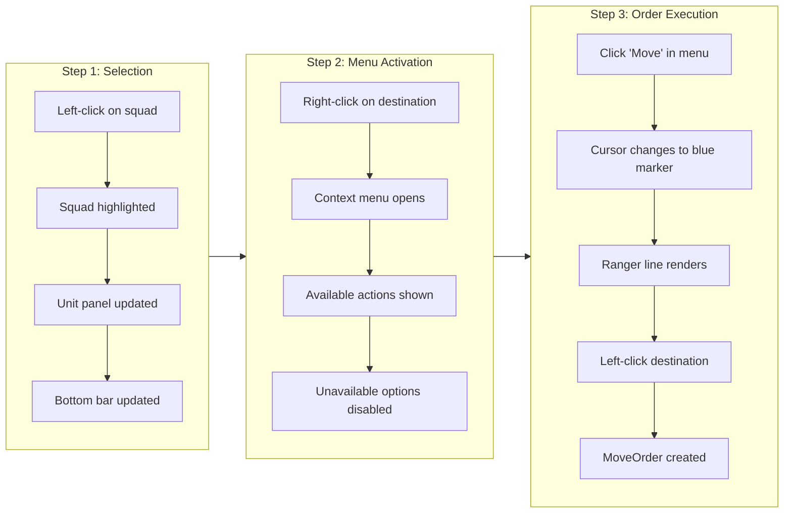

**Viewport Controls**:
- **Arrow Keys**: Scroll view in that direction
- **Middle Mouse Drag**: Pan view freely
- **Minimap Click**: Center view to that location
- **Minimap Drag**: Pan view by dragging rectangle

---

## 9.2 UI Architecture

### 9.2.1 Module System

The game uses a **module-based architecture** where different screens are separate modules:

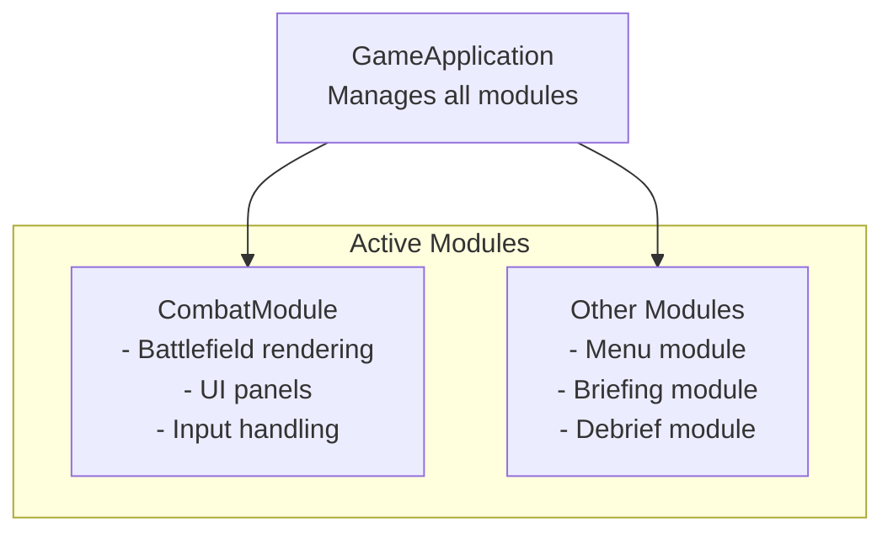

**CombatModule** (`src/application/CombatModule.h`) is the main gameplay module that coordinates:
- World simulation (combat logic)
- UI rendering (panels, minimap)
- Input routing (keyboard, mouse)
- Audio management

### 9.2.2 Widget Hierarchy

UI elements are organized using a **WidgetManager** system loaded from XML:

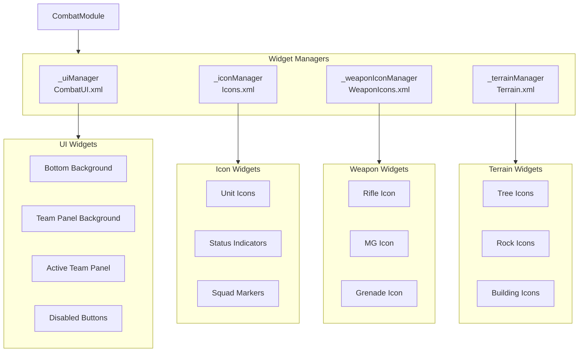

**Key Pattern**: Widgets are cloned when retrieved - caller must delete them.

### 9.2.3 Input Event Flow

Events flow through a layered system:

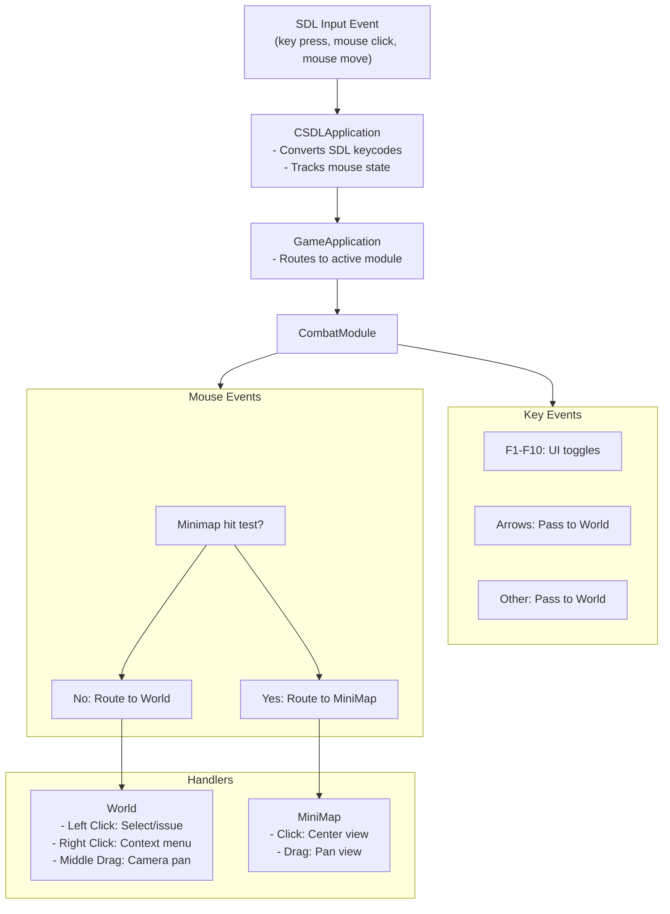

**Hit Test Priority**: Minimap is checked first because it overlays the world.

---

## 9.3 Command Processing Flow

### 9.3.1 Command Sequence: Movement Order

The following sequence details the internal state transitions when processing a move command:

**Phase 1: Selection**

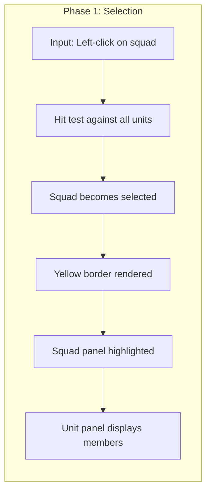

**Phase 2: Action Selection**

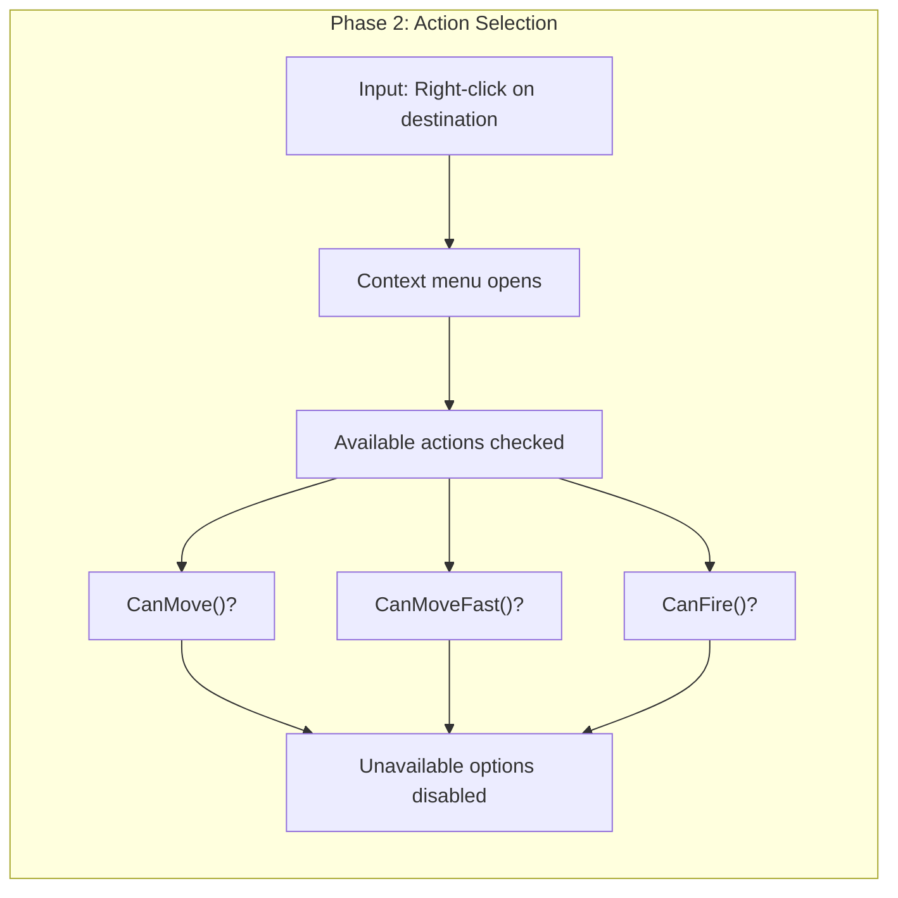

**Phase 3: Target Specification**

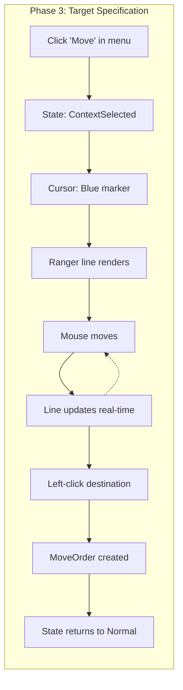

### 9.3.2 Command Sequence: Attack Order

**Phase 1: Selection**

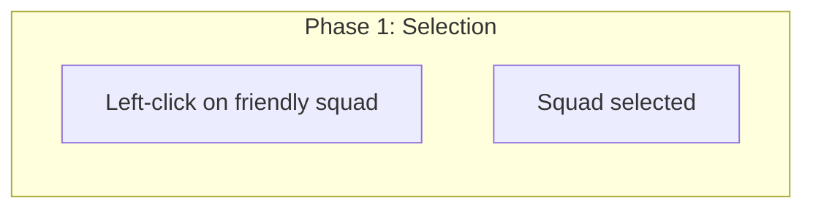

**Phase 2: Action Selection**

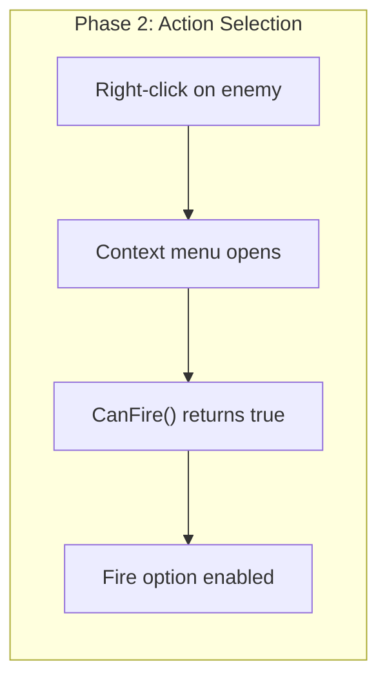

**Phase 3: Target Specification**

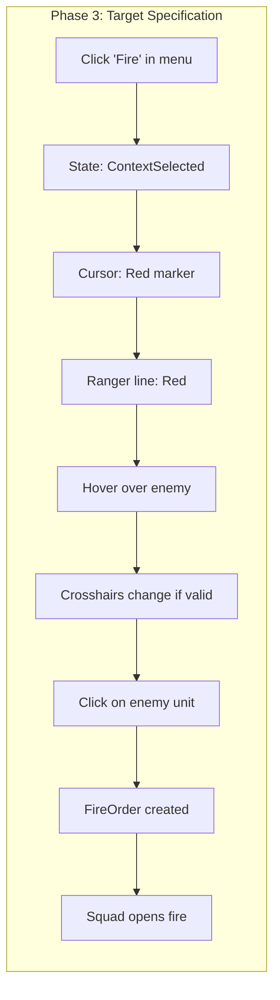

### 9.3.3 Order State Machine

The World class manages command input through distinct states:

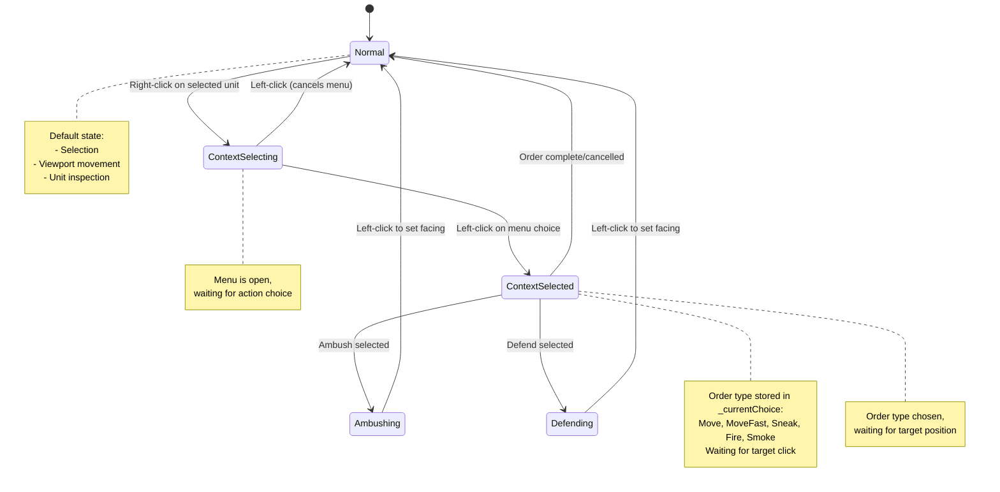

**State Descriptions**:
- **Normal**: Default state - selection, viewport movement, unit inspection
- **ContextSelecting**: Context menu is open, waiting for user to choose action
- **ContextSelected**: Order type chosen, waiting for target position/unit
- **Ambushing**: Setting ambush facing direction (click to set angle)
- **Defending**: Setting defend facing direction (click to set angle)

### 9.3.4 Context Menu

The context menu displays on right-click and shows available actions based on unit state:

**Available Actions**:
- **Move**: Standard movement order
- **Move Fast**: Run/sprint (increased speed, reduced stealth)
- **Fire**: Attack order (ground or unit target)
- **Sneak**: Crawl movement (reduced speed, increased stealth)
- **Smoke**: Deploy smoke grenade at position
- **Defend**: Set defensive facing (360° cover arc)
- **Ambush**: Set ambush facing (focused sector)

**Context Menu Flow**:

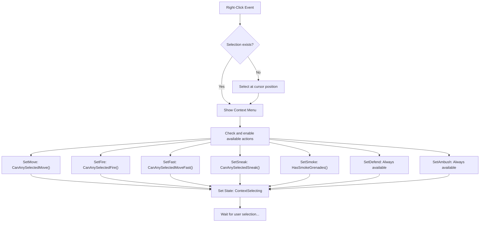

**Visual States**:
- **Dark**: Normal, available
- **Light**: Hovered/selected
- **Neg** (grayed): Unavailable for current unit

---

## 9.4 Implementation Details

### 9.4.1 CombatModule Class

**Location**: `src/application/CombatModule.h`, `src/application/CombatModule.cpp`

The main gameplay module that coordinates all combat UI elements:

```cpp
class CombatModule : public Module {
public:
    CombatModule();
    ~CombatModule(void);
    
    // Module interface
    virtual void Initialize(void *app);
    virtual void Simulate(long dt);
    virtual void Render(Screen *screen);
    
    // Mouse events
    virtual void LeftMouseDown(int x, int y);
    virtual void LeftMouseUp(int x, int y);
    virtual void LeftMouseDrag(int x, int y);
    virtual void RightMouseDown(int x, int y);
    virtual void RightMouseUp(int x, int y);
    virtual void RightMouseDrag(int x, int y);
    virtual void MiddleMouseDown(int x, int y);
    virtual void MiddleMouseUp(int x, int y);
    virtual void MiddleMouseDrag(int x, int y);
    
    // Keyboard events
    virtual void KeyUp(int key);
    virtual void KeyDown(int key);

protected:
    WidgetManager* _uiManager;           // CombatUI.xml widgets
    WidgetManager* _iconManager;         // Icons.xml
    WidgetManager* _weaponIconManager;   // WeaponIcons.xml
    WidgetManager* _terrainManager;      // Terrain.xml
    
    // Background graphics
    TGA* _longBottomBackground;
    TGA* _unitBackground;
    TGA* _teamBarBlank;
    TGA* _activeTeamPanel;
    
    // Core systems
    World* _currentWorld;
    MiniMap* _currentMiniMap;
    AnimationManager* _animationManager;
    SoldierManager* _soldierManager;
    
    // Panel visibility toggles
    bool _showTeamPanel;                 // F6 toggle
    bool _showMiniMap;                   // F5 toggle
    bool _showUnitPanel;                 // F7 toggle
    
    // FPS tracking
    long _frameTimeAccumulator;
    int _frameCount;
    float _currentFPS;
    float _currentFrameTime;
};
```

### 9.4.2 Widget System

**Location**: `src/graphics/WidgetManager.h`, `src/graphics/Widget.h`

Widgets are loaded from XML and cloned for use:

```cpp
class WidgetManager {
public:
    void LoadWidgets(const std::filesystem::path& fileName);
    Widget *GetWidget(const std::string& widgetName);
    Widget *GetWidget(int index);
    Widget *GetWidget(int index, bool clone);  // clone=false for original

protected:
    std::vector<Widget*> _widgets;
    std::vector<TGA*> _sourceImages;
};

class Widget {
public:
    void Render(Screen *screen, int x, int y);
    void Render(Screen *screen, int x, int y, Rect *clip);
    void Render(Screen *screen, int x, int y, int w, int h);
    void Render(Screen *screen, int x, int y, int w, int h, bool useAlpha);
    void Render(Screen *screen, int x, int y, Color *transparentColor);
    Widget *Clone();  // Shallow copy, shares TGA
    std::string GetName();

    inline int GetWidth() { return _tga->GetWidth(); }
    inline int GetHeight() { return _tga->GetHeight(); }
    inline TGA *GetImage() { return _tga; }

protected:
    std::string _name;
    TGA *_tga;  // Shared image data
};
```

**Important**: `GetWidget()` may return a clone depending on implementation. Use `GetWidget(index, false)` to get the original. Callers must `delete` cloned widgets.

### 9.4.3 Render Flow

```cpp
void CombatModule::Render(Screen *screen) {
    // Calculate clip rectangle (excludes UI panels)
    int bottomBarHeight = _longBottomBackground->GetHeight();
    Rect clip;
    clip.x = 0;
    clip.y = 0;
    clip.w = screen->GetWidth();
    clip.h = screen->GetHeight() - bottomBarHeight 
             - (_showTeamPanel ? _unitBackground->GetHeight()-7 : 0);
    
    // 1. Render game world (clipped)
    screen->SetClippingRectangle(clip.x, clip.y, clip.w, clip.h);
    _currentWorld->Render(screen, &clip);
    screen->SetClippingRectangle(0, 0, screen->GetWidth(), screen->GetHeight());
    
    // 2. Render minimap
    if(_showMiniMap) {
        int x = 0;
        int y = screen->GetHeight() - bottomBarHeight 
                - (_showTeamPanel ? _unitBackground->GetHeight()-7 : 0) 
                - _currentMiniMap->GetHeight();
        _currentMiniMap->SetPosition(x, y);
        _currentMiniMap->SetVisibleArea(clip.w, clip.h);
        _currentMiniMap->Render(screen);
    }
    
    // 3. Render unit panel (right side)
    if(_currentWorld->State.SelectedSquad >= 0 && _showUnitPanel) {
        // Per-unit panels showing: name, status, action, weapon, ammo
    }
    
    // 4. Render team panel (tiled background)
    if(_showTeamPanel) {
        // Tile background, render squad icons with selection highlight
    }
    
    // 5. Render bottom command bar
    // Tile background, show disabled buttons, team info
    
    // 6. Render overlays (if enabled)
    if(g_Globals->World.bRenderStats) {
        // FPS display: top-right corner
    }
    if(g_Globals->World.bRenderHelpText) {
        // Help text: all F-key mappings
    }
}
```

### 9.4.4 Input Handling

**Keyboard** (F-keys for UI toggles):

```cpp
void CombatModule::KeyUp(int key) {
    switch(key) {
        case 112: /* F1 */
            g_Globals->World.bRenderHelpText = !g_Globals->World.bRenderHelpText;
            break;
        case 113: /* F2 */
            g_Globals->World.bRenderStats = !g_Globals->World.bRenderStats;
            break;
        case 116: /* F5 */
            _showMiniMap = !_showMiniMap;
            break;
        case 117: /* F6 */
            _showTeamPanel = !_showTeamPanel;
            break;
        case 118: /* F7 */
            _showUnitPanel = !_showUnitPanel;
            break;
        // ... other F-keys
        default:
            _currentWorld->KeyUp(key);  // Pass to world
            break;
    }
}
```

**Mouse** (minimap hit-test first):

```cpp
void CombatModule::LeftMouseDown(int x, int y) {
    if(_showMiniMap && _currentMiniMap->Contains(x,y)) {
        _currentMiniMap->LeftMouseDown(x,y);
    } else {
        _currentWorld->LeftMouseDown(x,y);
    }
}

void CombatModule::RightMouseUp(int x, int y) {
    _currentWorld->RightMouseUp(x,y);  // Context menu
}

void CombatModule::MiddleMouseDrag(int x, int y) {
    _currentWorld->MiddleMouseDrag(x, y);  // Camera pan
}
```

### 9.4.5 World Order Processing

**State Handling** (simplified):

```cpp
void World::LeftMouseUp(int x, int y) {
    if(_currentState == Normal) {
        Select(x, y);  // Just selecting
        _contextMenu->Hide();
    } 
    else if(_currentState == ContextSelecting) {
        // Menu was open, user clicked
        _currentState = ContextSelected;
        _contextMenu->Hide();
        _currentChoice = _contextMenu->Choose(x, y);
        
        // Set up ranger line based on choice
        SetupRangerLineForChoice(_currentChoice);
    }
    else if(_currentState == ContextSelected) {
        // Ranger line was showing, user clicked destination
        IssueOrderBasedOnChoice(_currentChoice, x, y);
        _currentState = Normal;
    }
}

void World::RightMouseUp(int x, int y) {
    // Ensure we have a selection
    if(_selectedObjects.empty()) {
        Select(x, y);
    }
    
    // Show context menu with available actions
    _contextMenu->SetMove(CanAnySelectedMove());
    _contextMenu->SetFire(CanAnySelectedFire());
    // ... other options
    
    _contextMenu->Show(x, y);
    _currentState = ContextSelecting;
}
```

### 9.4.6 MiniMap Implementation

**Location**: `src/world/MiniMap.h`, `src/world/MiniMap.cpp`

```cpp
class MiniMap {
public:
    Point Position;  // Screen position
    
    void SetPosition(int x, int y);
    void SetVisibleArea(int w, int h);
    bool Contains(int x, int y);  // Hit test
    void Render(Screen *screen);
    
    // Input handling
    void LeftMouseUp(int x, int y);    // Center view
    void LeftMouseDrag(int x, int y);  // Pan view

protected:
    TGA *_tga;  // Minimap image
    World *_parentWorld;
    
    // Viewport rectangle (yellow)
    int _zoomWidth, _zoomHeight;
    int _x, _y;  // Rectangle position within minimap
};
```

**Render Elements**:
1. Minimap terrain image (scaled down)
2. 2px black border + 1px white border
3. Victory location flags
4. Unit markers (5x5 rectangles):
   - Blue: Player units
   - Green: Allied units
   - Red: Enemy units
5. Yellow viewport rectangle (current view area)

### 9.4.7 Mark and Cursor Systems

**Mark Colors** (`src/graphics/Mark.h`):
- **Blue**: Waypoints, move orders
- **Purple**: Fast move orders
- **Red**: Fire orders, enemy targets
- **Yellow**: Sneak orders
- **Green**: Allied markers

**Cursor Types** (`src/application/CursorInterface.h`):
```cpp
enum CursorType {
    MarkBlue, MarkPurple, MarkRed, MarkYellow,
    MarkOrange, MarkBrown, MarkGreen, MarkGrey,
    CrosshairsBlack, CrosshairsRed, CrosshairsYellow, CrosshairsGreen,
    CrosshairsEmptyBlack, CrosshairsEmptyRed,
    CrosshairsEmptyYellow, CrosshairsEmptyGreen,
    Regular, NumCursorTypes
};
```

**Ranger Line**: Visual line from selected unit to cursor during order placement. Color matches order type.

---

## 9.5 Developer Tools

These features are intended for developers and debugging, not normal gameplay:

### 9.5.1 Debug Display Toggles (F-keys)

| Key | Code | Developer Feature | Effect |
|-----|------|-------------------|--------|
| F1 | 112 | Help Text | Shows control help overlay |
| F2 | 113 | FPS/Frame Time Display | Shows performance metrics |
| F3 | 114 | Path Rendering | Shows unit pathfinding paths |
| F4 | 115 | Weapon Fan/LOS | Displays line-of-sight cones |
| F8 | 119 | Building Display Cycle | Cycles: Interiors → Outlines → Elevation → None |
| F9 | 120 | Terrain Elements | Toggles terrain detail rendering |
| F10 | 121 | Bounding Boxes | Shows collision/debug boxes |
| K | - | Kill Selected Units | **NOT IMPLEMENTED** - mapped but no handler exists |

### 9.5.2 FPS Tracking

CombatModule tracks performance metrics:

```cpp
void CombatModule::Simulate(long dt) {
    _currentWorld->Simulate(dt);
    
    // Update every 500ms
    _frameTimeAccumulator += dt;
    _frameCount++;
    
    if(_frameTimeAccumulator >= 500) {
        _currentFrameTime = (float)_frameTimeAccumulator / (float)_frameCount;
        _currentFPS = (float)_frameCount * 1000.0f / (float)_frameTimeAccumulator;
        _frameTimeAccumulator = 0;
        _frameCount = 0;
    }
}
```

Display (when F2 enabled):
- Position: Top-right corner
- Format: `FPS: 60.2  Frame: 16.67ms`

### 9.5.3 Help Text Display

Pressing F1 shows all available controls:
- All F-key mappings
- Mouse controls (select, context menu, camera)
- Debug commands

---

## 9.6 Quick Reference

### Keyboard Shortcuts

| Key | Player Action | Developer Action |
|-----|---------------|------------------|
| F1 | Toggle help text | - |
| F5 | Toggle minimap | - |
| F6 | Toggle squad panel | - |
| F7 | Toggle unit panel | - |
| F2 | - | Toggle FPS display |
| F3 | - | Toggle path rendering |
| F4 | - | Toggle weapon fan |
| F8 | - | Cycle building display |
| F9 | - | Toggle terrain elements |
| F10 | - | Toggle bounding boxes |
| Arrows | Scroll view | - |
| Left Click | Select / Issue order | - |
| Right Click | Open context menu | - |
| Middle Drag | Pan camera | - |
| K | - | Kill selected units (**NOT IMPLEMENTED**) |
| F | Cycle formation (**NOT IMPLEMENTED**) | - |

### File Locations

| Component | Files |
|-----------|-------|
| CombatModule | `src/application/CombatModule.h`, `.cpp` |
| Widget System | `src/graphics/WidgetManager.h`, `Widget.h` |
| MiniMap | `src/world/MiniMap.h`, `.cpp` |
| Context Menu | `src/graphics/CombatContextMenu.h`, `.cpp` |
| Marks | `src/graphics/Mark.h`, `.cpp` |
| Cursor | `src/application/CursorInterface.h` |
| XML Configs | `config/CombatUI.xml`, `Icons.xml`, `WeaponIcons.xml`, `Terrain.xml` |

---

**Next**: [Chapter 10: Build System and Dependencies](./10-build-system.md)
