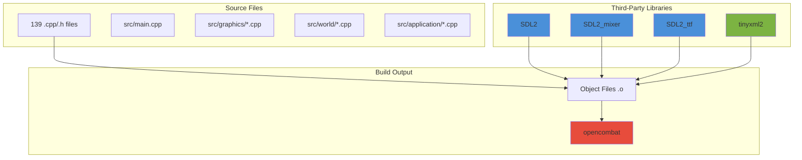
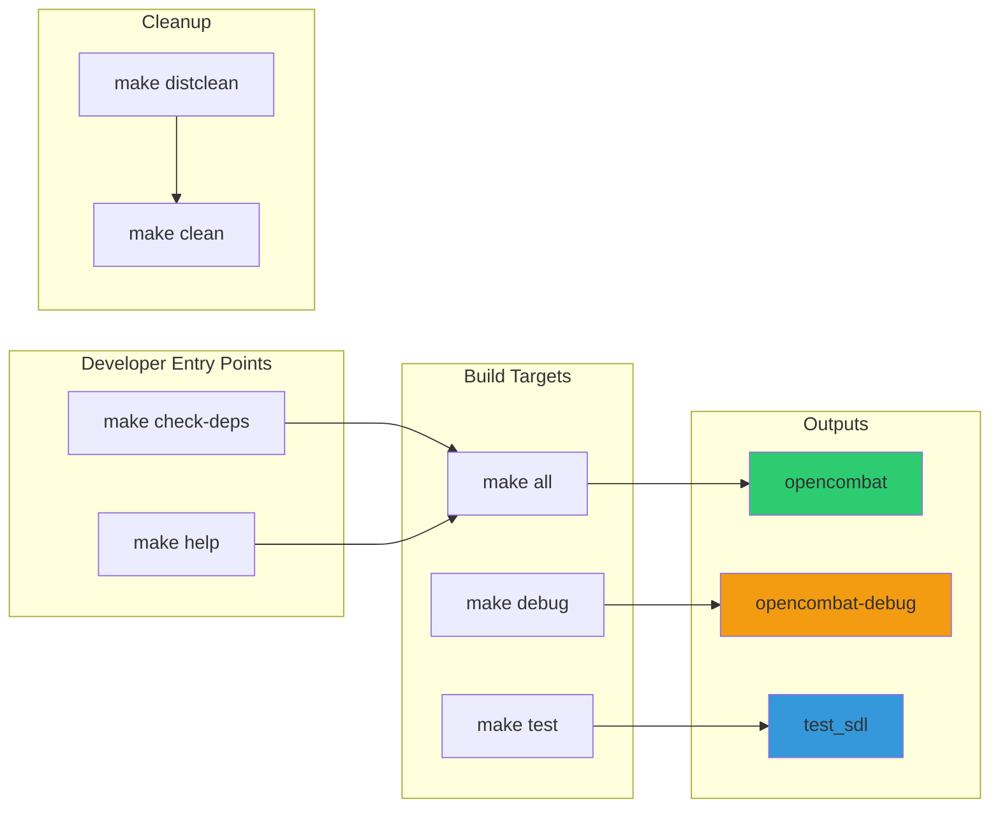
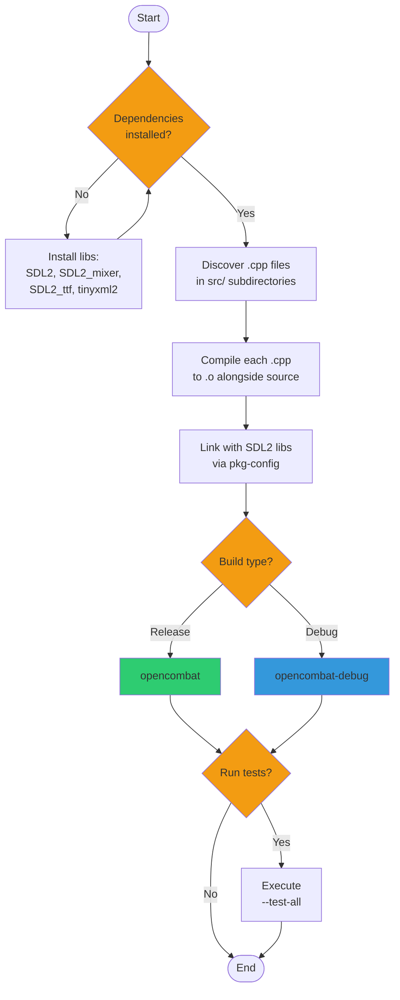

# Chapter 10: Build System and Dependencies

This chapter explains how to build OpenCombat SDL from source. You'll learn what tools and libraries you need, why each is required, how to install them, and how to compile and run the game.

---

## 10.1 Concept: What You Need

Building OpenCombat SDL requires three things:

1. **Compiler**: A C++17-compatible compiler (GCC 7+)
2. **Libraries**: SDL2 family for graphics/audio, tinyxml2 for configuration
3. **Build Tool**: GNU Make to orchestrate compilation

### Core Build Chain

```
Source Code (.cpp) → Compiler (g++) → Object Files (.o) → Linker → Executable
                                ↓
                    SDL2 headers/libs (graphics, audio, fonts)
                    tinyxml2 (XML config parsing)
```

### Build Dependency Diagram



---

## 10.2 Prerequisites: Why Each Dependency Is Needed

### Required Libraries

| Library | Purpose | Why It's Needed |
|---------|---------|-----------------|
| **SDL2** | Windowing, events, 2D rendering | Creates the game window, handles keyboard/mouse input, manages the framebuffer for software rendering |
| **SDL2_mixer** | Audio playback | Loads and plays WAV sound effects, manages audio channels for simultaneous sounds |
| **SDL2_ttf** | TrueType font rendering | Renders text using TTF fonts for UI elements, squad information, and debug displays |
| **tinyxml2** | XML parsing | Reads game configuration files (weapons, soldiers, terrain types), **always bundled** in `src/misc/` |

### Build Tools

| Tool | Purpose | Minimum Version |
|------|---------|-----------------|
| **g++** | C++ compiler | 7.0+ (for C++17 support) |
| **make** | Build orchestration | 3.81+ |
| **pkg-config** | Library detection | Any (required for SDL2 auto-configuration) |

---

## 10.3 Setup: Installing Dependencies

### Quick Start: Verify Your System

```bash
# Check if you have the essentials
g++ --version          # Need 7.0 or higher
make --version         # Need 3.81 or higher
pkg-config --version   # Should return version
```

### Ubuntu/Debian (Recommended)

```bash
# Install all dependencies in one command
sudo apt-get update
sudo apt-get install -y build-essential pkg-config
sudo apt-get install -y libsdl2-dev libsdl2-mixer-dev libsdl2-ttf-dev libtinyxml2-dev
```

**What's in `build-essential`**: g++, make, and other compilation tools.

### Fedora/CentOS/RHEL

```bash
sudo dnf install gcc-c++ make pkg-config
sudo dnf install SDL2-devel SDL2_mixer-devel SDL2_ttf-devel tinyxml2-devel
```

### Arch Linux

```bash
sudo pacman -S base-devel pkgconf
sudo pacman -S sdl2 sdl2_mixer sdl2_ttf tinyxml2
```

### macOS (Homebrew)

```bash
# Install Homebrew first if you haven't: https://brew.sh
brew install pkg-config
brew install sdl2 sdl2_mixer sdl2_ttf tinyxml2
```

### Windows (MinGW-w64 via MSYS2)

```bash
# In MSYS2 terminal
pacman -S mingw-w64-x86_64-gcc mingw-w64-x86_64-make
pacman -S mingw-w64-x86_64-pkg-config
pacman -S mingw-w64-x86_64-SDL2 mingw-w64-x86_64-SDL2_mixer mingw-w64-x86_64-SDL2_ttf mingw-w64-x86_64-tinyxml2
```

### Platform Setup Comparison

```mermaid
flowchart LR
    subgraph "Ubuntu/Debian"
        U1[apt-get update]
        U2[install build-essential]
        U3[install libsdl2-dev
            libsdl2-mixer-dev
            libsdl2-ttf-dev
            libtinyxml2-dev]
        U1 --> U2 --> U3
    end

    subgraph "macOS (Homebrew)"
        M1[brew install pkg-config]
        M2[brew install sdl2
            sdl2_mixer
            sdl2_ttf
            tinyxml2]
        M1 --> M2
    end

    subgraph "Windows (MSYS2)"
        W1[pacman -S mingw-w64-
           x86_64-gcc make
           pkg-config]
        W2[pacman -S mingw-w64-
           x86_64-SDL2
           mingw-w64-x86_64-
           SDL2_mixer
           mingw-w64-x86_64-
           SDL2_ttf
           mingw-w64-x86_64-
           tinyxml2]
        W1 --> W2
    end

    COMMON[make check-deps] --> BUILD[make -j$(nproc)]
    U3 --> COMMON
    M2 --> COMMON
    W2 --> COMMON
    BUILD --> RUN[./opencombat]

    style U3 fill:#e74c3c
    style M2 fill:#3498db
    style W2 fill:#9b59b6
    style BUILD fill:#2ecc71
    style RUN fill:#f39c12
```

---

## 10.4 Building: How to Compile

### Verify Dependencies

Before building, check that all libraries are installed:

```bash
make check-deps
```

Expected output:
```
Checking SDL2 dependencies...
✓ SDL2 found
✓ SDL2_ttf found
✓ SDL2_mixer found
✓ tinyxml2 found
```

### Build Targets Explained



| Target | What It Does | When To Use |
|--------|--------------|-------------|
| `make` or `make all` | Builds optimized release binary | Playing the game |
| `make debug` | Builds with debug symbols, no optimization | Debugging crashes |
| `make test` | Builds minimal test executable | Testing SDL2 setup |
| `make test-clean` | Removes test executables | Cleaning up test builds |
| `make clean` | Removes object files and binaries | Starting fresh build |
| `make distclean` | Full cleanup including backup files | Preparing for distribution |
| `make check-deps` | Verifies all dependencies are installed | First-time setup |
| `make help` | Lists all available targets | General reference |

### Standard Build Commands

```bash
# Release build - use parallel compilation for speed
make -j$(nproc)

# macOS (nproc not available)
make -j$(sysctl -n hw.ncpu)

# Debug build for development
make debug -j$(nproc)

# Clean and rebuild everything
make clean && make -j$(nproc)

# Full reset (removes backups too)
make distclean && make -j$(nproc)
```

### Build Outputs

After successful compilation, you'll have:

- `./opencombat` - Release executable
- `./opencombat-debug` - Debug executable (if you ran `make debug`)
- `.o` files - Compiled object files alongside source files

### Understanding the Build Process



The Makefile:
1. Discovers all `.cpp` files in `src/` subdirectories
2. Compiles each to `.o` files alongside `.cpp` files
3. Links with SDL2 libraries detected via `pkg-config`
4. Produces the final executable

**Source directories scanned**:
- `src/` - Main entry point
- `src/graphics/` - Rendering, fonts, animations
- `src/world/` - Map, buildings, terrain
- `src/objects/` - Soldiers, vehicles, weapons
- `src/application/` - Game application logic
- `src/states/` - State machine
- `src/ai/` - Pathfinding
- `src/orders/` - Orders system
- `src/sound/` - Audio management
- `src/misc/` - Utilities, XML parsing

---

## 10.5 Running: How to Execute and Test

### Before Running

Ensure you're in the project root directory with the required data folders:

```bash
# Check for required directories
ls config/ graphics/ maps/

# Expected output shows these directories exist
```

### Running the Game

```bash
# Run release build
./opencombat

# Run debug build
./opencombat-debug

# Run with verbose SDL output
SDL_DEBUG=1 ./opencombat
```

### Command-Line Options

| Option | Description | Exit Code |
|--------|-------------|-----------|
| `--test-all` | Runs all self-tests | 0 on pass, 1 on fail |
| `--test-screen` | Tests screen/blitting only | 0 on pass, 1 on fail |
| `--test-actionqueue` | Tests action queue only | 0 on pass, 1 on fail |
| `--help` | Not implemented (starts game) | 0 |

### Self-Tests

```mermaid
flowchart TD
    subgraph "Build Phase"
        BUILD[make -j$(nproc)]
        BUILD --> EXE[./opencombat]
    end

    subgraph "Test Execution"
        TEST_ALL[--test-all]
        TEST_SCREEN[--test-screen]
        TEST_ACTION[--test-actionqueue]
    end

    subgraph "Test Components"
        SCREEN[Screen Tests
        src/graphics/Screen.cpp]
        ACTION[ActionQueue Tests
        src/states/ActionQueue.h]
    end

    subgraph "Results"
        PASS[Exit 0
    All Passed]
        FAIL[Exit 1
    Failure]
    end

    EXE --> TEST_ALL
    EXE --> TEST_SCREEN
    EXE --> TEST_ACTION
    TEST_SCREEN --> SCREEN
    TEST_ACTION --> ACTION
    TEST_ALL --> SCREEN
    TEST_ALL --> ACTION
    SCREEN --> PASS
    SCREEN --> FAIL
    ACTION --> PASS
    ACTION --> FAIL

    style PASS fill:#2ecc71
    style FAIL fill:#e74c3c
```

Run these after building to verify core functionality:

```bash
# Run all tests
./opencombat --test-all

# Example successful output:
# =========================
# Testing Screen...
# Screen tests passed!
# Testing ActionQueue...
# ActionQueue tests passed!
# All tests passed!
```

**Test Details**:
- **Screen tests** (`src/graphics/Screen.cpp:812`): Tests blitting, clipping rectangles, and pixel operations
- **ActionQueue tests** (`src/states/ActionQueue.h:88`): Tests action scheduling and queue management

### Debug Mode Features

When running a debug build (`./opencombat-debug`), you can toggle visual debug overlays and UI panels:

#### Debug Rendering Toggles (F1-F4, F8-F10)

| Key | Feature | Description |
|-----|---------|-------------|
| F1 | Help text overlay | Shows control help and F-key mappings |
| F2 | Performance stats | FPS and frame time display |
| F3 | AI paths | Shows calculated movement paths |
| F4 | Weapon range fans | Displays line-of-sight cones |
| F8 | Building display cycle | Cycles: Interiors → Outlines → Elevation → None |
| F9 | Terrain elements | Toggles terrain detail rendering |
| F10 | Bounding boxes | Shows object collision boundaries |

#### UI Panel Toggles (F5-F7)

| Key | Feature | Description |
|-----|---------|-------------|
| F5 | Toggle minimap | Show/hide tactical minimap |
| F6 | Toggle team panel | Show/hide squad selection panel |
| F7 | Toggle unit panel | Show/hide unit details panel |

---

## 10.6 Troubleshooting

### Build Errors

#### "sdl2-config: command not found"

**Cause**: SDL2 development packages not installed.

**Solution**:
```bash
# Ubuntu/Debian
sudo apt-get install libsdl2-dev libsdl2-mixer-dev libsdl2-ttf-dev

# Fedora
sudo dnf install SDL2-devel SDL2_mixer-devel SDL2_ttf-devel

# Verify
pkg-config --exists sdl2 && echo "SDL2 found"
```

#### "tinyxml2.h: No such file or directory"

**Cause**: System tinyxml2 not found.

**Solution**:
```bash
# Option 1: Install system version (optional - for other projects)
sudo apt-get install libtinyxml2-dev

# Option 2: Use bundled version (always compiled from src/misc/)
# The Makefile always uses the bundled version in src/misc/ - no action needed
```

#### "undefined reference to pthread_create"

**Cause**: Linker flags missing pthread library.

**Solution**: Already included in Makefile, but if compiling manually:
```bash
g++ ... -lpthread -ldl
```

#### "pkg-config: command not found"

**Cause**: pkg-config utility not installed.

**Solution**:
```bash
# Ubuntu/Debian
sudo apt-get install pkg-config

# Fedora
sudo dnf install pkgconf-pkg-config

# macOS (usually pre-installed with Xcode)
brew install pkg-config
```

#### "error: filesystem is not a member of std"

**Cause**: GCC version too old (need C++17 support).

**Solution**:
```bash
# Check your version
g++ --version  # Need 7.0+

# Install newer GCC
sudo apt-get install g++-9
# Then use: make CXX=g++-9
```

### Runtime Errors

#### "Failed to initialize application"

**Cause**: Missing required data directories.

**Solution**:
```bash
# Verify you're in the correct directory
pwd  # Should show OpenCombat-SDL

# Check for required directories
ls -la config/ graphics/ maps/

# If missing, the game won't start
```

#### "Game crashes on startup with SDL error"

**Cause**: Running from wrong directory or missing assets.

**Solution**:
```bash
# Always run from project root
cd /path/to/OpenCombat-SDL
./opencombat

# Check all data is present
ls config/          # Should show XML files
ls graphics/        # Should show TGA files
ls maps/            # Should show map directories
```

#### "No sound output"

**Cause**: SDL_mixer initialization failure or missing sound files.

**Solution**:
```bash
# Check sounds directory exists
ls sounds/

# Test audio system
SDL_AUDIODRIVER=alsa ./opencombat  # Force ALSA
SDL_AUDIODRIVER=pulse ./opencombat # Force PulseAudio
```

### Debugging Crashes

```bash
# Build debug version
make debug

# Run with GDB
gdb ./opencombat-debug
(gdb) run
# When crash occurs:
(gdb) bt          # Show backtrace
(gdb) info locals # Show local variables
(gdb) quit

# Memory leak detection (Linux)
valgrind --leak-check=full ./opencombat-debug
```

---

## 10.7 Platform-Specific Notes

### Linux (Primary Platform)

**Tested on**: Ubuntu 20.04+, Debian 11+, Fedora 35+

**Notes**:
- Filesystem is case-sensitive: use `config/`, not `Config/`
- pkg-config typically pre-configured
- pthread and dl usually present by default

**Distribution-Specific Issues**:
- **Ubuntu/Debian**: Install `build-essential` first
- **Fedora**: May need to enable RPM Fusion for some SDL2 extras
- **Arch**: All packages in standard repositories

### macOS

**Tested on**: macOS 11+ (Big Sur and later)

**Notes**:
- Homebrew installs to `/opt/homebrew` (Apple Silicon) or `/usr/local` (Intel)
- pkg-config paths may need setup:
  ```bash
  export PKG_CONFIG_PATH="/opt/homebrew/lib/pkgconfig:$PKG_CONFIG_PATH"
  ```
- No `nproc` command; use `sysctl -n hw.ncpu` instead

### Windows (MinGW-w64)

**Tested on**: Windows 10/11 with MSYS2

**Notes**:
- Use MSYS2 MinGW 64-bit terminal, not standard MSYS2
- Paths use forward slashes in code (already portable)
- Executable is native Windows binary (no MSYS2 runtime needed)

**Building**:
```bash
# In MSYS2 MinGW 64-bit terminal
pacman -S mingw-w64-x86_64-toolchain
pacman -S mingw-w64-x86_64-SDL2 mingw-w64-x86_64-SDL2_mixer mingw-w64-x86_64-SDL2_ttf
make
# Produces opencombat.exe
```

---

## 10.8 Advanced Build Options

### Custom Compiler

```bash
# Use Clang instead of GCC
make CXX=clang++

# Use specific GCC version
make CXX=g++-10
```

### Custom Flags

```bash
# Add extra warning flags
make CXXFLAGS="-std=c++17 -Wall -Wextra -Wpedantic"

# Disable optimizations (debug)
make CXXFLAGS="-std=c++17 -O0 -g"
```

### Cross-Compilation

```bash
# Example: Build for ARM (Raspberry Pi)
make CXX=arm-linux-gnueabihf-g++
```

---

## 10.9 Distribution and Release

### Creating a Release Build

```bash
# Clean, rebuild, strip symbols
make clean
make -j$(nproc)
strip opencombat  # Removes debug symbols, reduces size
```

### Required Files for Distribution

```
opencombat              # Binary executable (can be renamed)
config/                 # 21 XML + 3 text configuration files
graphics/               # ~5,647 TGA image files
maps/                   # Map data (Acqueville/)
sounds/                 # WAV audio files (optional but recommended)
README.md               # Project documentation
LICENSE                 # License file
```

**No installation required** - The game runs from any directory containing these folders.

### Size Optimization

```bash
# Check binary size
ls -lh opencombat

# Compressed assets for distribution
tar czvf opencombat-release.tar.gz opencombat config/ graphics/ maps/ sounds/ README.md LICENSE
```

---

## 10.10 Build System Reference

### Makefile Configuration

Key variables you can override:

| Variable | Default | Description |
|----------|---------|-------------|
| `CXX` | `g++` | C++ compiler |
| `CXXFLAGS` | `-std=c++17 -Wall -Wextra -O2` | Compiler flags |
| `LDFLAGS` | `-lpthread -ldl` | Linker flags |

### Compiler Flags Reference

**Release**:
```bash
-std=c++17      # C++17 standard
-Wall           # Most warnings
-Wextra         # Extra warnings
-O2             # Optimization level 2
```

**Debug**:
```bash
-std=c++17      # C++17 standard
-Wall           # Most warnings
-Wextra         # Extra warnings
-g              # Debug symbols
-O0             # No optimization
-DDEBUG         # Debug preprocessor define
```

### Project Statistics

- **Source Files**: 139 `.cpp`/`.h` files
- **Lines of Code**: ~21,500
- **Primary Directories**: 10 source folders
- **Assets**: ~5,647 TGA files, 21 XML + 3 text config files

---

## Appendix: Quick Command Reference

### First-Time Setup

```bash
# Ubuntu/Debian
sudo apt-get install -y build-essential pkg-config
sudo apt-get install -y libsdl2-dev libsdl2-mixer-dev libsdl2-ttf-dev libtinyxml2-dev

# Verify
make check-deps
```

### Daily Development

```bash
# Build
make -j$(nproc)

# Test
./opencombat --test-all

# Run
./opencombat

# Debug
make debug && gdb ./opencombat-debug
```

### Troubleshooting Commands

```bash
# Check dependencies
make check-deps
pkg-config --libs sdl2 SDL2_ttf SDL2_mixer

# Clean builds
make clean          # Normal cleanup
make distclean      # Full cleanup

# Verbose output
make V=1            # Show full commands
SDL_DEBUG=1 ./opencombat
```

---

[← Back to Chapter 9: UI System and Combat Module](./09-ui-combat.md) | [↑ Up to Table of Contents](../ARCHITECTURE.md)
